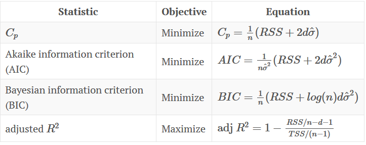

```{r echo = FALSE, message=FALSE, error=FALSE, warning=FALSE}
rm(list=ls()) # Lösche alle Variablen
library(tidyverse) # Datenaufbereitung und ggplot
library(lubridate) # Umgang mit Datum und Zeit
library(GGally) # Wird benötigt für die Erstellung des correlograms
```

# 1. Allgemeine Projektinformationen

## 1.1 Ausgangslage
Die Bestellung von Bäckereien ist häufig noch ein manueller und zeitaufwändiger Prozess, der auf adjustierten Vorwochenwerten basiert. Eine systematische Planung unter Einbeziehung von Mustern findet nur eingeschränkt statt.

## 1.2 Zielsetzung 
Es wird ein Prognosemodell entworfen, das Bäckereien ein bessere Planungsgrundlage auf Warengruppenebene bietet. 

**Lösungsansatz**

Mit Hilfe von verschiedenen Daten und Einflussfaktoren soll diese Umsätze je Warengruppe prognostiziert werden. 

*	Umsatzdaten, Wetterdaten, Veranstaltungsdaten
*	Weitere Einflussfaktoren (Wochentage, Feiertage, Ferien,…)

## 1.3 Datenbasis

Untersucht werden Daten für die Jahre 2013 bis 2019. Es liegen für diesen Zeitraum als Rohdaten drei Datensätze vor:

*	Umsätze je Warengruppe und Tag
  + Es werden fünf Warengruppen in die Analysen einbezogen: Brot (WG 1), Brötchen (WG 2), Croissant (WG 3), Konditorei (WG 4) und Kuchen (WG 5)
* Daten zur Kieler Woche
* Wetterdaten 
  + Informationen zu den Wetterdaten können der [privaten Webseite von Mario Lehwald](http://www.seewetter-kiel.de/seewetter/daten_symbole.htm) entnommen werden. Herr Lehwald hat seine Daten wiederum vom [Geomar - Helmholtz-Zentrum für Ozeanforschung Kiel](https://www.geomar.de/service/wetter/) sowie vom [Windfinder](https://www.windfinder.com/report/kiel_leuchtturm) bezogen (vgl. [Impressum](http://www.seewetter-kiel.de/allgemein/impressum.htm))

# 2 Datenexploration

## 2.1 Einlesen der Daten

Im ersten Schritt müssen die Daten zunächst eingelesen werden um sie bearbeiten zu können:
```{r message=FALSE}
# mit read_csv einlesen um eine Veränderung der Datentypen (bzw. eine Faktorisierung) zu verhindern!
Beispieldaten <- read_csv("data/Beispieldaten.csv")
KiWo <- read_csv("data/KiWo.csv")
Wetter <- read_csv("data/Wetter.csv")
```

## 2.2 Überprüfung der Datenstrukturen

* Datensatz **Beispieldaten**
```{r}
str(Beispieldaten)
glimpse(Beispieldaten)
typeof(Beispieldaten$Datum)
max(Beispieldaten$Datum)
range(Beispieldaten$Warengruppe)
range(Beispieldaten$Umsatz)
head(Beispieldaten)
tail(Beispieldaten)

```

Der Datensatz **Beispieldaten** ist ein Dataframe, enthält 11164 Zeilen und 3 Variablen:

* Datum (`date`)
* Warengruppe (`int`) mit den Warengruppen 1 - 6
* Umsatz (`dbl`) mit Werten zwischen 7.05 und 1879.46.

Umsätze werden jeweils 5 mit Nachkommastellen angezeigt. Hier wird später eine Änderung vorgenommen und die Variable auf zwei Nachkommastellen gerundet.

* Datensatz **KiWo**
```{r}
str(KiWo)
glimpse(KiWo)
any(KiWo$KielerWoche != 1)  # Prüfung: Ist die Ausprägung in irgendeiner Zelle der Spalte ungleich 1?
all(KiWo$KielerWoche == 1)  # Prüfung: Sind alle Ausprägungen gleich 1? 
```

Der Datensatz **KiWo** enthält 71 Zeilen und die beiden Variablen Datum (`date`) und KielerWoche (`int`), wobei die einzige Ausprägung der Variablen KielerWoche die Ziffer 1 ist. Anhand der Daten der einzelnen Daten erkennt man, dass der Datensatz nur solche Daten enthält, an denen tatsächlich die Kieler Woche in dem jeweiligen Jahr stattgefunden hat.


* Datensatz **Wetter**
```{r}
str(Wetter)
glimpse(Wetter)
range(Wetter$Bewoelkung, na.rm = TRUE)
range(Wetter$Temperatur, na.rm = TRUE)
range(Wetter$Windgeschwindigkeit)
range(Wetter$Wettercode, na.rm = TRUE)
```

Der Datensatz **Wetter** enthält 2601 Zeilen und fünf Variablen:

* Datum (`date`)
* Bewoelkung (`int`) mit Werte von 0 bis 8
* Temperatur (`dbl`) mit Werten zwischen -10.25 und 32.67 Grad Celsius
* Windgeschwindigkeit (`int`) mit Werten zwischen 3 und 35 Knoten
* Wettercode (`int`) mit Werten zwischen 0 und 95, wobei die einzelnen Wettercodes einer bestimmten Wettererscheinung oder einem bestimmten Wetterzustand entsprechen.

Weitere Informationen zu den einzelnen Variablen des Datensatzes **Wetter** und ihrer Interpretation können der privaten Webseite [**Seewetter Kiel**](http://www.seewetter-kiel.de/seewetter/daten_symbole.htm) entnommen werden. 

Alle Datensätze enthalten die Variable `Datum`. Folglich können die einzelnen Datensätze über diese Variable vereinigt werden. 

## 2.3 Überprüfung des Anfangs- und Endzeitpunkt der Datumsattribute in den Datensätzen
```{r}
min(Beispieldaten$Datum)
max(Beispieldaten$Datum)
range(KiWo$Datum)
range(Wetter$Datum)
```

* Die Daten des Datensatzes **Beispieldaten** reichen vom 01.07.2013 bis zum 30.07.2019.
* Die Daten des Datensatzes **KiWo** reichen vom 16.06.2012 bis zum 30.06.2019.
* Die Daten des Datensatzes **Wetter** reichen vom 01.01.2012 bis zum 01.08.2019.

## 2.4 Überprüfung der Datensätze auf fehlende Werte

### Überprüfung auf "klassische" fehlende Werte (NA)
Zunächst einmal wird geprüft, welche klassischen fehlenden Werte (NA) in den einzelnen Datensätzen vorhanden sind:
```{r}
sum(is.na(Beispieldaten))   # 0
sum(is.na(KiWo))            # 0
sum(is.na(Wetter))          # 679 fehlende Werte
# which(is.na(Wetter))
sum(is.na(Wetter$Datum))
sum(is.na(Wetter$Bewoelkung))   # 10 fehlende Werte
sum(is.na(Wetter$Temperatur))   # 0
sum(is.na(Wetter$Windgeschwindigkeit)) # 0
sum(is.na(Wetter$Wettercode))   # 669 fehlende Werte
```

* Der Datensatz **Beispieldaten** enthält keine fehlenden Werte.
* Der Datensatz **KiWo** enthält keine fehlenden Werte.
* Der Datensatz **Wetter** enthält 679 fehlende Werte, davon 10 in der Spalte "Bewoelkung", 669 in der Spalte "Wettercode".


## 2.5 Überprüfung des Datensatzes auf Vollständigkeit

In In einem weiteren Schritt wird geprüft, ob die Anzahl der Zeilen pro Jahr stimmt. 

In den Jahren 2014, 2015, 2017 und 2018, die vollständig vorliegen, müssten es je Warengruppe 365 Zeilen sein, im Schaltjahr 2016 366. Für das Jahr 2013, für das Daten erst ab dem 01.07.2013 zur Verfügung stehen, entsprechend 183 und für das unvollständige Jahr 2019 müssten 210 Datensätze vorliegen. Insgesamt müssten für jede Warengruppe demnach 2219 Zeilen vorhanden sein.

```{r}
Beispieldaten <- Beispieldaten %>% mutate(Jahr = year(Datum))

# 2174 -> 45 Daten fehlen
Beispieldaten %>%
  filter(Warengruppe == 1) %>%
  summarise(n = n())

# 2174 -> 45 Daten fehlen
Beispieldaten %>%
  filter(Warengruppe == 2) %>%
  summarise(n = n())

# 2174 -> 45 Daten fehlen
Beispieldaten %>%
  filter(Warengruppe == 3) %>%
  summarise(n = n())

# 2120 -> 99 Daten fehlen
Beispieldaten %>%
  filter(Warengruppe == 4) %>%
  summarise(n = n())

# 2174 -> 45 Daten fehlen
Beispieldaten %>%
  filter(Warengruppe == 5) %>%
  summarise(n = n())
```

Es fehlen bei allen Warengruppen Datensätze. Bei den Warengruppen 1,2, 3 und 5 fallen ca. 70% der fehlenden Daten auf Feiertage (insb. Karfreitag, Tag der Arbeit und 1. und 2. Weihnachtsfeiertag).
Bei Warengruppe 4 sind es ca. 30%. Weitere ~30% der fehlenden Daten der Warengruppe 4 liegen in den Sommermonaten Juni, Juli, August. Eine Möglichkeit wäre, dass die Kühlung ausgefallen ist / einen Defekt hatte und demzufolge keine Konditoreiwaren angeboten wurden. Eine andere Möglichkeit wäre, dass bei sehr trockenem, warmen Wetter der Verkauf von Konditoreiwaren in der Regel ein Minusgeschäft ist und daher das Sortiment temporär/tageweise verkleinert wird. Auffällig ist, dass die Anzahl der fehlenden Werte pro Jahr abnehmend ist und sich insbesondere in den Jahren 2012 und 2018 mehrheitlich auf Feiertage beschränkt.

Untersucht man die einzelnen Jahre genauer, ergibt sich folgendes Bild: 

```{r}
# 181 -> ein Datum fehlt
Beispieldaten %>%
  filter(Warengruppe == 1 & Jahr == 2013) %>%
  summarise(n = n())

# 181 -> ein Datum fehlt
Beispieldaten %>%
  filter(Warengruppe == 2 & Jahr == 2013) %>%
  summarise(n = n())

# 181 -> ein Datum fehlt
Beispieldaten %>%
  filter(Warengruppe == 3 & Jahr == 2013) %>%
  summarise(n = n())

# 165 -> 17 Daten fehlen
Beispieldaten %>%
  filter(Warengruppe == 4 & Jahr == 2013) %>%
  summarise(n = n())

# 181 -> ein Datum fehlt
Beispieldaten %>%
  filter(Warengruppe == 5 & Jahr == 2013) %>%
  summarise(n = n())

# 357 -> 8 Daten fehlen
Beispieldaten %>%
  filter(Warengruppe == 1 & Jahr == 2014) %>%
  summarise(n = n())

# 357 -> 8 Daten fehlen
Beispieldaten %>%
  filter(Warengruppe == 2 & Jahr == 2014) %>%
  summarise(n = n())

# 357 -> 8 Daten fehlen
Beispieldaten %>%
  filter(Warengruppe == 3 & Jahr == 2014) %>%
  summarise(n = n())

# 334 -> 31 Daten fehlen
Beispieldaten %>%
  filter(Warengruppe == 4 & Jahr == 2014) %>%
  summarise(n = n())

# 357 -> 8 Daten fehlen
Beispieldaten %>%
  filter(Warengruppe == 5 & Jahr == 2014) %>%
  summarise(n = n())

# 360 -> 5 Daten fehlen
Beispieldaten %>%
  filter(Warengruppe == 1 & Jahr == 2015) %>%
  summarise(n = n())

# 360 -> 5 Daten fehlen
Beispieldaten %>%
  filter(Warengruppe == 2 & Jahr == 2015) %>%
  summarise(n = n())

# 360 -> 5 Daten fehlen
Beispieldaten %>%
  filter(Warengruppe == 3 & Jahr == 2015) %>%
  summarise(n = n())

# 350 -> 15 Daten fehlen
Beispieldaten %>%
  filter(Warengruppe == 4 & Jahr == 2015) %>%
  summarise(n = n())

# 360 -> 5 Daten fehlen
Beispieldaten %>%
  filter(Warengruppe == 5 & Jahr == 2015) %>%
  summarise(n = n())

# 356 -> 10 Daten fehlen
Beispieldaten %>%
  filter(Warengruppe == 1 & Jahr == 2016) %>%
  summarise(n = n())

# 356 -> 10 Daten fehlen
Beispieldaten %>%
  filter(Warengruppe == 2 & Jahr == 2016) %>%
  summarise(n = n())

# 356 -> 10 Daten fehlen
Beispieldaten %>%
  filter(Warengruppe == 3 & Jahr == 2016) %>%
  summarise(n = n())

# 352 -> 14 Daten fehlen
Beispieldaten %>%
  filter(Warengruppe == 4 & Jahr == 2016) %>%
  summarise(n = n())

# 356 -> 10 Daten fehlen
Beispieldaten %>%
  filter(Warengruppe == 5 & Jahr == 2016) %>%
  summarise(n = n())

# 357 -> 8 Daten fehlen
Beispieldaten %>%
  filter(Warengruppe == 1 & Jahr == 2017) %>%
  summarise(n = n())

# 357 -> 8 Daten fehlen
Beispieldaten %>%
  filter(Warengruppe == 2 & Jahr == 2017) %>%
  summarise(n = n())

# 357 -> 8 Daten fehlen
Beispieldaten %>%
  filter(Warengruppe == 3 & Jahr == 2017) %>%
  summarise(n = n())

# 357 -> 8 Daten fehlen
Beispieldaten %>%
  filter(Warengruppe == 4 & Jahr == 2017) %>%
  summarise(n = n())

# 357 -> 8 Daten fehlen
Beispieldaten %>%
  filter(Warengruppe == 5 & Jahr == 2017) %>%
  summarise(n = n())

# 358 -> 7 Daten fehlen
Beispieldaten %>%
  filter(Warengruppe == 1 & Jahr == 2018) %>%
  summarise(n = n())

# 358 -> 7 Daten fehlen
Beispieldaten %>%
  filter(Warengruppe == 2 & Jahr == 2018) %>%
  summarise(n = n())

# 358 -> 7 Daten fehlen
Beispieldaten %>%
  filter(Warengruppe == 3 & Jahr == 2018) %>%
  summarise(n = n())

# 357 -> 8 Daten fehlen
Beispieldaten %>%
  filter(Warengruppe == 4 & Jahr == 2018) %>%
  summarise(n = n())

# 358 -> 7 Daten fehlen
Beispieldaten %>%
  filter(Warengruppe == 5 & Jahr == 2018) %>%
  summarise(n = n())

# 205 -> 5 Daten fehlen
Beispieldaten %>%
  filter(Warengruppe == 1 & Jahr == 2019) %>%
  summarise(n = n())

# 205 -> 5 Daten fehlen
Beispieldaten %>%
  filter(Warengruppe == 2 & Jahr == 2019) %>%
  summarise(n = n())

# 205 -> 5 Daten fehlen
Beispieldaten %>%
  filter(Warengruppe == 3 & Jahr == 2019) %>%
  summarise(n = n())

# 205 -> 5 Daten fehlen
Beispieldaten %>%
  filter(Warengruppe == 4 & Jahr == 2019) %>%
  summarise(n = n())

# 205 -> 5 Daten fehlen
Beispieldaten %>%
  filter(Warengruppe == 5 & Jahr == 2019) %>%
  summarise(n = n())
```

Je Warengruppe und Jahr fehlen unterschiedliche viele Datensätze.

## 2.6 Überprüfung der Datensätze auf Ausreißer

Ein Ausreißer ist ein Wert, der außerhalb der üblichen Struktur einer Verteilung liegt. Zunächst wird in einem ersten Schritt mittels einer Visualisierung in Form von `boxplots` überprüft, ob die einzelnen Datensätze überhaupt Ausreißer enthalten.

Die Überprüfung wird begonnen mit dem Datensatz **Beispieldaten**: 

```{r}
# Überprüfung der Variable Umsatz
boxplot(Beispieldaten$Umsatz)
hist(Beispieldaten$Umsatz)
density(Beispieldaten$Umsatz)

# Visualisierung
Beispieldaten %>% 
  dplyr::select(Umsatz) %>% 
  ggplot(aes(Umsatz)) +
  geom_density()
```

Das Attribut `Umsatz` enthält zahlreiche Ausreißer. Mit bloßem Auge ist nicht zu erkennen, wie viele Ausreißer es genau sind. Die Ausreißer werden also in einem 2. Schritt genauer betrachtet, um die genaue Anzahl der Ausreißer zu ermitteln. Statistiker haben viele Verfahren entwickelt, um auseinanderzuhalten, was man als Ausreißer bezeichnen sollte, und was nicht. 

Eine mögliche Definition und oft benutzte Regel, die von John W. Tukey stammt, besteht darin, dass ein Wert ein Ausreißer ist, falls er deutlich oberhalt des oberen Quartils (`Q_3`) oder unterhalb des unteren Quartils (`Q_1`) liegt. Dabei bezieht er den Abstand des oberen zum unteren Quartil mit ein, genannt "interquartile range" (IQR) und definiert einen Ausreißer als einen Punkt, der mehr als $$1,5 * IQR$$ vom oberen Quartils bzw. unteren Quartil abweicht. Anders gesagt liegen untere Ausreißer unterhalb

$$Q_1 - 1,5 * IQR$$
und obere Ausreißer oberhalb $$Q_3 + 1.5 * IQR$$

Vereinfachend untersuchen wir nun die Umsatzvariable insgesamt auf Ausreißer, wobei wir zunächst nicht nach Warengruppen trennen:

```{r}
g_oben <- quantile(Beispieldaten$Umsatz, probs=0.75) + (1.5*IQR(Beispieldaten$Umsatz)) #Obere Grenze fuer Ausreißer
g_oben

Beispieldaten %>%
  select(Umsatz) %>%
  filter(Umsatz > g_oben) %>%
  summarise(n = n())
```
Die obere Grenze für Ausreißer liegt demzufolge bei 559,80€ (gerundet). Es gibt insgesamt 348 Ausreißer in der Variable `Umsatz`. In einem 3. Schritt betrachten wir, an welchen Daten diese Ausreißer auftreten und ob Muster erkennbar sind (z. B. überproportional hohe Umsätze an Ostern oder anderen Feiertagen, in den Ferien, während der Kieler Woche o. Ä.):

```{r}
Beispieldaten %>%
  select(Datum, Umsatz, Warengruppe) %>%
  filter(Umsatz > g_oben) 

Beispieldaten %>%
  select(Datum, Umsatz, Warengruppe) %>%
  filter(Umsatz > g_oben) %>%
  arrange(desc(Umsatz))

Beispieldaten %>%
 select(Datum, Umsatz, Warengruppe) %>%
 filter(Datum == "2018-12-31")
```

Erste Erkenntnisse (nach Jahren sortiert):

[**2013**](https://www.kalender-365.eu/kalender-2013.html)

* Eine erste *Ausreißerperiode* ist - mit zwei Ausnahmetagen (Mo, 08.07.; Di, 16.07.) - in dem Zeitraum vom 06.07.2013 (Samstag) bis zum 04.08.2013 (Sonntag) zu beaobachten. Vergleicht man diese Periode mit den [Ferienzeiten der verschiedenen Bundesländer im Jahr 2013](https://www.schulferien.org/deutschland/ferien/2013/), so fällt auf, dass insbesondere die für den Tourismus in Schleswig-Holstein relevanten Bundesländer Hessen, Niedersaschsen, Rheinland-Pfalz, sowie teilweise Nordrhein-Westfalen (ab. 22.07.) in diesem Zeitraum Ferien hatten. Weiterhin lagen auch die Ferien der Berliner und der Schleswig-Holsteiner selbst sowie die der Bayern teilweise in diesem Zeitraum.
Die Vermutung liegt insofern nahe, dass die Sommerferien einen signifikanten Einfluss auf die Höhe des Umsatzes der betrachtenen Filiale haben.
* Nach dieser wirklich sichtbaren, anhaltenden Periode von überproportional hohen Umsätzen folgt eine Phase - beginnend am Samstag, 10.08.2013 -, in der ausschließlich an den beiden Wochenendtagen Ausreißer-Umsätze zu beobachten sind. Diese Phase endet am 08.09.2013 (Ausnahme in dieser Phase ist So, 01.09.).
* Nach dieser Wochenend-Ausreißerphase wird es erkennbar unregelmäßiger:
  + vereinzelt gibt es weiterhin Ausreißer an Wochenendtagen (z. B. am So, 28.09.; So, 17.11.; So, 24.11.; 01.12.; 25.12.)
  + auch an einzelnen Feiertagen / besonderen Ereignissen sind die Umsätze überproportional stark (03.10. (Tag der Deutschein Einheit); 31.12. (Silvester)).
  + die Herbst- und Winterferien sowie Weihnachten bzw. die Weihnachtsfeiertage scheinen insofern keinen signifikanten Einfluss auf die Umsätze der Bäckerei zu haben.
* Insgesamt gibt es im Jahr 2013 zwei Tage (So, 11.08. und Di, 31.12.), an denen zwei Warengruppen Ausreißer sind (jeweils Warengruppen 2 + 5).


[**2014**](https://www.kalender-365.eu/kalender-2014.html)

* Das Jahr 2014 beginnt strukturell so wie das Vorjahr geendet hat: unregelmäßig. Vereinzelt gibt es Ausreißer an Wochenendtagen (So, 12.01.; jeweils der Sonntag in der Zeit vom 09.02. - 09.03.; Sa, 29.03.; So, 06.04.).
* Ab Sa, 12.04. bis Ende April am So, 27.04. sind jeweils beide Wochenendtage überproportional stark (Anmerkung: Ferienzeit in vielen relevanten Bundesländern); auch an Ostern (Karfreitag 18.04., Ostersonntag 20.04. sowie Ostermontag 21.04.) sind starke Umsatz-Effekte zu beobachten.
* Ein ungewöhnlich hoher Umsatz ist am Montag, 05.05.2014 zu beobachten; es ist der höchste Umsatz im gesamten Zeitraum; ansonsten gibt es an den Sonntagen 18.05 und 25.05. Ausreißer sowie an Christi Himmelfaht (29.05.).
* Im Zeitraum vom 31.05. bis 29.06. erstrecken sich die Ausreißer wiederum über beide Wochentage; hinzu kommt in diesem Zeitraum ein (eingeschränkter) Effekt der Kieler Woche (Ausreißer am Do, 26.06. und Fr, 27.06.). 
* Im Juli sind am Sa, 05.07. sowie von Fr, 11.07. - So, 13.07 die "üblichen" Wochenendeffekte zu beobachten.
* Im Zeitraum vom 17.07. - 31.08 - also in einem Zeitraum von ca. 6 Wochen - jeden Tag Ausreißer zu verzeichnen; betrachtet man die [Sommerferienzeiträume der Bundesländer im Jahr 2014](https://www.schulferien.org/deutschland/ferien/2014/), so liegt die Vermutung nahe, dass wie schon im Vorjahr die Ferienzeit diese überporportional hohen Umsätze signifkant beeinflusst hat.
* An den ersten drei Septemberwochenenden sowie an den Oktoberwochenenden sind ebenfalls Ausreißer zu verzeichnen; hinzu kommt im Oktober zudem der Tag der Deutschen Einheit.
* Im November beschränken sich die Ausreißerumsätze auf die Sonntage; dies gilt mit Ausnahme des So, 21.12. auch für den Dezember; hinzu kommen im Dezember weiterhin der Di, 30. und der Mi, 31.12; auch im Jahr 2014 ist wieder kein "Weihnachts-Effekt" sichtbar.
* Insgesamt gibt es im Jahr 2014 einen Tag (Mi, 31.12.), an denen zwei Warengruppen Ausreißer sind (jeweils WG 2 + 5). Am 05.05. gibt es sogar Ausreißer in drei Warengruppen (WG 2, 3, 5).
* Mit mehr als 120 Ausreißern innerhalb eines Jahres ist das Jahr 2014 ein vglw. außergewöhnlich "ausreißerstarkes" Jahr (gewöhnlich liegt die Anzahl pro Jahr zwischen ~ 30 - 50 Ausreißern). Man könnte das Jahr 2014 selbst fast als Ausreißerjahr bezeichnen.

[**2015**](https://www.kalender-365.eu/kalender-2015.html)

* Im Zeitraum Januar bis März sind insgesamt nur vier Ausreißer zu beobachten; diese liegen jeweils auf einem Sonntag
* Das Osterwochenende im April (So, 05.04 + Mo, 06.04.) ist gewohnt stark; im Unterschied zu 2014 ist jedoch an Karfreitag kein Ausreißer-Umsatz zu verzeichnen. Ansonsten ist der April nicht von Ausreißern betroffen.
* Der Monat Mai + Anfang sind vergleichbar mit dem Vorjahr: überproportional hohe Umsätze am Sonntag nach Himmelfahrt (17.05.) sowie am Pfingstwochende (So, 24. + Mo, 25.05.).
* Der Juni erscheint schwächer als im Vorjahr; es ist lediglich ein leichter Wochenendeffekt sichtbar (Sa, 13.06., Sa, 20.06; sowie am zweiten "KiWo-Wochenende" 27. + 28.06.), der Effekt der Kieler Woche ist schwächer im Vergleich zum Vorjahr.
* Auch im Jahr 2015 scheinen die Sommerferien einen Einfluss zu haben, jedoch einen geringeren als im Vorjahr:
  + im Juli sind in den ersten drei Wochen (01.07. - 19.07.) nur Wochenendeffekte zu beobachten 
  + die Phase, in der jeder Tag ein Ausreißer ist, erstreckt sich 2015 nur über 3 Wochen (20.07. - 09.08.); in der Woche vom 10.08 - 16.08. sind zwar noch vier Ausreißer zu verzeichnen, ansonsten beschränken sich die Ausreißer im Rest des Augustes auf die Wochenenden.
* Der nächste und einzige weitere Ausreißer im Jahr 2015 ist an Silvester zu beobachten.

[**2016**](https://www.kalender-365.eu/kalender-2016.html)

* Im Jahr 2016 taucht der erste Ausreißer am Sonntag des ersten Februarwochenendes auf (07.02.).
* Das Osterwochenende Ende März (Sa, 04.04 + Mo, 06.04.) ist abermals stark, an jedem Tag sind Ausreißer zu finden.
* Im April gibt es im Jahr 2016 keinen einzigen Ausreißer, wobei in diesem Jahr auch kein Feiertag in den April fällt.
* Wie schon im Vorjahr ist an Christi Himmelfahrt (05.05.) selbst kein Ausreißer zu beobachten, wohl aber an dem darauf folgenden Sonntag (wie 2015). Ein weiterer Ausreißer im Mai liegt auf dem Pfingstmontag (16.05.). 
* Die Kieler Woche-Umsätze sind abermals schwach mit Blick auf Ausreißer; lediglich am 2. KiWo-Wochenende sind Ausreißer zu verzeichnen.
* Die Sommerferienzeit von Ende Juli bis Mitte August ist wie gewohnt mit vielen Ausreißern versehen, jedoch weniger als in den beiden Vorjahren. Ende August beschränken sich die Ausreißer auf die beiden Wochenendtage.
* Der Rest des Jahres verläuft ausreißertechnisch typisch. Es gibt zwei vereinzelte Ausreißer an zwei Sonntagen (02.10. und 18.12); Silvester ist erwartbar stark, sowohl in Warengruppe 2 als auch in Warengruppe 5.


[**2017**](https://www.kalender-365.eu/kalender-2017.html)

* Was AUsreißer anbelangt, ist das Jahr 2017 ein auffällig schwaches Jahr. Es ist mit knapp 30 Ausreißern im ganzen Jahr das schwächste von allen (Vgl. 2014: > 120).
* Die ersten beiden Ausreißer sind erst im April am Osterwochenende (15. + 16.04.) zu beobachten; ein weiterer Ausreißer kommt am letzten Aprilsonntag vor, im Mai gibt es nur einen Ausreißer am Sonntag nach Christi Himmelfahrt.
* Im Juni gibt es einen bemerkenswerten Ausreißer am Mo, 05.06. (Montag generell ungewöhnlich für Ausreißer); weiterhin sind an den beiden KiWo-Wochenenden Ausreißer zu verzeichnen.
* Ein gewisser Sommerferieneffekt ist sichtbar, dieser ist jedoch deutlich schwächer al sin den Vorjahren.
* Bemerkenswert ist ein zweiter Ausreißer an Heiligabend. 2017 ist das einzige Jahr, in dem Weihnachten bzw. genauer Heiligabend einen Ausreißer in der Warengruppe 2 zu verzeichnen hat.
* Zudem ist 2017 das einzige Jahr, in dem an Silvester kein Ausreißer in Warengruppe 2 zu beobachten ist.

Fazit: Insgesamt ein eher untypisches Jahr was Ausreißer anbelangt, sowohl von der Anzahl her als auch teilweise von der Verteilung.

[**2018**](https://www.kalender-365.eu/kalender-2018.html)

* Im Jahr 2018 gibt es einen ersten Ausreißer am Ostersonntag Anfang April (01.04.); der Mai profitiert von der Lage von Christi Himmelfahrt und Pfingsten.
* Im Juni sind an den beiden Wochenenden vor der KiWo einzelne Ausreißer zu verzeichnen; das erste KiWo-Wochenende ist stark. Insbesondere der Sa, 23.06. ist auffällig, das es der einzige Samstag ist, an dem für zwei Warengruppen (2 + 5) Ausreißer zu verzeichnen sind. 
* Der gewohnte Sommerferien-Effekt ist von Mitte Juli bis Mitte August bemerkbar und wieder deutlich stärker als im Vorjahr. Ein letzter Ausreißer im August ist am Sa, 25.08. zu verzeichnen. Danach gibt es im gesamten Jahresverlauf nur noch den gewohnten Silvesterausreißer.


[**2019**](https://www.kalender-365.eu/kalender-2019.html)

* Im Jahr 2019 gibt es zwei vereinzelte Sonntags-Ausreißer Ende Februar und Ende März.
* Ostern, Christi Himmelfahrt und Pfingsten sind gewohnt stark:
  + Ostern: Ausreißer von Sa, 20.04. - Mo, 22.04.
  + Christi Himmelfahrt: Sowohl an Christi Himmelfahrt selbst (30.05.) als auch am darauffolgenden Samstag (01.06.) sind Ausreißer beobachtbar.
  + Am Pfingstwochenende (Sa, 08. - Mo, 10.06.) sind an allen Tagen Ausreißer zu verzeichnen.
* Wiederum stark im Juni sind die beiden Kieler Woche-Wochenenden (22.-23. sowie 29.-30.06.).
* Der Sommerferieneffekt beginnt Mitte Juli (Sa, 13.07.) und hält bis zum Ende des Monats an.  


!!!!!!!!!!! an anderer Stelle einfügen oder ganz löschen !!!!!!!!!!!!!!!!!!!!!!!!

Am Ende der Auswertung wird deutlich, dass für einzelne Daten, z. B. den 05.05.2014, mehrere Umsätze vorhanden sind. Eine Überprüfung auf doppelt belegte Daten ergibt:

```{r}
Beispieldaten %>%
  select(Datum, Umsatz, Warengruppe) %>%
  filter(Umsatz > g_oben) %>%
  arrange(desc(Umsatz)) %>%
  filter(duplicated(Datum))

# Gegenprüfung
Beispieldaten %>%
  select(Datum, Umsatz) %>%
  filter(Umsatz > g_oben) %>%
  arrange(desc(Umsatz)) %>%
  distinct(Datum) 
```

Für acht Daten ergibt sich, dass für diese mehrere Umsätze für einen Tag eingetragen wurden:

* 2013-08-11: 666.91€ (WG 2), 583.49 € (WG 5)
* 2013-12-31:	586.13€ (WG 2), 1625.69€ (WG 5) 	
* 2014-05-05: 1203.43€ (WG 2), 565.94€ (WG 3), 749.22€ (WG 5) 
* 2014-12-31:	643.37€ (WG 2), 1879.46€ (WG 5)		
* 2015-12-31:	643.67€ (WG 2), 1869.94€ (WG 5)		
* 2016-12-31:	569.61€ (WG 2), 1705.14€ (WG 5) 			
* 2018-06-23:	706.42€ (WG 2), 662.37€ (WG 5)			
* 2018-12-31:	618.31€ (WG 2), 1668.12€ (WG 5)

Auch die Über- bzw. Gegenprüfung bestätigt dies: es gibt nur 339 nicht doppelte Fälle gibt.

### Anzahl der der Ausreißer pro Jahr

```{r}

```

!!!!!!!!!!!!!!!!!!!!!!!!!!!!!!!!!!!!!!!!!!! ENDE potentielle Einfügung !!!!!!!!!!!!!!!!!!!!!!!!!!!!!!!!!!!!!!!!!!!!!!

**Zusammenfassung der Erkenntnisse:**

* Warengruppe 2 (Brötchen) ist mit großem Abstand die Warengruppe mit den meisten Ausreißern, diese sind in jedem Jahr überwiegend in der Sommerfereinzeit zu verzeichnen. Weitere Ausreißer gibt es in Warengruppe 5 (Kuchen). Die Ausreißer der WG 5 sind insbesondere an Silvester zu beobachten. Einen einzelnen Ausreißer gibt es in der WG 3 (Croissant) am 05.05.2014.
* Die Struktur der Verteilung der Ausreißer ist in allen Jahren ähnlich, hat jedoch gewisse Abweichungen in den einzelnen Jahren (vgl. bspw. die Verteilung der Ausreißer in den Jahren 2014 und 2017). Was die Anzahl Ausreißer insgesamt pro Jahr anbelangt, gibt es deutliche Schwankungen. Dies sollte ggf. bei den weitergehenden Analysen noch einmal gesondert berücksichtigt werden.
* Die Sommerferien (der Tourismus) scheinen einen signifikanten Einfluss auf den Umsatz zu haben; dies gilt nicht für die übrigen Ferien des Jahres. Allerdings scheint es ebenfalls entscheidend zu sein, wie die Sommerferien in den einzelnen Bundesländern liegen (starten die Fereien vglw. früh oder eher spät, gibt es Überschneidungen bei großen BuLä, wie lange dauern diese Überschneidungen an)
* Das Wochenende ist insgesamt ebenfalls ein bedeutender Einflussfaktor; dieser Effekt beschränkt sich jedoch zeitweise nur auf den Sonntag (je nach Jahreszeit). 
* Die Kieler Woche beeinflusst die Umsätze der betrachteten Filiale in einzelnen Jahren des betrachteten Zeitraums maßgeblich, der Effekt ist jedoch nicht allzu groß.
* Feiertage haben nur teilweise einen bedeutsamen Einfluss auf den Umsatz (Ostern, Christi Himmelfahrt, Pfingsten, Tag der Deutschen Einheit, Silvester, nicht jedoch Weihnachten); andere Feiertage wie der Reformationstag haben keinen Einfluss.
* Die stärksten Ausreißer eines jeden der betrachteten Jahre sind jeweils an Silvester zu verzeichnen.


Als nächstes wird der Datensatz **Wetter** auf Ausreißer hin überprüft:
```{r}
boxplot(Wetter$Bewoelkung)
boxplot(Wetter$Temperatur)
boxplot(Wetter$Windgeschwindigkeit)
boxplot(Wetter$Wettercode)
```

Die Variable Windgeschwindigkeit enthält 7 Ausreißer.

....

## 2.7 Deskriptive Statistik

```{r}
# tapply
tapply(Beispieldaten$Umsatz, Beispieldaten[,2], sum)
tapply(Beispieldaten$Umsatz, Beispieldaten[,2], mean)

Beispieldaten %>%
  select(Warengruppe) %>%
  group_by(Warengruppe) %>%
  summarise(n = n())

Beispieldaten %>%
  group_by(Warengruppe) %>%
  summarise(min_dat=min(Datum), max_dat=max(Datum))
```

Für die Warengruppen 1, 2, 3 und 5 gibt es jeweils 2.174 Datensätze, für die Warengruppe 4 sind es 2.120 Datensätze. Auffällig ist, dass es für die Warengruppe 6 nur 348 Datensätze gibt. 

Die Datensätze für die ersten 5 Warengruppen erstrecken sich über denselben Zeitraum: 1.7.2013 bis 30.7.2019. Die erste Vermutung war, dass für die 6. Warengruppe nur ein eingeschränkter Zeitraum zur Verfügung steht. Dieser Verdacht wird widerlegt: Der Zeitraum der Daten für die 6. Warengruppe ist nur geringfügig kürzer und geht vom 24.10.2013 bis 28.12.2018.

Entscheidung: Die Warengruppe 6 wird in der Modellierung nicht betrachtet.

### Welches sind die 20 umsatzstärksten Tage des Jahres (Gesamtumsatz pro Tag)?

```{r}
Beispieldaten %>%
  select(Datum, Umsatz) %>%
  group_by(Datum) %>%
  summarise(Gesamtumsatz = sum(Umsatz)) %>%
  arrange(desc(Gesamtumsatz)) %>%
  top_n(20)
```

### Welches sind die 10 umsatzstärksten Tage des Jahres je Warengruppe? ÄNDERN!

```{r}

```


# 3 Datenaufbereitung, Erstellung von Rohdatensatz und Analysedatensätzen

## 3.1 Umgang mit Ausreißern

Zwei der 7 verbleibenden Variablen enthalten Ausreißer: `Umsatz` und `Windgeschwindigkeit`. Beim Umgang mit den vorhandenen Ausreißern muss differenziert werden, ob es sich um unerwartete / nicht prognostizierbare Ausreißer handelt oder ob diese in gewisser Hinsicht planbar sind, weil sie erwartbar sind, da sie in allen Jahren gleichermaßen zu beobachten sind (z. B. Silvester).Prognostizierbare Ausreißer werden im weiteren Verlauf kodiert, d. h. es werden Variablen für diese planbaren Ausreißer angelegt.

Was die vorliegenden Daten anbelangt, sind einzig die Umsätze am Montag, 05.05.2014 auf den ersten Blick nicht zu erklären. Dieser Tag ist der umsatzstärkste Tag im gesamten Zeitverlauf. Zudem ist es der einzige Tag im gesamten Datensatz, bei dem es Ausreißer für drei Warengruppen gibt (ansonsten beschränken sich die Ausreißer weitestgehend auf Warengruppe 2, vereinzelt gibt es Tage, an denen auch Warengruppe 5 Ausreißer aufweist, z. B. an Silvester). 

Bei genauerem Hinsehen haben wir festgestellt, dass für die beiden Vortage 03.05.2014 und 04.05.2014 keine Umsatzdaten vorliegen und zwar für alle Warengruppen. Der Verdacht liegt nahe, dass die Umsätze für den Zeitraum 03.-05.05.2014 summiert für den 05.05.2014 angesetzt wurden. Wir finden nämlich für den 05.05.2014 insgesamt einen Umsatz in Höhe von 3.156. Für den Vergleichszeitraum eine Woche später (10.-12.05.2014) finden wir einen Gesamtumsatz in vergleichbarer Höhe: 3.267. Es handelt sich bei keinem der Tage um einen Feiertag. 

Wir korrigierten die Werte für den Zeitraum 03.-05.05.2014 und setzen dafür vereinfachend die Werte der Folgewoche ein. Wir erstellen einen Datensatz `df` als Kopie der Beispieldaten. Dann löschen wir zunächst den 05.05.2014, laden die korrigierten Werte für den 03.-05.05.2014 aus dem Datensatz Beispieldaten_Korrektur.csv und verknüpfen ihn mit `df`.

```{r}
Beispieldaten %>% 
  group_by(Datum) %>% 
  filter(Datum=="2014-05-05") %>% 
  summarise(Summe_Umsatz=sum(Umsatz))

Beispieldaten %>% 
  filter(Datum >= "2014-05-10" & Datum <= "2014-05-12") %>%
  group_by(Datum) %>%
  summarise(Summe_Umsatz=sum(Umsatz))

# erzeuge df vor Korrektur der Beispieldaten
df <- Beispieldaten

# entferne alte Werte für den 05.05.2014
df <- df %>% filter(Datum != "2014-05-05")

# lese korrigierte Datensätze ein und füge Attribut Jahr hinzu
Beispieldaten_korr <- read_csv("data/Beispieldaten_Korrektur.csv")
Beispieldaten_korr <- Beispieldaten_korr %>% mutate(Jahr = year(Datum))

# verknüpfe df mit den korrigierten Datensätzen
df <- rbind(df, Beispieldaten_korr)
df %>% filter(Datum == "2014-05-05")
```


Da die anderen Ausreißer durch jeweilige Sondereffekte zu erklären sind (Wochenende, Feiertag, Brückentag etc.) werden diese Ausreißer im Datensatz belassen und im Fortgang hierfür gesonderte Variablen angelegt.

## 3.2 Umgang mit Warengruppe 6

Die Anzahl der Datensätze je Warengruppe differiert teilweise stark, insbesondere Warengruppe 6 ist auffällig:

* Warengruppen 1, 2, 3 und 5: jeweils 2.174 Datensätze
* Warengruppe 4: 2.120 Datensätze
* Warengruppe 6: 348 Datensätze. 

Die Datensätze der Warengruppe 6 werden infolgedessen gelöscht:
```{r}
df <- df %>%
  filter(Warengruppe != 6)
```
Nach dem Löschen der Datensätze enthält der Datensatz nunmehr 10826 Zeilen.

## 3.3 Rohdaten mit vollständiger Zeitreihe

Zunächst wird ein weiterer Datensatz `df_voll` erstellt, der eine komplette Zeitreihe enthält vom 1.7.2013 bis 31.7.2019 für alle Warengruppen 1 bis 5. Dabei wird in Kauf genommen, dass dieser zunächst viele fehlende Werte enthalten wird, die im weiteren Verlauf für die einzelnen Modelle sinnvoll zu ergänzen sind:

```{r message=FALSE}
## Hinzufügen der vollständigen Zeitreihe
Zeitreihe_voll_WG <- read_csv2("data/Zeitreihe_voll_WG.csv")
df_voll <- left_join(Zeitreihe_voll_WG, df, by = c("Datum", "Warengruppe"))
```

## 3.4 Vereinigung der Datensätze

Bei der Untersuchung der Datumsvariablen der einzelnen Datensätze ergab sich, dass diese über unterschiedliche Zeiträume reichen:

* Die Daten des Datensatzes **Beispieldaten** reichen vom 01.07.2013 bis zum 30.07.2019, sind aber teilweise unvollständig. Es fehlen bspw. für alle Warengruppen Daten für den Tag der Arbeit, Weihnachten, Neuhjahr etc. Weiterhin fehlen insbesondere bei der Warengruppe 4 immer wieder einzelne Daten in den Sommermonaten, vereinzelt auch an einzelnen Tagen im Herbst. 
* Die Daten des Datensatzes **KiWo** reichen vom 16.06.2012 bis zum 30.06.2019.
* Die Daten des Datensatzes **Wetter** reichen vom 01.01.2012 bis zum 01.08.2019.

Maßgeblich ist für uns der Zeitraum der vollstängien Zeitreihe `df_voll` vom 01.07.2013 bis zum 31.07.2019. Wir fügen über ein `left_join` die Daten zur Kieler Woche und die Wetterdaten an.

```{r}
df_voll <- left_join(df_voll, KiWo, by = "Datum")
df_voll <- left_join(df_voll, Wetter, by = "Datum")
head(df_voll)
```

## 3.5 Korrektur der Anzahl Nachkommastellen für einzelne Variablen

Die Variablen `Umsatz` und `Temperatur` enthalten jeweils vier Nachkommastellen, die als überflüssig und unsinnig erachtet werden. Die Anzahl der Nachkommstellen wird entsprechend korrigiert, wobei die Anzahl Nachkommastellen bei der Variable `Umsatz` auf 2 Nachkommastellen, die Variable `Temperatur` auf 1 Nachkommastelle gerundet wird:

```{r}
df_voll <- df_voll %>%
  mutate(Umsatz = round(Umsatz, 2)) %>% 
  mutate(Temperatur = round(Temperatur, 1))
head(df_voll)
```


## 3.6 Umgang mit fehlenden Werten

Der Datensatz **KiWo** enthält nur 72 Datensätze: für jedes Jahr wurde den Tagen, an denen die KiWo stattfindet, eine 1 zugeordnet. Diese Werte wurden Bei der Vereinigung der Datensätze entsprechend korrekt gemerged. Für alle anderen Daten, an denen keine KiWo ist, wurde bei der Vereinigung ein fehlender Wert (NA) automatisch erzeugt. Diese fehlenden Werte sind für die weitergehenden Analysen durch "0" zu ersetzen:

```{r}
df_voll <- df_voll %>%
  mutate(KielerWoche = replace_na(KielerWoche, 0))
head(df_voll)
```

Da die Variable `Wettercode` vglw. viele fehlende Werte hat (669) und unklar ist, wie diese fehlenden Werte sinnvoll ersetzt werden können, wird diese Variable ignoriert und eliminiert:

```{r}
df_voll <- df_voll[,1:8]
head(df_voll)  
```

## 3.7 Ergänzung um die Variablen Wochentag, Monat und Jahr

Ein wesentlicher Einflussfaktor für die Umsatzprognose wird der Wochentag sein, wir fügen diesen als eigene Spalte hinzu: Sonntag (1), Montag (2), ... , Samstag (7). Und für die spätere Aufteilung der Daten in Training- und Testset wird das Jahr als weitere Spalte ergänzt und der Monat.

Damit die Wochentage adäquat in die späteren Modelle einfließen können, wird der Wochentag überdies als `character`-Variable abgespeichert.

Bsp.:
Soll der `Wochentag` ein lineare Regressionsmodell aufgenommen werden, würde eine numerische Variable zu falschen Ergebnissen führen (wird der Wochentag um eins erhöht, erhöht sich der Umsatz um xy%). Bei einer `character`-Variable würde diese "dummyfiziert". Ein Wochentag würde als Referenztag abgebildet werden und die anderen 6 Wochentage in Form von Dummyvariablen.

```{r}
df_voll <- df_voll %>% mutate(Wochentag = wday(Datum))
df_voll <- df_voll %>% mutate(Jahr = year(Datum))
df_voll <- df_voll %>% mutate(Monat = month(Datum))

# Wochentag als character-Variable
df_voll <- df_voll %>% mutate(Wochentag_c = recode(Wochentag, "1" = "Sonntag", "2" = "Montag", "3" = "Dienstag", "4" = "Mittwoch", "5" = "Donnerstag", "6" = "Freitag", "7" = "Samstag"))

# Monat als character-Variable
df_voll <- df_voll %>% mutate(Monat_c = recode(Monat, "1" = "Januar", "2" = "Februar", "3" = "März", "4" = "April", "5" = "Mai", "6" = "Juni", "7" = "Juli", "8" = "August", "9" = "September", "10" = "Oktober", "11" = "November", "12" = "Dezember"))
```

Es besteht die Möglichkeit, dass es unterhalb der Wochentag keine großen Unterschiede gibt, wohl aber zwischen Wochentagen und Wochenendtagen. Insofern wird eine weitere Variable `Wochenende` erstellt, die nur die beiden Ausprägungen 1 = "Wochenende" und 0 = "kein Wochenende" ("Wochentag") hat.

```{r}
df_voll <- df_voll %>% mutate(Wochenende = recode(Wochentag, "1" = "1", "2" = "0", "3" = "0", "4" = "0", "5" = "0", "6" = "0", "7" = "1"))

df_voll <- df_voll %>% mutate(Wochenende = as.numeric(Wochenende))
```

## 3.8 Ergänzung um Sommerferienvariablen

Die Sommerferien scheinen einen starken Einfluss auf den Umsatz zu haben. Für die anderen Ferienzeiträume des Jahres gilt dies nicht. Für ausgewählte Bundesländer, namentlich Schleswig-Holstein, Nordrhein-Westfalen, Niedersachsen und Hessen wurden daher zunächst Datensätze in Excel erstellt (1 Datensatz je Bundesland). Diese Datensätze enthalten die Zeiträume der Sommerferien über die einzelnen Jahre. Diese Datensätze werden in R eingelesen und mit den anderen Daten zusammengeführt.

Die Auswahl der genannten Bundesländer erfolgte dabei anhand der Besucherzahlen / Übernachtungsvolumina in den vergangenen Jahren. Die meisten Gäste in Schleswig-Holstein kommen aus NRW, gefolgt von Niedersachsen und Schleswig-Holstein. Die Besucherzahlen aus Hessen lagen in den vergangenen Jahren etwas unterhalb derer von Niedersachsen und Schleswig-Holstein. Für Bayern und Baden-Württemberg werden zwar für die nähere Zukunft große Wachstumspotentiale prognostiziert, die Volumina waren in den betrachteten Zeiträumen jedoch gering und können daher vernachlässigt werden. Ebenso vernachlässigbar sind die übrigen Bundesländer.

```{r message=FALSE}
## Ergänzung der Sommerferien Schleswig-Holstein
SoFeSH <- read_csv2("data/SoFe_SH.csv")  # da der Separator ein ";" ist, muss read_csv2 verwendet werden
df_voll <- left_join(df_voll, SoFeSH, by = "Datum")

# Beim mergen erzeugte fehlende Werte (NA) durch 0 ersetzen:
df_voll <- df_voll %>%
  mutate(SommerferienSH = replace_na(SommerferienSH, 0))


## Ergänzung der Sommerferien Nordrhein-Westfalen
SoFeNRW <- read_csv2("data/SoFe_NRW.csv") 
df_voll <- left_join(df_voll, SoFeNRW, by = "Datum")

# Beim mergen erzeugte fehlende Werte (NA) durch 0 ersetzen:
df_voll <- df_voll %>%
  mutate(SommerferienNRW = replace_na(SommerferienNRW, 0))

## Ergänzung der Sommerferien Niedersachsen
SoFeNDS <- read_csv2("data/SoFe_NDS.csv")  
df_voll <- left_join(df_voll, SoFeNDS, by = "Datum")

# Beim mergen erzeugte fehlende Werte (NA) durch 0 ersetzen:
df_voll <- df_voll %>%
  mutate(SommerferienNDS = replace_na(SommerferienNDS, 0))

# Ergänzung der Sommerferien Hessen
SoFeHE <- read_csv2("data/SoFe_HE.csv")  
df_voll <- left_join(df_voll, SoFeHE, by = "Datum")

# Beim mergen erzeugte fehlende Werte (NA) durch 0 ersetzen:
df_voll <- df_voll %>%
  mutate(SommerferienHE = replace_na(SommerferienHE, 0))
```

## 3.9 Ergänzung um Feiertagsvariablen

Die ersten Betrachtungen und Analysen lassen den Schluss zu, dass bestimmte Feiertage Einfluss auf die Höhe des Umsatzes haben. 

Es existieren unterschiedliche Möglichkeiten, die Variable `Feiertag` für die Modellierung abzubilden / zu erfassen:

1. Anlegen einer generellen Feiertagsvariable: Feiertag ja/nein bzw. 1/0
2. Anlegen einer Variable für die einzelnen relevanten Feiertage.

Zu 1.:
Begonnen wird mit der generellen Feiertagsvariable. Ausgewählte Feiertage (Karfreitag, Ostern, Christi Himmelfahrt, Pfingsten, Tag der Deutschen Einheit) werden daher zunächst in einer Excel-Datei gespeichert. Nach dem Einlesen der Datei werden die Daten zum Analysedatensatz hinzugefügt.


```{r message=FALSE}
Feiertage <- read_csv2("data/Feiertage.csv")
df_voll <- left_join(df_voll, Feiertage, by = "Datum")

# Beim mergen erzeugte fehlende Werte (NA) durch 0 ersetzen:
df_voll <- df_voll %>%
  mutate(Feiertag = replace_na(Feiertag, 0))
```

Zu 2.:
Hier gibt es wiederum unterschiedliche Möglichkeiten. Zum einen kann man sich bei der Erstellung spezifischer Feiertagsvariablen, wie z. B. Ostern, rein auf die eigentlichen Feiertage beschränken, zum anderen könnten auch die Tage davor oder danach (Stichwort Brückentage, verlängertes Wochenende) in eine solche Feiertagsvariable einbezogen werden.
Für die Feiertage Karfreitag/Ostern (ohne Karfreitag, da die Filiale an diesem Tag geschlossen ist und dementsprechend keine Daten verfügbar sind), Christi Himmelfahrt, Pfingsten, Tag der Deutschen Einheit und Silvester werden beide Varianten umgesetzt.

Zunächst werden Variablen erstellt, die nur die Feiertage enthalten:
```{r message=FALSE}
## Hinzufügen der Variable Ostern (nur Feiertage Karfreitag, Ostersonntag, Ostermontag)
Ostern <- read_csv2("data/KarfreitagOstern.csv")
df_voll <- left_join(df_voll, Ostern, by = "Datum")

# Beim mergen erzeugte fehlende Werte (NA) durch 0 ersetzen:
df_voll <- df_voll %>%
  mutate(Ostern = replace_na(Ostern, 0))


## Hinzufügen der Variable Christihimmmelfahrt (nur dieser Feiertag)
ChristiHimmelfahrt <- read_csv2("data/ChristiHimmelfahrt.csv")
df_voll <- left_join(df_voll, ChristiHimmelfahrt, by = "Datum")

# Beim mergen erzeugte fehlende Werte (NA) durch 0 ersetzen:
df_voll <- df_voll %>%
  mutate(ChristiHimmelfahrt = replace_na(ChristiHimmelfahrt, 0))


## Hinzufügen der Variable Pfingsten (nur Pfingstsonntag, Pfingstmontag)
Pfingsten <- read_csv2("data/Pfingsten.csv")
df_voll <- left_join(df_voll, Pfingsten, by = "Datum")

# Beim mergen erzeugte fehlende Werte (NA) durch 0 ersetzen:
df_voll <- df_voll %>%
  mutate(Pfingsten = replace_na(Pfingsten, 0))


## Hinzufügen der Variable Tag der deutschen Einheit (nur der Feiertag)
TDE <- read_csv2("data/TdDE.csv")
df_voll <- left_join(df_voll, TDE, by = "Datum")

# Beim mergen erzeugte fehlende Werte (NA) durch 0 ersetzen:
df_voll <- df_voll %>%
  mutate(TDE = replace_na(TDE, 0))


## Hinzufügen der Variable Silvester
Silvester <- read_csv2("data/Silvester.csv")
df_voll <- left_join(df_voll, Silvester, by = "Datum")

# Beim mergen erzeugte fehlende Werte (NA) durch 0 ersetzen:
df_voll <- df_voll %>%
  mutate(Silvester = replace_na(Silvester, 0))

```

In einem nächsten Schritt werden Variablen erstellt, die neben den Feiertagen auch "Brückentage" / den vorherigen oder darauffolgenden Tag enthalten. Bezüglich der Frage, welche umgebenden Tage im Speziellen berücksichtigt werden, wird auf die Umsätze der umgebenden Tage in der Vergangenheit referenziert. Sind diese signifikant / bedeutend höher als vergleichbare Wochentage, so werden diese mit einbezogen.
Ausgenommen wird an dieser Stelle der Tag der Deutschen Einheit, da der Einfluss umgebender Tage bei diesem einzelnen Feiertag sehr davon abhängt, auf welchen Wochentag der Feiertag fällt. (NOCHMAL ABSCHLIEßEND PRÜFEN)

```{r}
## Hinzufügen der Variable Ostern_ext (= Ostern extendet) (Gründonnerstag, "Ostersamstag", Ostersonntag, Ostermontag, ohne Karfreitag, da geschlossen)
Ostern_ext <- read_csv2("data/Ostern_extended.csv")
df_voll <- left_join(df_voll, Ostern_ext, by = "Datum")

# Beim mergen erzeugte fehlende Werte (NA) durch 0 ersetzen:
df_voll <- df_voll %>%
  mutate(Ostern_ext = replace_na(Ostern_ext, 0))


## Hinzufügen der Variable Christihimmmelfahrt (Mittwoch vor Himmelfahrt bis Sonntag nach Himmelfahrt) 
ChristiHimmelfahrt_ext <- read_csv2("data/ChristiHimmelfahrt_ext.csv")
df_voll <- left_join(df_voll, ChristiHimmelfahrt_ext, by = "Datum")

# Beim mergen erzeugte fehlende Werte (NA) durch 0 ersetzen:
df_voll <- df_voll %>%
  mutate(ChristiHimmelfahrt_ext = replace_na(ChristiHimmelfahrt_ext, 0))


## Hinzufügen der Variable Pfingsten_ext (Samstag vor Pfingsten/Pfingstssamstag, Pfingstsonntag, Pfingstmontag; Dienstag nch Pfingsten)
Pfingsten_ext <- read_csv2("data/Pfingsten_ext.csv")
df_voll <- left_join(df_voll, Pfingsten_ext, by = "Datum")

# Beim mergen erzeugte fehlende Werte (NA) durch 0 ersetzen:
df_voll <- df_voll %>%
  mutate(Pfingsten_ext = replace_na(Pfingsten_ext, 0))


## Hinzufügen der Variable Silvester_ext (inkl. Vortag 30.12. und 01.01.)
Silvester_ext <- read_csv2("data/Silvester_ext.csv")
df_voll <- left_join(df_voll, Silvester_ext, by = "Datum")

# Beim mergen erzeugte fehlende Werte (NA) durch 0 ersetzen:
df_voll <- df_voll %>%
  mutate(Silvester_ext = replace_na(Silvester_ext, 0))
```


## 3.10 Ergänzung um Variable Jahreszeit

Die ersten Betrachtungen und Analysen lassen darauf schließen, dass die Jahreszeiten einen Einfluss auf die Höhe des Umsatzes haben. 

Die Variable Jahreszeiten kann bzw. muss dabei differenziert betrachtet werden. Zum einen besteht die Möglichkeit, Jahreszeiten als vorgegebene bzw. eigens definierte Variablen abzubilden. Dabei kann man bspw. den astronomische Eigenschaften zugrunde legen. Andererseits gibt es Modelle, die von sich heraus aus fiktive bzw. synthetische Jahreszeiten im Hintergrund ableiten.

Bsp.: Jahreszeiten können im Rahmen eines Entscheidungsbaums derart generiert werden, dass März, April, Mai zusammengefasst werden und zusätzlich aufgrund struktureller Ähnlichkeiten der September und der Oktober zu dieser (synthetischen) Jahreszeit hinzugefügt werden.

Die erste Möglichkeit soll an dieser Stelle umgesetzt werden. Die zweite Möglichkeit wird im weiteren Verlauf bei der Anwendung der unterschiedlichen Modelle relevant sein.

### Anlegen einer eigens definierten Jahreszeit-Variable 

Grundsätzlich unterteilen die Jahreszeiten das Jahr in verschiedene Perioden, welche sich durch charakteristische astronomische oder klimatische Eigenschaften auszeichnen. Im alltäglichen Sprachgebrauch sind damit hauptsächlich meteorologisch deutlich voneinander unterscheidbare Jahresabschnitte gemeint; in gemäßigten Breiten sind dies Frühling, Sommer, Herbst und Winter. (http://www.hrhen.de/wk/html/jahreszeiten.html, https://vschweiz.ch/jahreszeitenbeginn/)

Legt man astronomische Jahreszeitenanfänge für die Erstellung einer ersten Jahreszeit-Variable zugrunde, sind folgende Daten zu berücksichtigen:

Jahr  | Frühling  | Sommer    | Herbst         | Winter
------|-----------|-----------|----------------|--------------
2013  | 20. März  | 21. Juni  | 22. September  | 21. Dezember
2014  | 20. März  | 21. Juni  | 23. September  | 22. Dezember
2015  | 20. März  | 21. Juni  | 23. September  | 22. Dezember
2016  | 20. März  | 21. Juni  | 22. September  | 21. Dezember  
2017  | 20. März  | 21. Juni  | 22. September  | 21. Dezember
2018  | 20. März  | 21. Juni  | 23. September  | 21. Dezember
2019  | 20. März  | 21. Juni  | 23. September  | 22. Dezember

Es gibt wiederum zwei Möglichkeiten, die Variable anzulegen:

1. Anlegen einer Variable mit allen Jahreszeiten
2. Je eine Variable pro Jahreszeit


Zunächst wird eine Variable für alle Jahreszeiten erstellt bzw. eingelesen und an den bestehenden Rohdatensatz hinzugefügt:
```{r}
## Hinzufügen der Variable Jahreszeiten
Jahreszeiten <- read_csv2("data/Jahreszeiten.csv")
df_voll <- left_join(df_voll, Jahreszeiten, by = "Datum")
```

In einem weiteren Schritt werden für die einzelnen Jahreszeiten eigene Variablen angelegt und mit dem bestehenden Rohdatensatz verknüpft:

```{r}
## Hinzufügen der Variable Fruehling
Fruehling <- read_csv2("data/Fruehling.csv")
df_voll <- left_join(df_voll, Fruehling, by = "Datum")

# Beim mergen erzeugte fehlende Werte (NA) durch 0 ersetzen:
df_voll <- df_voll %>%
  mutate(Fruehling = replace_na(Fruehling, 0))


## Hinzufügen der Variable Sommer
Sommer <- read_csv2("data/Sommer.csv")
df_voll <- left_join(df_voll, Sommer, by = "Datum")

# Beim mergen erzeugte fehlende Werte (NA) durch 0 ersetzen:
df_voll <- df_voll %>%
  mutate(Sommer = replace_na(Sommer, 0))


## Hinzufügen der Variable Herbst
Herbst <- read_csv2("data/Herbst.csv")
df_voll <- left_join(df_voll, Herbst, by = "Datum")

# Beim mergen erzeugte fehlende Werte (NA) durch 0 ersetzen:
df_voll <- df_voll %>%
  mutate(Herbst = replace_na(Herbst, 0))


## Hinzufügen der Variable Winter
Winter <- read_csv2("data/Winter.csv")
df_voll <- left_join(df_voll, Winter, by = "Datum")

# Beim mergen erzeugte fehlende Werte (NA) durch 0 ersetzen:
df_voll <- df_voll %>%
  mutate(Winter = replace_na(Winter, 0))
```

## 3.11 vollständige Datenreihe, Imputationen, Trainingsdaten, Testdaten

### vollständige Datenreihe

Ergebnis der vorangegegangenen Operationen ist der Datensatz `df_voll`, der eine vollständige Zeitreihe vom 01.07.2013 bis 31.07.2019 für die Warengruppen 1 bis 5 enthält, angereichert um zahlreiche Variablen wir Kieler Woche, Wetterdaten, Sommerferien, Feiertage.

In diesem Datensatz fehlen teilweise die Umsätze für einzelne Tage und/oder Warengruppen, weil die Rohdaten fehlende Werte aufweisen.

Der Datensatz `df_voll` kann für einzelne Analysen ohne Weiteres verwendet werden, z. B. für eine Regressionsanalyse. Möchte man Vorhersagen auf Basis der Vorwochenwerte durchführen, z. B. die Umsatz-Prognose für den aktuellen Montag auf Basis des vorangegangenen Montags durchführen, könnten Probleme auftreten, da der Vorwochenwert aufgrund der unterbrochenenen Zeitreihe ggf. nicht verfügbar ist. 

### Imputation: Ergänzung fehlender Werte

Fehlende Daten sind im Datensatz `df_voll` mit `NA` gefüllt. Das bereitet für die Anwendung u.a. der naiven Modelle Probleme: Wenn bspw. der Umsatz auf Basis des Vorwochenwertes geschätzt werden soll, dann wird ein "sinnvoller" Umsatz für jedes Datum erwartet.

Zuerst kennzeichnen wir im Datensatz `df_voll` die Zeilen, die fehlende Umsatzwerte aufweisen mit einem neuen Attribut "Umsatz_NA", das die Werte TRUE (Umsatz fehlt in den Rohdaten und wurde ergänzt) und FALSE (Umsatz vorhanden in den Rohdaten) annimmt.

Danach wollen wir diese fehlenden Umsätze durch Werte aus der Vergangenheit ersetzen. In der Regel gucken wir uns die Umsätze der Vorwoche an dem entsprechenden Wochentag an. Eine Ausnahme machen wir für die fehlenden Umsätze an Silvester und Neujahr: Da die Vorwochenwerte erhöht sind (Heiligabend) bzw. fehlen, gehen wir 4 Wochen zurück, weil die ersetzten Werte dann als Schätzer bspw. für die Folgewoche verwendet werden sollen.

```{r}
# ergänze Attribut Umsatz_NA
df_voll <- df_voll %>% mutate(Umsatz_NA=is.na(Umsatz))

# Ergänze Spalten für den Umsatz vor 1 Woche (Umsatz_lag_1W), 2 Wochen (Umsatz_lag_2W), 3 Wochen (Umsatz_lag_3W) und 4 Wochen (Umsatz_lag_4W).
# WICHTIG: Pro Woche müssen wir 7*5=35 Datensätze zurück gehen (7 Tage mal 5 Warengruppen)
df_voll <- df_voll %>% mutate(Umsatz_lag_1W=lag(Umsatz,n=35))
df_voll <- df_voll %>% mutate(Umsatz_lag_2W=lag(Umsatz,n=2*35))
df_voll <- df_voll %>% mutate(Umsatz_lag_3W=lag(Umsatz,n=3*35))
df_voll <- df_voll %>% mutate(Umsatz_lag_4W=lag(Umsatz,n=4*35))
```

Fehlende Umsätze (Umsatz_NA = TRUE) werden dann ersetzt durch den Vorwochenwert (Umsatz_lag_1W). Falls der Wert ebenfalls fehlt, gehen wir 2 Wochen zurück (Umsatz_lag_2W). Und falls der Wert ebenfalls fehlt, gehen wir 3 Wochen zurück (Umsatz_lag_3W). Eine Ausnahme bilden Silvester und Neujahr (Silvester_ext=1): In diesem Fall wollen wir den fehlenden Umsatz aus dem Wert vor 4 Wochen nehmen (Umsatz_lag_4W).

Der ersetzte Wert wird in einer separaten Variable "Umsatz_lag" gespeichert:

```{r}
# Ergänze Attribut Umsatz_lag für den Vorwochen-Umsatz mit Initialwert 0.
df_voll <- df_voll %>% mutate(Umsatz_lag = 0)

# nicht Silvester / Neujahr: Dann nehme Umsatz der Vorwoche
df_voll <- df_voll %>% mutate(Umsatz_lag_temp = Umsatz_lag_1W * Umsatz_NA * !Silvester_ext)

# Zwischenschritt: ersetze NA durch 0
df_voll <- df_voll %>%
  mutate(Umsatz_lag_temp = replace_na(Umsatz_lag_temp, 0))

# Summiere Umsatz_lag und Umsatz_lag_temp
df_voll <- df_voll %>% mutate(Umsatz_lag = Umsatz_lag + Umsatz_lag_temp)

# Silvester / Neujahr: Dann nehme Umsatz von vor 4 Wochen
df_voll <- df_voll %>% mutate(Umsatz_lag_temp = Umsatz_lag_4W * Umsatz_NA * Silvester_ext)

# Zwischenschritt: ersetze NA durch 0
df_voll <- df_voll %>%
  mutate(Umsatz_lag_temp = replace_na(Umsatz_lag_temp, 0))

# Summiere Umsatz_lag und Umsatz_lag_temp
df_voll <- df_voll %>% mutate(Umsatz_lag = Umsatz_lag + Umsatz_lag_temp)

# prüfe: Wo fehlte noch Umsatz in den Rohdaten (Umsatz_NA = TRUE) den wir nicht ersetzen konnten aus Umsatz_lag_1W und Umsatz_lag_4W (Umsatz_lag = 0)? und Umsatz_lag = 0?
df_voll %>% filter(Umsatz_NA & (Umsatz_lag==0))

# Nehme für diese Fälle den Umsatz vor 2 Wochen (Umsatz_lag_2W)
df_voll <- df_voll %>% mutate(Umsatz_lag_temp = Umsatz_lag_2W * (df_voll$Umsatz_NA & df_voll$Umsatz_lag == 0))

# Zwischenschritt: ersetze NA durch 0
df_voll <- df_voll %>%
  mutate(Umsatz_lag_temp = replace_na(Umsatz_lag_temp, 0))

# Summiere Umsatz_lag und Umsatz_lag_temp
df_voll <- df_voll %>% mutate(Umsatz_lag = Umsatz_lag + Umsatz_lag_temp)

# prüfe: Wo fehlte noch Umsatz in den Rohdaten (Umsatz_NA = TRUE), der nicht ersetzt werden konnte (Umsatz_lag = 0)?
df_voll %>% filter(Umsatz_NA & (Umsatz_lag==0))

# Spalte Umsatz_lag_temp nicht mehr benötigt, entfernen!
df_voll <- df_voll[,1:38]
```

Führe nun den Umsatz aus den Rohdaten (Umsatz) zusammen mit den aus den Vorwochen ermittelten fehlenden Werten (Umsatz_lag).

```{r}
# Vorbereitung: ersetze in Spalte Umsatz NA durch 0
df_voll <- df_voll %>%
  mutate(Umsatz = replace_na(Umsatz, 0))

# Führe Umsatz und Umsatz_lag zusammen
df_voll <- df_voll %>% mutate(Umsatz = Umsatz + Umsatz_lag)
```

### Trainings- und Testdaten

Wir verwenden den Zeitraum 2014 bis 2017 als Trainingsdaten. Die Daten des Jahres 2018 dienen als Testdaten. Dafür werden weitere Datensätze erstellt. Die Datensätze `df_train` und `df_test` basieren auf dem vollstängigen Datensatz `df_voll`. Der vollständige Datensatz enthält die komplette Zeitreihe vom 01.07.2013 bis 31.07.2019, jedes Datum und jede Warengruppe ist enthalten. Eventuell fehlende Umsätze sind aus den Vorwochen ergänzt. Zeilen, bei denen der Umsatz ergänzt wurden, sind erkennbar am Attribut "Umsatz_NA", die TRUE ist, wenn in den Rohdaten der Umsatz fehlte.

```{r}
df_voll <- df_voll %>% arrange(Datum, Warengruppe)
df_train <- df_voll %>% filter(Jahr >= 2014 & Jahr <= 2017)
df_test <- df_voll %>% filter(Jahr == 2018)
```

# 4. Deskriptive Analysen

## 4.1 Umsatz je Wochentag / Warengruppe

Untersuche den Umsatz je Wochentag und/oder Warengruppe in den Daten. Als Basis verwenden wir die zunächst den vollständigen Datensatz `df_voll`.

```{r}
df_voll %>% group_by(Warengruppe) %>% summarise(Umsatz_sum = sum(Umsatz))
df_voll %>% group_by(Wochentag_c) %>% summarise(Umsatz_sum = sum(Umsatz))
df_voll %>% group_by(Warengruppe, Wochentag_c) %>% summarise(Umsatz_sum = sum(Umsatz))
df_voll %>% group_by(Warengruppe, Wochentag) %>% summarise(Umsatz_sum = sum(Umsatz))
df_voll %>% group_by(Warengruppe, Wochenende) %>% summarise(Umsatz_sum = sum(Umsatz))
```

* Warengruppe 2 zeigt den höchsten Umsatz insgesamt, gefolgt von Warengruppe 5.
* Die Wochentage Samstag und Sonntag sind mit leichtem Abstand die umsatzstärksten Tage, aggregiert über alle Warengruppen.
* Für die einzelnen Warengruppen zeigt sich ein differenzierteres Bild: Für Brot (Warengruppe 1) sind bspw. Donnerstag und Samstag die umsatzstärksten Wochentage. Auch der Montag ist in dieser Woche überdurchschnittlich stark im Vergleich zu den anderen Warengruppen.
* Vergleicht man die Wochenendumsätze mit den Umsätzen der Wochentag, so ergibt sich folgendes Bild:
  + 26% der Umsätze der Warengruppe 1 (Brot) werden am Wochenende erzielt, 74% an den Wochentagen
  + 36% der Umsätze der Warengruppe 2 (Brötchen) werden am Wochenende erzielt, 64% unter der Woche.
  + 37% der Umsätze der Warengruppe 3 (Croissants) werden am Wochenende erzielt, 63% an den Wochentagen.
  + 36% der Umsätze der Warengruppe 4 (Konditorei) werden am Wochenende erzielt, 64% unter der Woche.
  + 32% der Umsätze der Warengruppe 5 (Kuchen) werden am Wochenende erzielt, 68% unter der Woche.
  ==> demnach scheint es für die einzelnen Warengruppen abweichende Wochenend-Effekte geben. Kuchen und Brot werden im Verhältnis zu den anderen Warengruppen am Wochenende weniger verkauft.
  
## 4.2 Umsatz je Monat / Warengruppe

In einem weiteren Schritt werden die Umsätze je Warengruppe und Monat untersucht, um eine differenziertere Verteilung der Umsätze im Jahresverlauf zu erhalten. 

```{r}
df_voll %>% group_by(Warengruppe, Monat) %>% summarise(Umsatz_sum = sum(Umsatz))

df_voll %>% group_by(Warengruppe, Monat_c) %>% summarise(Umsatz_sum = sum(Umsatz)) %>% arrange(Warengruppe, desc(Umsatz_sum))
```

* Es gibt erkennbare Unterschiede zwischen den Warengruppen, was den Umsatz pro Monat anbelangt:
  + In den Warengruppen 1 - 3 (und mit Einschränkung Warengruppe 5) sind die Monate Juli, August und Juni die Top 3-Monate sind, 
  + Bei Warengruppe 4 liegen diese Monate auf den Plätzen 3 (August), 6 (Juli) und 11 (Juni). In dieser Waregngruppe ist der Februar der umsatzstärkste Monat, gefolgt von Oktober, der bei den anderen WG eher im Mittelfeld liegt (Platz 4 - 6). Die Warengruppe 4 verhält sich bei der Verteilung der Umsätze im Monatsverlauf also deutlich anders als die anderen Warengruppen.      
+ Tendenziell sind die Umsätze in den Wintermonaten (Dezember, Januar, Februar) sowie im November am schwächsten (auch hier mit leichten Abweichungen bei Warengruppe 4 und 5). Die Warengruppen Konditorei und Kuchen unterscheiden sich hier, mal mehr mal weniger, von den ersten drei Warengruppen.

## 4.3 Umsatz im Zeitverlauf

Von Interesse ist nun die Entwicklung der Umsätze im Zeitverlauf. Wir wollen prüfen, ob eine Trendentwicklung zu beobachten ist und ob es strukturelle Brüche in den Zeitreihen gibt. Wir betrachten dafür zunächst die Entwicklung des Gesamtumsatzes pro Jahr. Als Datenbasis verwenden wir die Trainingsdaten `df_train`, die den Zeitraum 2014 bis 2017 umfassen und damit 4 Jahresscheiben abbilden.

```{r}
umsatz_jahr <- df_train %>% group_by(Jahr) %>% summarise(Umsatz=sum(Umsatz))
umsatz_jahr
```

Zu beobachten ist, dass der Jahresumsatz von 2014 bis 2016 sukzessive sinkt und dann 2017 stabil bleibt. Um diese Beobachtung besser zu verstehen, betrachten wir den Umsatz nun auf Monatsebene, immer noch aggregiert über alle Warengruppen.

```{r}
umsatz_jahr_monat <- df_train %>% mutate(Jahr=as.character(Jahr)) %>% group_by(Jahr, Monat) %>% summarise(Umsatz=sum(Umsatz)) # Variable Jahr in character umgewandelt, damit im folgenden Plot eine diskrete Farbskala in der Legende gezeigt werden kann

p_umsatz_jahr_monat <- ggplot(data = umsatz_jahr_monat, aes(x = Monat, y = Umsatz)) +
  geom_point(aes(color = Jahr), size = 3, alpha = 0.5) +
  geom_line(aes(group = Jahr, color = Jahr)) + 
  scale_x_discrete(limits=c("1","2","3","4","5","6","7","8","9","10","11","12")) +
  xlab("Monat") + ylab("Umsatz") + 
  labs(color = "Jahr") +
  theme_classic() +
  ggtitle("Gesamtumsatz je Monat")

p_umsatz_jahr_monat
```

Beobachtungen:

* Die Jahre 2016 und 2017 sind weitestgehend ähnlich im Jahresverlauf. 
* Die Umsätze im Jahr 2014 sind insgesamt offenbar parallel verschoben und systematisch höher jeden Monat.
* Und der Verlauf für 2015 ist ähnlich zu 2016 und 2017, nur in den ersten 3 Monaten des Jahres scheint der Umsatz 2015 systematisch höher zu liegen.

Um dies weiter zu analysieren, betrachten wir schließlich noch den Umsatz auf Monatsebene je Warengruppe, um eventuelle Unterschiede im Verhalten der einzelnen Warengruppen aufzudecken.

```{r}
umsatz_jahr_monat_WG <- df_train %>% mutate(Jahr=as.character(Jahr)) %>% group_by(Jahr, Monat, Warengruppe) %>% summarise(Umsatz=sum(Umsatz)) # Variable Jahr in character umgewandelt, damit im folgenden Plot eine diskrete Farbskala in der Legende gezeigt werden kann
```

**Erstellung der Variablen Umsatz auf Monatsebene Warengruppe 1**
```{r}
p_umsatz_jahr_monat_WG1 <- 
  umsatz_jahr_monat_WG %>% 
  filter(Warengruppe == 1) %>% 
  ggplot(aes(x = Monat, y = Umsatz)) +
  geom_point(aes(color = Jahr), size = 3, alpha = 0.5) +
  geom_line(aes(group = Jahr, color = Jahr)) + 
  scale_x_discrete(limits=c("1","2","3","4","5","6","7","8","9","10","11","12")) +
  xlab("Monat") + ylab("Umsatz") + 
  labs(color = "Jahr") +
  theme_classic() +
  ggtitle("Warengruppe 1: Umsatz je Monat")

```


**Erstellung des Plots zur Variablen Umsatz auf Monatsebene Warengruppe 2**
```{r}
p_umsatz_jahr_monat_WG2 <- 
  umsatz_jahr_monat_WG %>% 
  filter(Warengruppe == 2) %>% 
  ggplot(aes(x = Monat, y = Umsatz)) +
  geom_point(aes(color = Jahr), size = 3, alpha = 0.5) +
  geom_line(aes(group = Jahr, color = Jahr)) + 
  scale_x_discrete(limits=c("1","2","3","4","5","6","7","8","9","10","11","12")) +
  xlab("Monat") + ylab("Umsatz") + 
  labs(color = "Jahr") +
  theme_classic() +
  ggtitle("Warengruppe 2: Umsatz je Monat")

```

**Erstellung des Plots zur Variablen Umsatz auf Monatsebene Warengruppe 3**
```{r}
p_umsatz_jahr_monat_WG3 <- 
  umsatz_jahr_monat_WG %>% 
  filter(Warengruppe == 3) %>% 
  ggplot(aes(x = Monat, y = Umsatz)) +
  geom_point(aes(color = Jahr), size = 3, alpha = 0.5) +
  geom_line(aes(group = Jahr, color = Jahr)) + 
  scale_x_discrete(limits=c("1","2","3","4","5","6","7","8","9","10","11","12")) +
  xlab("Monat") + ylab("Umsatz") + 
  labs(color = "Jahr") +
  theme_classic() +
  ggtitle("Warengruppe 3: Umsatz je Monat")

```

**Erstellung des Plots zur Variablen Umsatz auf Monatsebene Warengruppe 4**
```{r}
p_umsatz_jahr_monat_WG4 <- 
  umsatz_jahr_monat_WG %>% 
  filter(Warengruppe == 4) %>% 
  ggplot(aes(x = Monat, y = Umsatz)) +
  geom_point(aes(color = Jahr), size = 3, alpha = 0.5) +
  geom_line(aes(group = Jahr, color = Jahr)) + 
  scale_x_discrete(limits=c("1","2","3","4","5","6","7","8","9","10","11","12")) +
  xlab("Monat") + ylab("Umsatz") + 
  labs(color = "Jahr") +
  theme_classic() +
  ggtitle("Warengruppe 4: Umsatz je Monat")
```

**Erstellung des Plots zur Variablen Umsatz auf Monatsebene Warengruppe 5**
```{r}
p_umsatz_jahr_monat_WG5 <- 
  umsatz_jahr_monat_WG %>% 
  filter(Warengruppe == 5) %>% 
  ggplot(aes(x = Monat, y = Umsatz)) +
  geom_point(aes(color = Jahr), size = 3, alpha = 0.5) +
  geom_line(aes(group = Jahr, color = Jahr)) + 
  scale_x_discrete(limits=c("1","2","3","4","5","6","7","8","9","10","11","12")) +
  xlab("Monat") + ylab("Umsatz") + 
  labs(color = "Jahr") +
  theme_classic() +
  ggtitle("Warengruppe 5: Umsatz je Monat")
```

```{r}
p_umsatz_jahr_monat_WG1
p_umsatz_jahr_monat_WG2
p_umsatz_jahr_monat_WG3
p_umsatz_jahr_monat_WG4
p_umsatz_jahr_monat_WG5
```

Beobachtungen:

* Für die Warengruppen 1, 2, 3 und 5 zeigen sich ähnliche Effekte: Die Umsätze 2014 liegen systematisch höher. Das setzt sich bis in die ersten 3 Monate des Jahres 2015 fort. Ab April 2015 sind die Verläufe ähnlich bis Ende 2017.
* Die Warengruppe 4 ist insgesamt die umsatzschwächste Gruppe. Die Monatsumsätze sind über die Jahre 2014 bis 2017 relativ ähnlich. Eine Ausnahme bildet der Februar 2017: Hier liegen die Umsätze deutlich unter den Umsätzen der übrigen Jahre. Dafür gibt es bislang keine Erklärung.

Für die weitere Entwicklung unserer Prognosemodelle könnte es daher sinnvoll sein, dass wir uns bei den Trainingsdaten auf den Zeitraum ab April 2015 bis 2017 beschränken und die Zeit davor außer Acht lassen. Und wir behalten im Hinterkopf, dass der Februar 2017 auffällig niedrige Umsätze im Februar aufweist.

# 5 Anwendung naiver Modelle

## 5.1 Vorhaben

Wir wollen nun einige naive Modelle einsetzen, um die Umsätze je Warengruppe zu prognostizieren. Wir arbeiten dafür mit dem vollständigen Datensatz `df_voll`, der für jeden Tag und jede Warengruppe eine Zeile enthält. Fehlende Umsatzwerte in den Rohdaten sind durch die Vorwochenwerte ersetzt, weitere fehlenden Daten sind mit `NA` gefüllt.

Wir werden im folgenden verschiedene naive Prognosemodelle testen und vergleichen. Zuerst betrachten wir die Schätzung des Umsatzes auf Basis des Vorwochenwertes (Umsatz_lag_1W). 

Im zweiten Teil betrachten wir die Schätzung mittels eines gleitenden Durchschnitts über die letzten 3 Tage (Umsatz_glDS_3T). Wir wissen bereits, dass der Umsatz am Wochenende systematisch höher ist, als unter der Woche. Daher erwarten wir, dass der gleitende Durchschnitt in der Form nur eingeschränkt geeignet ist, wahrscheinlich nur Für Donnerstag und Freitag. Als Erweiterung könnte man den Umsatz für Wochentage auf Basis des Durchschnitts der letzten drei Wochentage schätzen und den Umsatz für Wochenendtage auf Basis der letzten drei Wochenendtage (Umsatz_glDS_3T_erw), oder sogar auf Basis der letzten vier Wochentage bzw. Wochenendtage (Umsatz_glDS_4T_erw).

Und schließlich betrachten wir einen gewichteten Mittelwert der Vorwochen (Umsatz_gewMW_4W) als Schätzer. Hierbei gewichten wir den Wert der Vorwoche mit 50%, den Wert zwei Wochen zurück mit 25% und den Wert drei Wochen zurück mit 15% und den Wert vier Wochen zurück mit 10%.

Und dann werfen wir einen Blick auf die Prognose-Güte:

- Anteil an zu hoch / zu niedrig geschätzten Umsätze, ggf. je Warengruppe und/oder Wochentag
- mittlere Abweichung, mittlere absolute Abweichung, mittlere quadratische Abweichung
- Standardabweichung, Verteilung der Abweichungen

Wir wollen die naiven Modelle in ihrer Prognose-Güte vergleichen. Und wir prüfen die Top10 stärksten Abweichungen nach oben und nach unten für die verschiedenen Modelle, um rauszufinden, ob es Tage gibt, für die mehrere oder sogar alle naiven Modelle versagen.

## 5.2 Datenaufbereitung

Wir arbeiten mit dem vollständigen Datensatz `df_voll`. Dieser enthält im Zeitraum 01.07.2013 bis 31.07.2019 eine Zeile für jedes Datum und jede Warengruppe. In den Rohdaten fehlende Umsätze sind auf Basis der Vorwochenwerte ergänzt worden. Die Zeilen mit ergänzten Umsätzen sind selektierbar über die Variable Umsatz_NA (= TRUE).

Zunächst benötigen wir Werte für folgende Attribute, die teilweise schon vorhanden sind und teilweise neu erstellt werden:

- Umsatz_lag_1W
- Umsatz_lag_2W
- Umsatz_lag_3W
- Umsatz_lag_4W
- Umsatz_gewMW_4W
- Umsatz_lag_1T bis Umsatz_lag_8T, Umsatz_lag_13T, Umsatz_lag_14T (1 bis 8, 13 und 14 Tage zurück)
- Umsatz_glDS_3T
- Umsatz_glDS_3T_erw
- Umsatz_glDS_4T_erw

Wir erstellen für diesen Abschnitt einen Analysedatensatz `df_naiv` auf Basis von `df_voll`.

```{r}
# initialisiere Datensatz
df_naiv <- df_voll

# fülle Umsatz_lag_1W mit dem Vorwochenwert (also 7 Tage mal 5 Warengruppen zurück)
df_naiv <- df_naiv %>% mutate(Umsatz_lag_1W = lag(Umsatz, n=35))

# fülle entsprechend Umsatz_lag_2W, Umsatz_lag_3W, Umsatz_lag_4W
df_naiv <- df_naiv %>% mutate(Umsatz_lag_2W = lag(Umsatz, n=70))
df_naiv <- df_naiv %>% mutate(Umsatz_lag_3W = lag(Umsatz, n=105))
df_naiv <- df_naiv %>% mutate(Umsatz_lag_4W = lag(Umsatz, n=140))

# damit können wir bereits den gewichteten Mittelwert der letzten 4 Wochen erstellen
df_naiv <- df_naiv %>% mutate(Umsatz_gewMW_4W = 0.5*Umsatz_lag_1W + 0.25*Umsatz_lag_2W + 0.15*Umsatz_lag_3W + 0.1 * Umsatz_lag_4W)

# Bereite die Berechnung des gleitenden Durchschnitts der letzten 3 Tage vor.
# Für die Berechnung des erweiterten gleitenden Durchschnitts benötigen wir weitere Tage.
df_naiv <- df_naiv %>% mutate(Umsatz_lag_1T = lag(Umsatz, n=5)) # 1 Tag zurück
df_naiv <- df_naiv %>% mutate(Umsatz_lag_2T = lag(Umsatz, n=10)) # 2 Tage zurück
df_naiv <- df_naiv %>% mutate(Umsatz_lag_3T = lag(Umsatz, n=15)) # 3 Tage zurück
df_naiv <- df_naiv %>% mutate(Umsatz_lag_4T = lag(Umsatz, n=20)) # 4 Tage zurück
df_naiv <- df_naiv %>% mutate(Umsatz_lag_5T = lag(Umsatz, n=25)) # 5 Tage zurück
df_naiv <- df_naiv %>% mutate(Umsatz_lag_6T = lag(Umsatz, n=30)) # 6 Tage zurück
df_naiv <- df_naiv %>% mutate(Umsatz_lag_7T = lag(Umsatz, n=35)) # 7 Tage zurück
df_naiv <- df_naiv %>% mutate(Umsatz_lag_8T = lag(Umsatz, n=40)) # 8 Tage zurück
df_naiv <- df_naiv %>% mutate(Umsatz_lag_13T = lag(Umsatz, n=65)) # 13 Tage zurück
df_naiv <- df_naiv %>% mutate(Umsatz_lag_14T = lag(Umsatz, n=70)) # 14 Tage zurück

# nun können wir den gleitenden Durchschnitt der letzten 3 Tage erstellen
df_naiv <- df_naiv %>% mutate(Umsatz_glDS_3T = (Umsatz_lag_1T + Umsatz_lag_2T + Umsatz_lag_3T) / 3)

# Dir Berechnung des erweiterten gleitenden Durchschnitt ist etwas aufwändiger: Hierfür wollen wir zuerst den Durchschnitt der letzten 3 Wochentage bzw. Wochenendtage ermitteln. Für einen Montag müssen wir also 3, 4 und 5 Tage zurück gehen, für einen Samstag 6, 7 und 13 Tage. Oder anders ausgedrückt: Der Umsatz 1 Tag zurück (Umsatz_lag_1T) fließt in die Berechnung des erweiterten Durchschnitts für die Tage Di, Mi, Do, Fr und So ein, also alle Tage außer Mo und Sa. Wir errechnen den erweiterten Durchschnitt scheibenweise:
df_naiv <- df_naiv %>% mutate(Umsatz_glDS_3T_erw = 0) # initialisiere neue Variable

# speichere die 1. Scheibe in Umsatz_temp zwischen
df_naiv <- df_naiv %>% mutate(Umsatz_temp = Umsatz_lag_1T * (df_naiv$Wochentag_c != "Montag" & df_naiv$Wochentag_c != "Samstag"))

# Zwischenschritt: ersetze NA durch 0
df_naiv <- df_naiv %>%
  mutate(Umsatz_temp = replace_na(Umsatz_temp, 0))

# übernehme das Zwischenergebnis in die Zielvariable Umsatz_glDS_3T_erw, mit Faktor 1/3
df_naiv <- df_naiv %>% mutate(Umsatz_glDS_3T_erw = Umsatz_glDS_3T_erw + (Umsatz_temp / 3))

# speichere die 2. Scheibe in Umsatz_temp zwischen
df_naiv <- df_naiv %>% mutate(Umsatz_temp = Umsatz_lag_2T * (df_naiv$Wochentag_c == "Mittwoch" | df_naiv$Wochentag_c == "Donnerstag" | df_naiv$Wochentag_c == "Freitag"))

# Zwischenschritt: ersetze NA durch 0
df_naiv <- df_naiv %>%
  mutate(Umsatz_temp = replace_na(Umsatz_temp, 0))

# übernehme das Zwischenergebnis in die Zielvariable Umsatz_glDS_3T_erw, mit Faktor 1/3
df_naiv <- df_naiv %>% mutate(Umsatz_glDS_3T_erw = Umsatz_glDS_3T_erw + (Umsatz_temp / 3))

# speichere die 3. Scheibe in Umsatz_temp zwischen
df_naiv <- df_naiv %>% mutate(Umsatz_temp = Umsatz_lag_3T * (df_naiv$Wochentag_c == "Montag" | df_naiv$Wochentag_c == "Donnerstag" | df_naiv$Wochentag_c == "Freitag"))

# Zwischenschritt: ersetze NA durch 0
df_naiv <- df_naiv %>%
  mutate(Umsatz_temp = replace_na(Umsatz_temp, 0))

# übernehme das Zwischenergebnis in die Zielvariable Umsatz_glDS_3T_erw, mit Faktor 1/3
df_naiv <- df_naiv %>% mutate(Umsatz_glDS_3T_erw = Umsatz_glDS_3T_erw + (Umsatz_temp / 3))

# speichere die 4. Scheibe in Umsatz_temp zwischen
df_naiv <- df_naiv %>% mutate(Umsatz_temp = Umsatz_lag_4T * (df_naiv$Wochentag_c == "Montag" | df_naiv$Wochentag_c == "Dienstag"))

# Zwischenschritt: ersetze NA durch 0
df_naiv <- df_naiv %>%
  mutate(Umsatz_temp = replace_na(Umsatz_temp, 0))

# übernehme das Zwischenergebnis in die Zielvariable Umsatz_glDS_3T_erw, mit Faktor 1/3
df_naiv <- df_naiv %>% mutate(Umsatz_glDS_3T_erw = Umsatz_glDS_3T_erw + (Umsatz_temp / 3))

# speichere die 5. Scheibe in Umsatz_temp zwischen
df_naiv <- df_naiv %>% mutate(Umsatz_temp = Umsatz_lag_5T * (df_naiv$Wochentag_c == "Montag" | df_naiv$Wochentag_c == "Dienstag" | df_naiv$Wochentag_c == "Mittwoch"))

# Zwischenschritt: ersetze NA durch 0
df_naiv <- df_naiv %>%
  mutate(Umsatz_temp = replace_na(Umsatz_temp, 0))

# übernehme das Zwischenergebnis in die Zielvariable Umsatz_glDS_3T_erw, mit Faktor 1/3
df_naiv <- df_naiv %>% mutate(Umsatz_glDS_3T_erw = Umsatz_glDS_3T_erw + (Umsatz_temp / 3))

# speichere die 6. Scheibe in Umsatz_temp zwischen
df_naiv <- df_naiv %>% mutate(Umsatz_temp = Umsatz_lag_6T * (df_naiv$Wochentag_c == "Samstag"))

# Zwischenschritt: ersetze NA durch 0
df_naiv <- df_naiv %>%
  mutate(Umsatz_temp = replace_na(Umsatz_temp, 0))

# übernehme das Zwischenergebnis in die Zielvariable Umsatz_glDS_3T_erw, mit Faktor 1/3
df_naiv <- df_naiv %>% mutate(Umsatz_glDS_3T_erw = Umsatz_glDS_3T_erw + (Umsatz_temp / 3))

# speichere die 7. Scheibe in Umsatz_temp zwischen
df_naiv <- df_naiv %>% mutate(Umsatz_temp = Umsatz_lag_7T * (df_naiv$Wochentag_c == "Samstag" | df_naiv$Wochentag_c == "Sonntag"))

# Zwischenschritt: ersetze NA durch 0
df_naiv <- df_naiv %>%
  mutate(Umsatz_temp = replace_na(Umsatz_temp, 0))

# übernehme das Zwischenergebnis in die Zielvariable Umsatz_glDS_3T_erw, mit Faktor 1/3
df_naiv <- df_naiv %>% mutate(Umsatz_glDS_3T_erw = Umsatz_glDS_3T_erw + (Umsatz_temp / 3))

# speichere die 8. Scheibe in Umsatz_temp zwischen
df_naiv <- df_naiv %>% mutate(Umsatz_temp = Umsatz_lag_8T * (df_naiv$Wochentag_c == "Sonntag"))

# Zwischenschritt: ersetze NA durch 0
df_naiv <- df_naiv %>%
  mutate(Umsatz_temp = replace_na(Umsatz_temp, 0))

# übernehme das Zwischenergebnis in die Zielvariable Umsatz_glDS_3T_erw, mit Faktor 1/3
df_naiv <- df_naiv %>% mutate(Umsatz_glDS_3T_erw = Umsatz_glDS_3T_erw + (Umsatz_temp / 3))

# speichere die 13. Scheibe in Umsatz_temp zwischen
df_naiv <- df_naiv %>% mutate(Umsatz_temp = Umsatz_lag_13T * (df_naiv$Wochentag_c == "Samstag"))

# Zwischenschritt: ersetze NA durch 0
df_naiv <- df_naiv %>%
  mutate(Umsatz_temp = replace_na(Umsatz_temp, 0))

# übernehme das Zwischenergebnis in die Zielvariable Umsatz_glDS_3T_erw, mit Faktor 1/3
df_naiv <- df_naiv %>% mutate(Umsatz_glDS_3T_erw = Umsatz_glDS_3T_erw + (Umsatz_temp / 3))

# Prüfung: df_naiv %>% filter(is.na(Umsatz_glDS_3T_erw))
```

```{r}
# Wir wiederholen das Vorgehen, um noch den Durchschnitt der letzten 4 Wochentage bzw. Wochenendtage ermitteln. Für einen Montag müssen wir also 3, 4, 5 und 6 Tage zurück gehen, für einen Samstag 6, 7, 13 und 14 Tage. Oder anders ausgedrückt: Der Umsatz 1 Tag zurück (Umsatz_lag_1T) fließt in die Berechnung des erweiterten Durchschnitts für die Tage Di, Mi, Do, Fr und So ein, also alle Tage außer Mo und Sa. Wir errechnen den erweiterten Durchschnitt scheibenweise:
df_naiv <- df_naiv %>% mutate(Umsatz_glDS_4T_erw = 0) # initialisiere neue Variable

# speichere die 1. Scheibe in Umsatz_temp zwischen
df_naiv <- df_naiv %>% mutate(Umsatz_temp = Umsatz_lag_1T * (df_naiv$Wochentag_c != "Montag" & df_naiv$Wochentag_c != "Samstag"))

# Zwischenschritt: ersetze NA durch 0
df_naiv <- df_naiv %>%
  mutate(Umsatz_temp = replace_na(Umsatz_temp, 0))

# übernehme das Zwischenergebnis in die Zielvariable Umsatz_glDS_4T_erw, mit Faktor 1/4
df_naiv <- df_naiv %>% mutate(Umsatz_glDS_4T_erw = Umsatz_glDS_4T_erw + (Umsatz_temp / 4))

# speichere die 2. Scheibe in Umsatz_temp zwischen
df_naiv <- df_naiv %>% mutate(Umsatz_temp = Umsatz_lag_2T * (df_naiv$Wochentag_c == "Mittwoch" | df_naiv$Wochentag_c == "Donnerstag" | df_naiv$Wochentag_c == "Freitag"))

# Zwischenschritt: ersetze NA durch 0
df_naiv <- df_naiv %>%
  mutate(Umsatz_temp = replace_na(Umsatz_temp, 0))

# übernehme das Zwischenergebnis in die Zielvariable Umsatz_glDS_4T_erw, mit Faktor 1/4
df_naiv <- df_naiv %>% mutate(Umsatz_glDS_4T_erw = Umsatz_glDS_4T_erw + (Umsatz_temp / 4))

# speichere die 3. Scheibe in Umsatz_temp zwischen
df_naiv <- df_naiv %>% mutate(Umsatz_temp = Umsatz_lag_3T * (df_naiv$Wochentag_c == "Montag" | df_naiv$Wochentag_c == "Donnerstag" | df_naiv$Wochentag_c == "Freitag"))

# Zwischenschritt: ersetze NA durch 0
df_naiv <- df_naiv %>%
  mutate(Umsatz_temp = replace_na(Umsatz_temp, 0))

# übernehme das Zwischenergebnis in die Zielvariable Umsatz_glDS_4T_erw, mit Faktor 1/4
df_naiv <- df_naiv %>% mutate(Umsatz_glDS_4T_erw = Umsatz_glDS_4T_erw + (Umsatz_temp / 4))

# speichere die 4. Scheibe in Umsatz_temp zwischen
df_naiv <- df_naiv %>% mutate(Umsatz_temp = Umsatz_lag_4T * (df_naiv$Wochentag_c == "Montag" | df_naiv$Wochentag_c == "Dienstag" | df_naiv$Wochentag_c == "Freitag"))

# Zwischenschritt: ersetze NA durch 0
df_naiv <- df_naiv %>%
  mutate(Umsatz_temp = replace_na(Umsatz_temp, 0))

# übernehme das Zwischenergebnis in die Zielvariable Umsatz_glDS_4T_erw, mit Faktor 1/4
df_naiv <- df_naiv %>% mutate(Umsatz_glDS_4T_erw = Umsatz_glDS_4T_erw + (Umsatz_temp / 4))

# speichere die 5. Scheibe in Umsatz_temp zwischen
df_naiv <- df_naiv %>% mutate(Umsatz_temp = Umsatz_lag_5T * (df_naiv$Wochentag_c == "Montag" | df_naiv$Wochentag_c == "Dienstag" | df_naiv$Wochentag_c == "Mittwoch"))

# Zwischenschritt: ersetze NA durch 0
df_naiv <- df_naiv %>%
  mutate(Umsatz_temp = replace_na(Umsatz_temp, 0))

# übernehme das Zwischenergebnis in die Zielvariable Umsatz_glDS_4T_erw, mit Faktor 1/4
df_naiv <- df_naiv %>% mutate(Umsatz_glDS_4T_erw = Umsatz_glDS_4T_erw + (Umsatz_temp / 4))

# speichere die 6. Scheibe in Umsatz_temp zwischen
df_naiv <- df_naiv %>% mutate(Umsatz_temp = Umsatz_lag_1T * (df_naiv$Wochentag_c != "Freitag" & df_naiv$Wochentag_c != "Sonntag"))

# Zwischenschritt: ersetze NA durch 0
df_naiv <- df_naiv %>%
  mutate(Umsatz_temp = replace_na(Umsatz_temp, 0))

# übernehme das Zwischenergebnis in die Zielvariable Umsatz_glDS_4T_erw, mit Faktor 1/4
df_naiv <- df_naiv %>% mutate(Umsatz_glDS_4T_erw = Umsatz_glDS_4T_erw + (Umsatz_temp / 4))

# speichere die 7. Scheibe in Umsatz_temp zwischen
df_naiv <- df_naiv %>% mutate(Umsatz_temp = Umsatz_lag_7T * (df_naiv$Wochentag_c == "Samstag" | df_naiv$Wochentag_c == "Sonntag"))

# Zwischenschritt: ersetze NA durch 0
df_naiv <- df_naiv %>%
  mutate(Umsatz_temp = replace_na(Umsatz_temp, 0))

# übernehme das Zwischenergebnis in die Zielvariable Umsatz_glDS_4T_erw, mit Faktor 1/4
df_naiv <- df_naiv %>% mutate(Umsatz_glDS_4T_erw = Umsatz_glDS_4T_erw + (Umsatz_temp / 4))

# speichere die 8. Scheibe in Umsatz_temp zwischen
df_naiv <- df_naiv %>% mutate(Umsatz_temp = Umsatz_lag_8T * (df_naiv$Wochentag_c == "Sonntag"))

# Zwischenschritt: ersetze NA durch 0
df_naiv <- df_naiv %>%
  mutate(Umsatz_temp = replace_na(Umsatz_temp, 0))

# übernehme das Zwischenergebnis in die Zielvariable Umsatz_glDS_4T_erw, mit Faktor 1/4
df_naiv <- df_naiv %>% mutate(Umsatz_glDS_4T_erw = Umsatz_glDS_4T_erw + (Umsatz_temp / 4))

# speichere die 13. Scheibe in Umsatz_temp zwischen
df_naiv <- df_naiv %>% mutate(Umsatz_temp = Umsatz_lag_13T * (df_naiv$Wochentag_c == "Samstag"))

# Zwischenschritt: ersetze NA durch 0
df_naiv <- df_naiv %>%
  mutate(Umsatz_temp = replace_na(Umsatz_temp, 0))

# übernehme das Zwischenergebnis in die Zielvariable Umsatz_glDS_4T_erw, mit Faktor 1/4
df_naiv <- df_naiv %>% mutate(Umsatz_glDS_4T_erw = Umsatz_glDS_4T_erw + (Umsatz_temp / 4))

# speichere die 14. Scheibe in Umsatz_temp zwischen
df_naiv <- df_naiv %>% mutate(Umsatz_temp = Umsatz_lag_14T * (df_naiv$Wochentag_c == "Samstag" | df_naiv$Wochentag_c == "Sonntag"))

# Zwischenschritt: ersetze NA durch 0
df_naiv <- df_naiv %>%
  mutate(Umsatz_temp = replace_na(Umsatz_temp, 0))

# übernehme das Zwischenergebnis in die Zielvariable Umsatz_glDS_4T_erw, mit Faktor 1/4
df_naiv <- df_naiv %>% mutate(Umsatz_glDS_4T_erw = Umsatz_glDS_4T_erw + (Umsatz_temp / 4))
```

Unsere Schätzung machen wir nur für Tage, für die Umsatzdaten in den Rohdaten vorlagen (Umsatz_NA = FALSE). Und für die einzelnen Modelle beginnt die Schätzung erst ab dem Zeitpunkt, ab dem Vorwochenwerte vorliegen. Für die Verwendung des gewichteten MIttelwertes der letzten 4 Wochen können wir bspw. erst ab dem 29. Tag schätzen. Alle anderen Schätzer liegen schon früher vor. Für die Vergleichbarkeit der Modelle starten wir daher einheitlich ab dem 01.08.2013 (also sogar erst 31 Tage nach Beginn der Zeitreihe).

## 5.3 Prognose der Umsätze anhand des Vorwochenwertes

Für die Schätzung und die anschließende Ermittlung der Gütemaße verwenden wir einen eigenen Datensatz `prog_naiv_lag_1W`.

```{r}
prog_naiv_lag_1W <- df_naiv %>%
  filter(Umsatz_NA == FALSE) %>% # fehlende Umsätze in den Rohdaten raus nehmen
  filter(Datum >= "2013-08-01")  # starte ab 01.08.2013
  
# ergänze Prognose_zuhoch (TRUE / FALSE), Abweichung (Schätzer - Umsatz), absolute Abweichung (Abweichung_abs), relative Abweichung (Abweichung_rel), quadratische Abweichung (Abweichung_quad)
prog_naiv_lag_1W <- prog_naiv_lag_1W %>%
  mutate(Prognose_zuhoch = (Umsatz_lag_1W >= Umsatz)) %>%
  mutate(Abweichung = Umsatz_lag_1W - Umsatz) %>%
  mutate(Abweichung_abs = abs(Umsatz_lag_1W - Umsatz)) %>%
  mutate(Abweichung_rel = (Umsatz_lag_1W - Umsatz) / Umsatz) %>%
  mutate(Abweichung_quad = Abweichung^2)

# Prognosegüte: Anteil "zu hoch prognostiziert". Ergänze dafür zunächst die Anzahl der Beobachtungen je Warengruppe (Anzahl), um danach den absoluten Anteil (Anteil_abs) und relativen Anteil (Anteil_rel) zu ermitteln.
prog_naiv_lag_1W <- prog_naiv_lag_1W %>%
  group_by(Warengruppe) %>%
  mutate(Anzahl = n())

prog_naiv_lag_1W %>% 
  group_by(Warengruppe, Prognose_zuhoch) %>%
  summarise(Anteil_abs = n(), Anteil_rel = round(n() / mean(Anzahl) * 100))

# Prognosegüte: mittlere Abweichung, Standardabweichung, mittlere absolute / relative Abweichung, mittlere quadratische Abweichung, das 5% und das 95% Quantil für die Abweichung
prog_naiv_lag_1W %>%
  group_by(Warengruppe) %>%
  summarise(Anzahl=n(), mittlUmsatz=mean(Umsatz), mittlAbw=mean(Abweichung), StdAbw=sd(Abweichung), mittlAbw_abs=mean(Abweichung_abs), mittlAbw_rel=round(mean(Abweichung_abs)/mean(Umsatz)*100), mittlAbw_quad=sum(Abweichung_quad)/n(), Abweichung_Q5 = quantile(Abweichung,  probs = c(0.05)), Abweichung_Q95 = quantile(Abweichung,  probs = c(0.95)))

# visualisiere die relative Abweichung im Histogramm: Erhalte eine Verteilung der Abweichung
naiv_lag_1W_relAbw_hist <- ggplot(data = prog_naiv_lag_1W, aes(x = Abweichung_rel*100)) + 
  geom_histogram(binwidth = 5, fill="steelblue", color="black", size=0.5) +
  ggtitle("Schätzung auf Basis der Vorwoche: Relative Abweichung") +
  xlab("rel. Abweichung (%)") + 
  ylab("Anzahl Beobachtungen")

# ermittle die Dichteverteilung für die Abweichung
naiv_lag_1W_relAbw_dens <- ggplot(data = prog_naiv_lag_1W, aes(x = Abweichung_rel*100)) + 
  geom_density(fill="steelblue", color="steelblue", size=0.5, alpha = 0.3) +
  ggtitle("Schätzung auf Basis der Vorwoche: Relative Abweichung") +
  xlab("rel. Abweichung (%)") + 
  ylab("Dichte")

# zeige das Histogramm und die Dichteverteilung
naiv_lag_1W_relAbw_hist
naiv_lag_1W_relAbw_dens
```

Die Verteilung der relativen Abweichung erscheint sehr breit. Unser naiver Schätzer auf Basis des Vorwochenwertes liefert also keine gute Umsatzprognose. Augenscheinlich gibt es einige Prognosewerte, die deutlich zu hoch sind. Diese Ausreißer wollen wir nun näher untersuchen, um zu verstehen, an welchen Stellen unser Modell noch Probleme hat. Für die Untersuchung der Prognosegüte hatten wir den Datensatz `prog_naiv_lag_1W` erstellt, mit dem wir jetzt weiter arbeiten.

```{r}
# Untersuche die Fälle, in denen die Prognose mehr als 100% höher war als der Umsatz. Die Ausreißer verteilen sich folgendermaßen auf die Warengruuppen:
prog_naiv_lag_1W %>%
  filter(Abweichung_rel > 1) %>%
  group_by(Warengruppe) %>%
  summarise(Anzahl=n())

# Offenbar haben wir ein Problem für die Warengruppen 1 (Brot) und 4 (Konditorei), die wir näher betrachen wollen. Untersuche, ob Feiertage die Ursache sind:
prog_naiv_lag_1W %>%
  filter(Abweichung_rel > 1, Warengruppe == 1 | Warengruppe == 4) %>%
  group_by(Warengruppe, Feiertag) %>%
  summarise(Anzahl=n())

# Das liefert uns keine nennenswerten Erkenntnisse, Feiertage scheinen nicht die Hauptursache für die starken Abweichungen zu sein. Untersuche, ob einzelne Wochentage besonders betroffen sind, jetzt wieder über alle Warengruppen:
prog_naiv_lag_1W %>%
  filter(Abweichung_rel > 1) %>%
  group_by(Wochentag_c) %>%
  summarise(Anzahl=n())
```

Für Dienstage und Freitage scheint unser naiver Schätzer nur selten eine deutlich zu hohe Prognose zu liefern. Ansonsten sind keine Unterschiede zu erkennen.

Wir werfen nun einen Blick auf die Top10 Abweichungen (Abweichung_rel) nach oben und nach unten: Für welche Tage liegt der Schätzer auf Basis des Vorwochenwertes besonders weit daneben? Oder gibt es Warengruppen, für die der Schätzer besonders viele große Ausreißer aufweist?

```{r}
# sortiere nach der relativen Abweichung und zeige die ersten und letzten 10 Zeilen
prog_naiv_lag_1W %>%
  arrange(Abweichung_rel) %>%
  head(n=10)

prog_naiv_lag_1W %>%
  arrange(Abweichung_rel) %>%
  tail(n=10)
```

Für Silvester liefert unser naiver Schätzer auf Basis des Vorwochenwertes offenbar systematisch zu niedrige Prognosen, besonders für Warengruppe 5 (Kuchen), was vermutlich am Verkauf der Berliner liegt. Das war zu erwarten, weil Silvester immer sehr umsatzstarke Tage sind. Ebenso liefert das Modell für den 7. Januar konsequent zu hohe Schätzwerte, weil diese auf Basis der sehr hohen Silvester-Umsätze prognostiziert werden.

## 5.4 Prognose der Umsätze anhand des gleitenden Durchschnitts

In diesem Abschnitt betrachten wir die Schätzung mittels eines gleitenden Durchschnitts über die letzten 3 Tage (Umsatz_glDS_3T). Wir wissen bereits, dass der Umsatz am Wochenende systematisch höher ist, als unter der Woche. Daher erwarten wir, dass der gleitende Durchschnitt in der Form nur eingeschränkt geeignet ist, wahrscheinlich nur Für Donnerstag und Freitag. 

Als Erweiterung wollen wir den Umsatz für Wochentage auf Basis des Durchschnitts der letzten drei Wochentage schätzen und den Umsatz für Wochenendtage auf Basis der letzten drei Wochenendtage (Umsatz_glDS_3T_erw). Und am Ende erweitern wir dieses Vorgehen sogar noch um einen Tag (Umsatz_glDS_4T_erw) und beziehen die letzten vier Wochen- bzw. Wochenendtage in die Prognose ein.

### Gleitender Durchschnitt der letzten 3 Tage

Für die Schätzung und die anschließende Ermittlung der Gütemaße verwenden wir eigene Datensätze `prog_naiv_glDS_3T` und `prog_naiv_glDS_3T_erw` bzw. `prog_naiv_glDS_4T_erw`. Wir starten wieder am 01.08.2013, um die Vergleichbarkeit der naiven Modelle zu wahren.

```{r}
prog_naiv_glDS_3T <- df_naiv %>%
  filter(Umsatz_NA == FALSE) %>% # fehlende Umsätze in den Rohdaten raus nehmen
  filter(Datum >= "2013-08-01")  # starte ab 01.08.2013
  
# ergänze Prognose_zuhoch (TRUE / FALSE), Abweichung (Schätzer - Umsatz), absolute Abweichung (Abweichung_abs), relative Abweichung (Abweichung_rel), quadratische Abweichung (Abweichung_quad)
prog_naiv_glDS_3T <- prog_naiv_glDS_3T %>%
  mutate(Prognose_zuhoch = (Umsatz_glDS_3T >= Umsatz)) %>%
  mutate(Abweichung = Umsatz_glDS_3T - Umsatz) %>%
  mutate(Abweichung_abs = abs(Umsatz_glDS_3T - Umsatz)) %>%
  mutate(Abweichung_rel = (Umsatz_glDS_3T - Umsatz) / Umsatz) %>%
  mutate(Abweichung_quad = Abweichung^2)

# Prognosegüte: Anteil "zu hoch prognostiziert". Ergänze dafür zunächst die Anzahl der Beobachtungen je Warengruppe (Anzahl), um danach den absoluten Anteil (Anteil_abs) und relativen Anteil (Anteil_rel) zu ermitteln.
prog_naiv_glDS_3T <- prog_naiv_glDS_3T %>%
  group_by(Warengruppe) %>%
  mutate(Anzahl = n())

prog_naiv_glDS_3T %>% 
  group_by(Warengruppe, Prognose_zuhoch) %>%
  summarise(Anteil_abs = n(), Anteil_rel = round(n() / mean(Anzahl) * 100))

# Prognosegüte: mittlere Abweichung, Standardabweichung, mittlere absolute / relative Abweichung, mittlere quadratische Abweichung, das 5% und das 95% Quantil für die Abweichung
prog_naiv_glDS_3T %>%
  group_by(Warengruppe) %>%
  summarise(Anzahl=n(), mittlUmsatz=mean(Umsatz), mittlAbw=mean(Abweichung), StdAbw=sd(Abweichung), mittlAbw_abs=mean(Abweichung_abs), mittlAbw_rel=round(mean(Abweichung_abs)/mean(Umsatz)*100), mittlAbw_quad=sum(Abweichung_quad)/n(), Abweichung_Q5 = quantile(Abweichung,  probs = c(0.05)), Abweichung_Q95 = quantile(Abweichung,  probs = c(0.95)))

# visualisiere die relative Abweichung im Histogramm: Erhalte eine Verteilung der Abweichung
naiv_glDS_3T_relAbw_hist <- ggplot(data = prog_naiv_glDS_3T, aes(x = Abweichung_rel*100)) + 
  geom_histogram(binwidth = 5, fill="red", color="black", size=0.5) +
  ggtitle("Schätzung auf Basis des gl. Durchschnitts (3 Tage): Relative Abweichung") +
  xlab("rel. Abweichung (%)") + 
  ylab("Anzahl Beobachtungen")
  
# ermittle die Dichteverteilung für die Abweichung
naiv_glDS_3T_relAbw_dens <- ggplot(data = prog_naiv_glDS_3T, aes(x = Abweichung_rel*100)) + 
  geom_density(fill="red", color="red", size=0.5, alpha = 0.3) +
  ggtitle("Schätzung auf Basis der gl. Durchschnitts (3 Tage): Relative Abweichung") +
  xlab("rel. Abweichung (%)") + 
  ylab("Dichte")

# zeige das Histogramm und die Dichteverteilung
naiv_glDS_3T_relAbw_hist
naiv_glDS_3T_relAbw_dens
```

Die Verteilung der relativen Abweichung erscheint ebenfalls sehr breit. Unser naiver Schätzer auf Basis des gleitenden Durchschnitts der letzten 3 Tage liefert also keine gute Umsatzprognose. Augenscheinlich gibt es einige Prognosewerte, die deutlich zu hoch sind. Diese Ausreißer wollen wir nun näher untersuchen, um zu verstehen, an welchen Stellen unser Modell noch Probleme hat. Für die Untersuchung der Prognosegüte hatten wir den Datensatz `prog_naiv_glDS_3T` erstellt, mit dem wir jetzt weiter arbeiten.

```{r}
# Untersuche die Fälle, in denen die Prognose mehr als 100% höher war als der Umsatz. Die Ausreißer verteilen sich folgendermaßen auf die Warengruuppen:
prog_naiv_glDS_3T %>%
  filter(Abweichung_rel > 1) %>%
  group_by(Warengruppe) %>%
  summarise(Anzahl=n())

# Offenbar haben wir ein Problem für die Warengruppen 1 (Brot) und 4 (Konditorei), die wir näher betrachen wollen. Untersuche, ob Feiertage die Ursache sind:
prog_naiv_glDS_3T %>%
  filter(Abweichung_rel > 1, Warengruppe == 1 | Warengruppe == 4) %>%
  group_by(Warengruppe, Feiertag) %>%
  summarise(Anzahl=n())

# Das liefert uns keine nennenswerten Erkenntnisse, Feiertage scheinen nicht die Hauptursache für die starken Abweichungen zu sein. Untersuche, ob einzelne Wochentage besonders betroffen sind, jetzt wieder über alle Warengruppen:
prog_naiv_glDS_3T %>%
  filter(Abweichung_rel > 1) %>%
  group_by(Wochentag_c) %>%
  summarise(Anzahl=n())
```

Wie erwartet funktioniert das Modell für die Tage Donnerstag und Freitag sehr gut, weil für diese Tage die Schätzung keine Wochenendtage einbezieht. Offenbar funktioniert das auch für den Samstag relativ gut. Für die übrigen Tage gibt es Probleme.

Wir werfen nun einen Blick auf die Top10 Abweichungen (Abweichung_rel) nach oben und nach unten: Für welche Tage liegt der Schätzer auf Basis des Vorwochenwertes besonders weit daneben? Oder gibt es Warengruppen, für die der Schätzer besonders viele große Ausreißer aufweist?

```{r}
# sortiere nach der relativen Abweichung und zeige die ersten und letzten 10 Zeilen
prog_naiv_glDS_3T %>%
  arrange(Abweichung_rel) %>%
  head(n=10)

prog_naiv_glDS_3T %>%
  arrange(Abweichung_rel) %>%
  tail(n=10)
```

Für Silvester liefert unser naiver Schätzer auf Basis des gleitenden Durchschnitts offenbar systematisch zu niedrige Prognosen, besonders für Warengruppe 5 (Kuchen), was vermutlich am Verkauf der Berliner liegt. Das war zu erwarten, weil Silvester immer sehr umsatzstarke Tage sind. Für die Tage mit deutlich hoher Prognose ist auf den ersten Blick keine Systematik zu erkennen.

### Erweiterter gl. Durchschnitt der letzten 3 Wochen- bzw. Wochenendtage

Als Erweiterung wollen wir den Umsatz für Wochentage auf Basis des Durchschnitts der letzten drei Wochentage schätzen und den Umsatz für Wochenendtage auf Basis der letzten drei Wochenendtage (Umsatz_glDS_3T_erw).

Für die Schätzung und die anschließende Ermittlung der Gütemaße verwenden wir einen eigenen Datensatz `prog_naiv_glDS_3T_erw`. Wir starten wieder am 01.08.2013, um die Vergleichbarkeit der naiven Modelle zu wahren.

```{r}
prog_naiv_glDS_3T_erw <- df_naiv %>%
  filter(Umsatz_NA == FALSE) %>% # fehlende Umsätze in den Rohdaten raus nehmen
  filter(Datum >= "2013-08-01")  # starte ab 01.08.2013
  
# ergänze Prognose_zuhoch (TRUE / FALSE), Abweichung (Schätzer - Umsatz), absolute Abweichung (Abweichung_abs), relative Abweichung (Abweichung_rel), quadratische Abweichung (Abweichung_quad)
prog_naiv_glDS_3T_erw <- prog_naiv_glDS_3T_erw %>%
  mutate(Prognose_zuhoch = (Umsatz_glDS_3T_erw >= Umsatz)) %>%
  mutate(Abweichung = Umsatz_glDS_3T_erw - Umsatz) %>%
  mutate(Abweichung_abs = abs(Umsatz_glDS_3T_erw - Umsatz)) %>%
  mutate(Abweichung_rel = (Umsatz_glDS_3T_erw - Umsatz) / Umsatz) %>%
  mutate(Abweichung_quad = Abweichung^2)

# Prognosegüte: Anteil "zu hoch prognostiziert". Ergänze dafür zunächst die Anzahl der Beobachtungen je Warengruppe (Anzahl), um danach den absoluten Anteil (Anteil_abs) und relativen Anteil (Anteil_rel) zu ermitteln.
prog_naiv_glDS_3T_erw <- prog_naiv_glDS_3T_erw %>%
  group_by(Warengruppe) %>%
  mutate(Anzahl = n())

prog_naiv_glDS_3T_erw %>% 
  group_by(Warengruppe, Prognose_zuhoch) %>%
  summarise(Anteil_abs = n(), Anteil_rel = round(n() / mean(Anzahl) * 100))

# Prognosegüte: mittlere Abweichung, Standardabweichung, mittlere absolute / relative Abweichung, mittlere quadratische Abweichung, das 5% und das 95% Quantil für die Abweichung
prog_naiv_glDS_3T_erw %>%
  group_by(Warengruppe) %>%
  summarise(Anzahl=n(), mittlUmsatz=mean(Umsatz), mittlAbw=mean(Abweichung), StdAbw=sd(Abweichung), mittlAbw_abs=mean(Abweichung_abs), mittlAbw_rel=round(mean(Abweichung_abs)/mean(Umsatz)*100), mittlAbw_quad=sum(Abweichung_quad)/n(), Abweichung_Q5 = quantile(Abweichung,  probs = c(0.05)), Abweichung_Q95 = quantile(Abweichung,  probs = c(0.95)))

# visualisiere die relative Abweichung im Histogramm: Erhalte eine Verteilung der Abweichung
naiv_glDS_3T_erw_relAbw_hist <- ggplot(data = prog_naiv_glDS_3T_erw, aes(x = Abweichung_rel*100)) + 
  geom_histogram(binwidth = 5, fill="yellow", color="black", size=0.5) +
  ggtitle("Schätzung auf Basis des erw. gl. Durchschnitts (3 Wochen-/Wochenendtage): Rel. Abweichung") +
  xlab("rel. Abweichung (%)") + 
  ylab("Anzahl Beobachtungen")
  
# ermittle die Dichteverteilung für die Abweichung
naiv_glDS_3T_erw_relAbw_dens <- ggplot(data = prog_naiv_glDS_3T_erw, aes(x = Abweichung_rel*100)) + 
  geom_density(fill="yellow", color="yellow", size=0.5, alpha = 0.3) +
  ggtitle("Schätzung auf Basis der erw. gl. Durchschnitts (3 Wochen-/Wochenendtage): Relative Abweichung") +
  xlab("rel. Abweichung (%)") + 
  ylab("Dichte")

# zeige das Histogramm und die Dichteverteilung
naiv_glDS_3T_erw_relAbw_hist
naiv_glDS_3T_erw_relAbw_dens
```

Die Verteilung der relativen Abweichung erscheint deutlich schmaler. Unser naiver Schätzer auf Basis des erweiterten gleitenden Durchschnitts der letzten 3 Wochentage (für Mo bis Fr) bzw. Wochenendtage (für Sa und So) liefert eine treffendere Umsatzprognose. Augenscheinlich gibt es aber immer noch einige Prognosewerte, die deutlich zu hoch sind. Diese Ausreißer wollen wir nun näher untersuchen, um zu verstehen, an welchen Stellen unser Modell noch Probleme hat. Für die Untersuchung der Prognosegüte hatten wir den Datensatz `prog_naiv_glDS_3T_erw` erstellt, mit dem wir jetzt weiter arbeiten.

```{r}
# Untersuche die Fälle, in denen die Prognose mehr als 100% höher war als der Umsatz. Die Ausreißer verteilen sich folgendermaßen auf die Warengruuppen:
prog_naiv_glDS_3T_erw %>%
  filter(Abweichung_rel > 1) %>%
  group_by(Warengruppe) %>%
  summarise(Anzahl=n())

# Offenbar haben wir ein Problem für die Warengruppen 1 (Brot) und 4 (Konditorei), die wir näher betrachen wollen. Warengruppe 2 (Brötchen) taucht gar nicht auf. Untersuche, ob Feiertage die Ursache sind:
prog_naiv_glDS_3T_erw %>%
  filter(Abweichung_rel > 1, Warengruppe == 1 | Warengruppe == 4) %>%
  group_by(Warengruppe, Feiertag) %>%
  summarise(Anzahl=n())

# Für die Warengruppe 1 (Brot) spielen Feiertage bei den größeren Ausreißern eine Rolle. Das alleine liefert uns aber keine nennenswerten Erkenntnisse. Untersuche, ob einzelne Wochentage besonders betroffen sind, jetzt wieder über alle Warengruppen:
prog_naiv_glDS_3T_erw %>%
  filter(Abweichung_rel > 1) %>%
  group_by(Wochentag_c) %>%
  summarise(Anzahl=n())
```

Das Modell funktioniert - wie erwartet - deutlich besser für alle Wochentage Mo bis Fr. Allerdings gibt es offenbar noch Schwachstellen für das Wochenende: Besonders die Schätzung für Sonntage liegt auffällig oft deutlich zu hoch.

Wir werfen nun einen Blick auf die Top10 Abweichungen (Abweichung_rel) nach oben und nach unten: Für welche Tage liegt der Schätzer auf Basis des Vorwochenwertes besonders weit daneben? Oder gibt es Warengruppen, für die der Schätzer besonders viele große Ausreißer aufweist?

```{r}
# sortiere nach der relativen Abweichung und zeige die ersten und letzten 10 Zeilen
prog_naiv_glDS_3T_erw %>%
  arrange(Abweichung_rel) %>%
  head(n=10)

prog_naiv_glDS_3T_erw %>%
  arrange(Abweichung_rel) %>%
  tail(n=10)
```

Für Silvester liefert unser naiver Schätzer auf Basis des erweiterten gleitenden Durchschnitts der letzten 3 Wochen- bzw. Wochenendtage offenbar systematisch zu niedrige Prognosen, besonders für Warengruppe 5 (Kuchen), was vermutlich am Verkauf der Berliner liegt. Das war zu erwarten, weil Silvester immer sehr umsatzstarke Tage sind. Für die Tage mit deutlich hoher Prognose ist auf den ersten Blick keine Systematik zu erkennen.

### Erweiterter gl. Durchschnitt der letzten 4 Wochen- bzw. Wochenendtage

Als Modellerweiterung betrachten wir nun die letzten 4 Wochen- bzw. Wochenendtage und erhoffen uns davon, dass die Schätzung für den Sonntag treffsicherer wird.

Für die Schätzung und die anschließende Ermittlung der Gütemaße verwenden wir einen eigenen Datensatz `prog_naiv_glDS_4T_erw`. Wir starten wieder am 01.08.2013, um die Vergleichbarkeit der naiven Modelle zu wahren.

```{r}
prog_naiv_glDS_4T_erw <- df_naiv %>%
  filter(Umsatz_NA == FALSE) %>% # fehlende Umsätze in den Rohdaten raus nehmen
  filter(Datum >= "2013-08-01")  # starte ab 01.08.2013
  
# ergänze Prognose_zuhoch (TRUE / FALSE), Abweichung (Schätzer - Umsatz), absolute Abweichung (Abweichung_abs), relative Abweichung (Abweichung_rel), quadratische Abweichung (Abweichung_quad)
prog_naiv_glDS_4T_erw <- prog_naiv_glDS_4T_erw %>%
  mutate(Prognose_zuhoch = (Umsatz_glDS_4T_erw >= Umsatz)) %>%
  mutate(Abweichung = Umsatz_glDS_4T_erw - Umsatz) %>%
  mutate(Abweichung_abs = abs(Umsatz_glDS_4T_erw - Umsatz)) %>%
  mutate(Abweichung_rel = (Umsatz_glDS_4T_erw - Umsatz) / Umsatz) %>%
  mutate(Abweichung_quad = Abweichung^2)

# Prognosegüte: Anteil "zu hoch prognostiziert". Ergänze dafür zunächst die Anzahl der Beobachtungen je Warengruppe (Anzahl), um danach den absoluten Anteil (Anteil_abs) und relativen Anteil (Anteil_rel) zu ermitteln.
prog_naiv_glDS_4T_erw <- prog_naiv_glDS_4T_erw %>%
  group_by(Warengruppe) %>%
  mutate(Anzahl = n())

prog_naiv_glDS_4T_erw %>% 
  group_by(Warengruppe, Prognose_zuhoch) %>%
  summarise(Anteil_abs = n(), Anteil_rel = round(n() / mean(Anzahl) * 100))

# Prognosegüte: mittlere Abweichung, Standardabweichung, mittlere absolute / relative Abweichung, mittlere quadratische Abweichung, das 5% und das 95% Quantil für die Abweichung
prog_naiv_glDS_4T_erw %>%
  group_by(Warengruppe) %>%
  summarise(Anzahl=n(), mittlUmsatz=mean(Umsatz), mittlAbw=mean(Abweichung), StdAbw=sd(Abweichung), mittlAbw_abs=mean(Abweichung_abs), mittlAbw_rel=round(mean(Abweichung_abs)/mean(Umsatz)*100), mittlAbw_quad=sum(Abweichung_quad)/n(), Abweichung_Q5 = quantile(Abweichung,  probs = c(0.05)), Abweichung_Q95 = quantile(Abweichung,  probs = c(0.95)))

# visualisiere die relative Abweichung im Histogramm: Erhalte eine Verteilung der Abweichung
naiv_glDS_4T_erw_relAbw_hist <- ggplot(data = prog_naiv_glDS_4T_erw, aes(x = Abweichung_rel*100)) + 
  geom_histogram(binwidth = 5, fill="orange", color="black", size=0.5) +
  ggtitle("Schätzung auf Basis des erw. gl. Durchschnitts (4 Wochen-/Wochenendtage): Rel. Abweichung") +
  xlab("rel. Abweichung (%)") + 
  ylab("Anzahl Beobachtungen")
  
# ermittle die Dichteverteilung für die Abweichung
naiv_glDS_4T_erw_relAbw_dens <- ggplot(data = prog_naiv_glDS_4T_erw, aes(x = Abweichung_rel*100)) + 
  geom_density(fill="orange", color="orange", size=0.5, alpha = 0.3) +
  ggtitle("Schätzung auf Basis der erw. gl. Durchschnitts (4 Wochen-/Wochenendtage): Relative Abweichung") +
  xlab("rel. Abweichung (%)") + 
  ylab("Dichte")

# zeige das Histogramm und die Dichteverteilung
naiv_glDS_4T_erw_relAbw_hist
naiv_glDS_4T_erw_relAbw_dens
```

Die Verteilung der relativen Abweichung erscheint ebenfalls schmal. Unser naiver Schätzer auf Basis des erweiterten gleitenden Durchschnitts der letzten 4 Wochentage (für Mo bis Fr) bzw. Wochenendtage (für Sa und So) liefert eine treffendere Umsatzprognose. Augenscheinlich gibt es aber immer noch einige Prognosewerte, die deutlich zu hoch sind. Diese Ausreißer wollen wir nun näher untersuchen, um zu verstehen, an welchen Stellen unser Modell noch Probleme hat. Für die Untersuchung der Prognosegüte hatten wir den Datensatz `prog_naiv_glDS_4T_erw` erstellt, mit dem wir jetzt weiter arbeiten.

```{r}
# Untersuche die Fälle, in denen die Prognose mehr als 100% höher war als der Umsatz. Die Ausreißer verteilen sich folgendermaßen auf die Warengruuppen:
prog_naiv_glDS_4T_erw %>%
  filter(Abweichung_rel > 1) %>%
  group_by(Warengruppe) %>%
  summarise(Anzahl=n())

# Offenbar haben wir ein Problem für die Warengruppen 1 (Brot) und 4 (Konditorei), die wir näher betrachen wollen. Warengruppe 2 (Brötchen) taucht gar nicht auf. Untersuche, ob Feiertage die Ursache sind:
prog_naiv_glDS_4T_erw %>%
  filter(Abweichung_rel > 1, Warengruppe == 1 | Warengruppe == 4) %>%
  group_by(Warengruppe, Feiertag) %>%
  summarise(Anzahl=n())

# Für die Warengruppe 1 (Brot) spielen Feiertage bei den größeren Ausreißern eine Rolle. Das alleine liefert uns aber keine nennenswerten Erkenntnisse. Untersuche, ob einzelne Wochentage besonders betroffen sind, jetzt wieder über alle Warengruppen:
prog_naiv_glDS_4T_erw %>%
  filter(Abweichung_rel > 1) %>%
  group_by(Wochentag_c) %>%
  summarise(Anzahl=n())
```

Das Modell funktioniert liefert etwas bessere Schätzungen für den Sonntag, der aber immer noch ein Problem darstellt.

Wir werfen nun einen Blick auf die Top10 Abweichungen (Abweichung_rel) nach oben und nach unten: Für welche Tage liegt der Schätzer auf Basis des Vorwochenwertes besonders weit daneben? Oder gibt es Warengruppen, für die der Schätzer besonders viele große Ausreißer aufweist?

```{r}
# sortiere nach der relativen Abweichung und zeige die ersten und letzten 10 Zeilen
prog_naiv_glDS_4T_erw %>%
  arrange(Abweichung_rel) %>%
  head(n=10)

prog_naiv_glDS_4T_erw %>%
  arrange(Abweichung_rel) %>%
  tail(n=10)
```

Für Silvester liefert unser naiver Schätzer auf Basis des erweiterten gleitenden Durchschnitts der letzten 4 Wochen- bzw. Wochenendtage offenbar systematisch zu niedrige Prognosen, besonders für Warengruppe 5 (Kuchen), was vermutlich am Verkauf der Berliner liegt. Das war zu erwarten, weil Silvester immer sehr umsatzstarke Tage sind. Für die Tage mit deutlich hoher Prognose ist auf den ersten Blick keine Systematik zu erkennen.

## 5.5 Prognose der Umsätze anhand des gewichteten Vorwochendurchschnitts

Nun betrachten wir einen gewichteten Mittelwert der Vorwochen (Umsatz_gewMW_4W) als Schätzer. Hierbei gewichten wir den Wert der Vorwoche mit 50%, den Wert zwei Wochen zurück mit 25% und den Wert drei Wochen zurück mit 15% und den Wert vier Wochen zurück mit 10%.

Für die Schätzung und die anschließende Ermittlung der Gütemaße verwenden wir einen eigenen Datensatz `prog_naiv_gewMW_4W`. Wir starten wieder am 01.08.2013, um die Vergleichbarkeit der naiven Modelle zu wahren.

```{r}
prog_naiv_gewMW_4W <- df_naiv %>%
  filter(Umsatz_NA == FALSE) %>% # fehlende Umsätze in den Rohdaten raus nehmen
  filter(Datum >= "2013-08-01")  # starte ab 01.08.2013
  
# ergänze Prognose_zuhoch (TRUE / FALSE), Abweichung (Schätzer - Umsatz), absolute Abweichung (Abweichung_abs), relative Abweichung (Abweichung_rel), quadratische Abweichung (Abweichung_quad)
prog_naiv_gewMW_4W <- prog_naiv_gewMW_4W %>%
  mutate(Prognose_zuhoch = (Umsatz_gewMW_4W >= Umsatz)) %>%
  mutate(Abweichung = Umsatz_gewMW_4W - Umsatz) %>%
  mutate(Abweichung_abs = abs(Umsatz_gewMW_4W - Umsatz)) %>%
  mutate(Abweichung_rel = (Umsatz_gewMW_4W - Umsatz) / Umsatz) %>%
  mutate(Abweichung_quad = Abweichung^2)

# Prognosegüte: Anteil "zu hoch prognostiziert". Ergänze dafür zunächst die Anzahl der Beobachtungen je Warengruppe (Anzahl), um danach den absoluten Anteil (Anteil_abs) und relativen Anteil (Anteil_rel) zu ermitteln.
prog_naiv_gewMW_4W <- prog_naiv_gewMW_4W %>%
  group_by(Warengruppe) %>%
  mutate(Anzahl = n())

prog_naiv_gewMW_4W %>% 
  group_by(Warengruppe, Prognose_zuhoch) %>%
  summarise(Anteil_abs = n(), Anteil_rel = round(n() / mean(Anzahl) * 100))

# Prognosegüte: mittlere Abweichung, Standardabweichung, mittlere absolute / relative Abweichung, mittlere quadratische Abweichung, das 5% und das 95% Quantil für die Abweichung
prog_naiv_gewMW_4W %>%
  group_by(Warengruppe) %>%
  summarise(Anzahl=n(), mittlUmsatz=mean(Umsatz), mittlAbw=mean(Abweichung), StdAbw=sd(Abweichung), mittlAbw_abs=mean(Abweichung_abs), mittlAbw_rel=round(mean(Abweichung_abs)/mean(Umsatz)*100), mittlAbw_quad=sum(Abweichung_quad)/n(), Abweichung_Q5 = quantile(Abweichung,  probs = c(0.05)), Abweichung_Q95 = quantile(Abweichung,  probs = c(0.95)))

# visualisiere die relative Abweichung im Histogramm: Erhalte eine Verteilung der Abweichung
naiv_gewMW_4W_relAbw_hist <- ggplot(data = prog_naiv_gewMW_4W, aes(x = Abweichung_rel*100)) + 
  geom_histogram(binwidth = 5, fill="purple", color="black", size=0.5) +
  ggtitle("Schätzung auf Basis des gewichteten Vorwochendurchschnitts: Rel. Abweichung") +
  xlab("rel. Abweichung (%)") + 
  ylab("Anzahl Beobachtungen")
  
# ermittle die Dichteverteilung für die Abweichung
naiv_gewMW_4W_relAbw_dens <- ggplot(data = prog_naiv_gewMW_4W, aes(x = Abweichung_rel*100)) + 
  geom_density(fill="purple", color="purple", size=0.5, alpha = 0.3) +
  ggtitle("Schätzung auf Basis des gewichteten Vorwochendurchschnitts: Relative Abweichung") +
  xlab("rel. Abweichung (%)") + 
  ylab("Dichte")

# zeige das Histogramm und die Dichteverteilung
naiv_gewMW_4W_relAbw_hist
naiv_gewMW_4W_relAbw_dens
```

Die Verteilung der relativen Abweichung erscheint zwar breit. Aber es scheint weniger Ausreißer nach oben zu geben, als in den anderen naiven Modellen. Unser naiver Schätzer auf Basis des gewichteten Vorwochendurchschnitts liefert insgesamt keine gute Umsatzprognose. Augenscheinlich gibt es einige Prognosewerte, die deutlich zu hoch sind. Diese Ausreißer wollen wir nun näher untersuchen, um zu verstehen, an welchen Stellen unser Modell noch Probleme hat. Für die Untersuchung der Prognosegüte hatten wir den Datensatz `prog_naiv_gewMW_4W` erstellt, mit dem wir jetzt weiter arbeiten.

```{r}
# Untersuche die Fälle, in denen die Prognose mehr als 100% höher war als der Umsatz. Die Ausreißer verteilen sich folgendermaßen auf die Warengruuppen:
prog_naiv_gewMW_4W %>%
  filter(Abweichung_rel > 1) %>%
  group_by(Warengruppe) %>%
  summarise(Anzahl=n())

# Offenbar haben wir ein Problem für die Warengruppen 1 (Brot) und 4 (Konditorei), die wir näher betrachen wollen. Untersuche, ob Feiertage die Ursache sind:
prog_naiv_gewMW_4W %>%
  filter(Abweichung_rel > 1, Warengruppe == 1 | Warengruppe == 4) %>%
  group_by(Warengruppe, Feiertag) %>%
  summarise(Anzahl=n())

# Für die Warengruppe 1 (Brot) spielen Feiertage bei den größeren Ausreißern eine Rolle. Das alleine liefert uns aber keine nennenswerten Erkenntnisse. Untersuche, ob einzelne Wochentage besonders betroffen sind, jetzt wieder über alle Warengruppen:
prog_naiv_gewMW_4W %>%
  filter(Abweichung_rel > 1) %>%
  group_by(Wochentag_c) %>%
  summarise(Anzahl=n())

# Für alle Wochentage ähnlich.
```

Die Schätzung auf Basis des gewichteten Durchschnitts der letzten 4 Wochen liefert offenbar für alle Wochentage wenig Ausreißer nach oben.

Wir werfen nun einen Blick auf die Top10 Abweichungen (Abweichung_rel) nach oben und nach unten: Für welche Tage liegt der Schätzer auf Basis des Vorwochenwertes besonders weit daneben? Oder gibt es Warengruppen, für die der Schätzer besonders viele große Ausreißer aufweist?

```{r}
# sortiere nach der relativen Abweichung und zeige die ersten und letzten 10 Zeilen
prog_naiv_gewMW_4W %>%
  arrange(Abweichung_rel) %>%
  head(n=10)

prog_naiv_gewMW_4W %>%
  arrange(Abweichung_rel) %>%
  tail(n=10)
```

Für Silvester liefert unser naiver Schätzer auf Basis des erweiterten gleitenden Durchschnitts der letzten 4 Wochen- bzw. Wochenendtage offenbar systematisch zu niedrige Prognosen, besonders für Warengruppe 5 (Kuchen), was vermutlich am Verkauf der Berliner liegt. Das war zu erwarten, weil Silvester immer sehr umsatzstarke Tage sind. Ebenso liefert das Modell für den 7. Januar konsequent zu hohe Schätzwerte, weil diese - zumindest zu einem großen Teil (50%) - auf Basis der sehr hohen Silvester-Umsätze prognostiziert werden.

## 5.6 Vergleich der naiven Modelle

Wir wollen jetzt die Ergebnisse der verschiedenen naiven Modelle vergleichen. Und zwar beschränken wir uns auf das Jahr 2018, weil wir die späteren Modelle (lineare Regression, Support Vector Machines, Multilayer-Perceptron,...) ebenfalls für das Jahr 2018 testen werden und einen Vergleich zu den naiven Modellen herstellen wollen.

Wir haben in diesem Kapitel die folgenden Analysedatensätze verwendet und gefüllt:

- prog_naiv_lag_1W
- prog_naiv_glDS_3T
- prog_naiv_glDS_3T_erw
- prog_naiv_glDS_4T_erw
- prog_naiv_gewMW_4W

### Vergleich der relativen Abweichung

Nun bringen wir die relativen Abweichungen in einem Datensatz zusammen, je Datum, Warengruppe und Modell, um damit Facetten-Plots der Dichteverteilung, Boxplots und Violinplots der Verteilungen zu erstellen.

Als Grundgerüst (Datum, Warengruppe, Jahr, Wochentag) für die gemeinsame Tabelle dient uns der ursprüngliche Datensatz `df_naiv`. Wir starten ab dem 01.08.2013, weil wir ab diesem Datum Schätzer für alle Modelle haben. Und wir streichen die Datensätze, für die die Umsätze in den Rohdaten fehlen.

```{r}
prog_naiv_vgl_relAbw <- df_naiv %>%
  filter(Umsatz_NA == FALSE) %>% # fehlende Umsätze in den Rohdaten raus nehmen
  filter(Datum >= "2013-08-01") %>%  # starte ab 01.08.2013
  select(Datum, Warengruppe, Jahr, Wochentag, Wochentag_c, SommerferienSH, Feiertag) # behalte nur diese Spalten
```

Füge als nächstes die relativen Abweichungen an die Tabelle an:
```{r}
prog_naiv_vgl_relAbw <- prog_naiv_vgl_relAbw %>% 
  mutate(lag_1W = prog_naiv_lag_1W$Abweichung_rel) %>%
  mutate(glDS_3T = prog_naiv_glDS_3T$Abweichung_rel) %>%
  mutate(glDS_3T_erw = prog_naiv_glDS_3T_erw$Abweichung_rel) %>%
  mutate(glDS_4T_erw = prog_naiv_glDS_4T_erw$Abweichung_rel) %>%
  mutate(gewMW_4W = prog_naiv_gewMW_4W$Abweichung_rel)

```

Wir müssen die Tabelle noch pivotieren (pivot_longer), als Vorbereitung für den anschließenden Plot:
```{r}
prog_naiv_vgl_relAbw <- prog_naiv_vgl_relAbw %>% 
  pivot_longer(cols=-c("Datum", "Warengruppe", "Jahr", "Wochentag", "Wochentag_c", "SommerferienSH", "Feiertag"), names_to="Modell", values_to="Abweichung_rel")
```

Stelle nun die Verteilung der relativen Abweichung für die verschiedenen naiven Modelle in einem Plot dar, examplarisch für die Warengruppe 1:

```{r}
prog_naiv_vgl_relAbw %>%
  filter(Jahr == 2018 & Warengruppe==1) %>%
  ggplot(mapping=aes(x=Abweichung_rel*100)) +
  geom_density(aes(color=Modell), alpha=0.3) + 
  scale_color_manual(breaks = c("lag_1W", "glDS_3T", "glDS_3T_erw", "glDS_4T_erw", "gewMW_4W"), values=c("steelblue", "red", "yellow", "orange", "purple")) +
  ggtitle("2018 / WG1 - Vergleich der naiven Modelle: Relative Abweichung") +
  xlab("rel. Abweichung (%)") + 
  ylab("Dichte") +
  xlim(-100, 200)
```

AUSWERTUNG: Stelle auch die übrigen WGs dar! Unterschiede?!?

Stelle nun die Verteilung der relativen Abweichung für die Wochentage dar:

```{r}
prog_naiv_vgl_relAbw %>%
  filter(Jahr == 2018 & Wochentag_c=="Montag") %>%
  ggplot(mapping=aes(x=Abweichung_rel*100)) +
  geom_density(aes(color=Modell), alpha=0.3) + 
  scale_color_manual(breaks = c("lag_1W", "glDS_3T", "glDS_3T_erw", "glDS_4T_erw", "gewMW_4W"), values=c("steelblue", "red", "yellow", "orange", "purple")) +
  ggtitle("2018 / Montag - Vergleich der naiven Modelle: Relative Abweichung") +
  xlab("rel. Abweichung (%)") + 
  ylab("Dichte") +
  xlim(-100, 200)
```

AUSWERTUNG: Stelle auch die übrigen Wochentag dar! Unterschiede?!?

Um die Dichteverteilungen besser vergleichen zu können, wählen wir einen Boxplot:

```{r}
# Jahr 2018, alle Wochentage und Warengruppen
prog_naiv_vgl_relAbw %>%
  filter(Jahr == 2018) %>%
  ggplot(mapping=aes(x=Modell, y=Abweichung_rel*100)) +
  geom_boxplot() + coord_flip() +
  ggtitle("2018 - Vergleich der naiven Modelle: Relative Abweichung") +
  xlab("rel. Abweichung (%)") + 
  ylab("Dichte") +
  ylim(-100, 200)

# Jahr 2018, nur Montage, alle Warengruppen
# prog_naiv_vgl_relAbw %>%
#   filter(Jahr == 2018 & Wochentag_c=="Montag") %>%
#   ggplot(mapping=aes(x=Modell, y=Abweichung_rel*100)) +
#   geom_boxplot() + coord_flip() +
#   ggtitle("2018 / Montag - Vergleich der naiven Modelle: Relative Abweichung") +
#   xlab("rel. Abweichung (%)") + 
#   ylab("Dichte") +
#  ylim(-100, 200)

# Jahr 2018, nur Sonntage, alle Warengruppen
#prog_naiv_vgl_relAbw %>%
#  filter(Jahr == 2018 & Wochentag_c=="Sonntag") %>%
#  ggplot(mapping=aes(x=Modell, y=Abweichung_rel*100)) +
#  geom_boxplot() + coord_flip() +
#  ggtitle("2018 / Sonntag - Vergleich der naiven Modelle: Relative Abweichung") +
#  xlab("rel. Abweichung (%)") + 
#  ylab("Dichte") +
#  ylim(-100, 200)

# Jahr 2018, nach Wochentag, alle Warengruppen
# Wochentag_c sortiert nach Wochentag
prog_naiv_vgl_relAbw %>%
  filter(Jahr == 2018) %>%
  mutate(Wochentag_ord = reorder(Wochentag_c,Wochentag)) %>%
  ggplot(mapping=aes(x=Modell, y=Abweichung_rel*100)) +
  geom_boxplot() + coord_flip() +
  ggtitle("2018 - Vergleich der naiven Modelle: Rel. Abweichung nach Wochentag") +
  xlab("rel. Abweichung (%)") + 
  ylab("Dichte") +
  ylim(-100, 200) +
  facet_wrap(vars(Wochentag_ord))

# Jahr 2018, nach Warengruppen, alle Wochentage
prog_naiv_vgl_relAbw %>%
  filter(Jahr == 2018) %>%
  ggplot(mapping=aes(x=Modell, y=Abweichung_rel*100)) +
  geom_boxplot() + coord_flip() +
  ggtitle("2018 - Vergleich der naiven Modelle: Rel. Abweichung nach Warengruppe") +
  xlab("rel. Abweichung (%)") + 
  ylab("Dichte") +
  ylim(-100, 200) +
  facet_wrap(vars(Warengruppe))

# Jahr 2018, nach Warengruppen, alle Wochentage, OHNE Sommerferien und OHNE Feiertage
prog_naiv_vgl_relAbw %>%
  filter(Jahr == 2018 & SommerferienSH == 0 & Feiertag == 0) %>%
  ggplot(mapping=aes(x=Modell, y=Abweichung_rel*100)) +
  geom_boxplot() + coord_flip() +
  ggtitle("2018 OHNE SoFerien u. Feiertage - Vgl. der naiven Modelle: Rel. Abw. nach Warengruppe") +
  xlab("rel. Abweichung (%)") + 
  ylab("Dichte") +
  ylim(-100, 200) +
  facet_wrap(vars(Warengruppe))
```

Vergleicht man die Dichteverteilungen für das Jahr 2018 insgesamt (über alle Warengruppen und Wochentage), liefert der erweiterte gleitende Durchschnitt der letzten 3 Wochen- bzw. Wochenendtage die besten Ergebnisse.

Unterteilt man die Verteilungen nach Wochentag oder Warengruppe, ergibt sich ein differenzierteres Bild: 

Nach Wochentag liefert der erweiterte gleitende Durchschnitt der letzten 3 Wochen- bzw. Wochenendtage die besten Ergebnisse unter der Woche (Mo bis Fr), versagt aber an Wochenenden (Sa und So), wie wir bereits gesehen hatten. Für Samstage liefert der erweiterte gleitende Durchschnitt der letzten 4 anstatt 3 Wochen- bzw. Wochenendtage die besten Ergebnisse. Für Sonntage liefert das einfachste Modell auf Basis des Vorwochenwertes offenbar die treffendsten Schätzer.

Nach Warengruppe liefert der gleitende Durchschnitt der letzten 3 Tage die besten Ergebnisse für Warengruppe 1 (Brot). Die übrigen Warengruppen werden durch den erweiterten gleitenden Durchschnitt der letzten 3 Wochen- bzw. Wochenendtagen am besten prognostiziert.

Guckt man sich die Verteilungen nach Warengruppe OHNE Sommerferien und OHNE Feiertage an, erhält man fast identische Ergebnisse.

### Vergleich der Güte-Kennzahlen

Wir wollen nun die ermittelten Güte-Kennzahlen für die verschiedenen naiven Modelle verfeinern und zusammen bringen. Dafür erstellen wir eine Vergleichstabelle (prog_naiv_vgl_kennz), die die Kennzahlen je Modell für 2018 enthält. Im ersten Schritt betrachten wir nur die Gesamtgüte für die 5 Modelle und trennen erst später nach Warengruppen und Wochentagen.

Wir möchten nun folgende Güte-Kennzahlen für die Umsatzschätzung vergleichen:

- mittlere absolute Abweichung (MAE)
- mittlere relative Abweichung (MPE)
- mittlere Absolutwert der relativen Abweichung (MAPE)
- gewichtetes Mittel des Absolutwerts der relativen Abweichung (WAPE)
- mittlere quadratische Abweichung (MSE)

Die mittlere absulute Abweichung (MAE = mean absolute error) gibt uns ein Gefühl, wie start der Schätzer vom tatsächlichen Umsatz abweicht.

Die mittlere relative Abweichung (MPE = mean percentage error) gibt uns Anhaltspunkte, ob und wir stark die Prognose eines Modells systematisch daneben liegt - in Prozent.

Der mittlere Absolutwert der relativen Abweichung (MAPE = mean absolute percentage error) verrät uns, wie stark die Schätzung im Mittel vom tatsächlichen Umsatz abweicht - in beide Richtungen - in Prozent.

Das gewichtete Mittel des Absolutwerts der relativen Abweichung (WAPE = weighted absolute percentage error) bezieht den Umsatz des Schätzers zusätzlich als Gewicht mit ein. Das Ergebnis ist ebenfalls ein Prozentwert.

Die mittlere quadratische Abweichung (MSE = mean squared error) bestraft größere Abweichungen stärker als die übrigen Kennzahlen.

Wir haben in diesem Kapitel bisher die folgenden Analysedatensätze verwendet und gefüllt:

- prog_naiv_lag_1W
- prog_naiv_glDS_3T
- prog_naiv_glDS_3T_erw
- prog_naiv_glDS_4T_erw
- prog_naiv_gewMW_4W

Diese enthalten schon:

- Abweichung: Differenz zwischen prognostiziertem und tatsächlichem Umsatz
- Abweichung_abs: Der Absolutwert der Abweichung
- Abweichung_rel: Die relative Abweichung

Wir benötigen noch weitere Hilfsgrößen:

- Abweichung_rel_abs: Der Absolutwert der relativen Abweichung
- Abweichung_rel_abs_mult_Umsatz: Das ganze noch multipliziert mit dem tatsächlichen Umsatz

```{r}
# starte mit lag_1W: Ergänze die benötigten Hilfsgrößen
prog_naiv_lag_1W <-  prog_naiv_lag_1W %>%
  mutate(Abweichung_rel_abs = abs(Abweichung_rel), Abweichung_rel_abs_mult_umsatz = Abweichung_rel_abs * Umsatz)

# Prognosegüte: mittlere Abweichung, mittlere absolute / relative Abweichung, mittlere quadratische Abweichung
temp <- prog_naiv_lag_1W %>%
  group_by() %>%
  filter(Jahr==2018) %>%
  summarise(Anzahl=n(), Umsatz_ges = round(sum(Umsatz)), Umsatz_mittel = round(sum(Umsatz)/n()), MAE = round(mean(Abweichung_abs)), MPE = round(mean(Abweichung_rel)*100), MAPE = round(mean(Abweichung_rel_abs)*100), WAPE = round(sum(Abweichung_rel_abs_mult_umsatz)/sum(Umsatz)*100), MSE = round(mean(Abweichung_quad)))

# füge das Modell hinzu
temp <- temp %>% mutate(Modell = "lag_1W")

# füge die Kennzahlen nun an die Vergleichstabelle
prog_naiv_vgl_kennz <- temp

# weiter mit glDS_3T: Ergänze die benötigten Hilfsgrößen
prog_naiv_glDS_3T <-  prog_naiv_glDS_3T %>%
  mutate(Abweichung_rel_abs = abs(Abweichung_rel), Abweichung_rel_abs_mult_umsatz = Abweichung_rel_abs * Umsatz)

# Prognosegüte: mittlere Abweichung, mittlere absolute / relative Abweichung, mittlere quadratische Abweichung
temp <- prog_naiv_glDS_3T %>%
  group_by() %>%
  filter(Jahr==2018) %>%
  summarise(Anzahl=n(), Umsatz_ges = round(sum(Umsatz)), Umsatz_mittel = round(sum(Umsatz)/n()), MAE = round(mean(Abweichung_abs)), MPE = round(mean(Abweichung_rel)*100), MAPE = round(mean(Abweichung_rel_abs)*100), WAPE = round(sum(Abweichung_rel_abs_mult_umsatz)/sum(Umsatz)*100), MSE = round(mean(Abweichung_quad)))

# füge das Modell hinzu
temp <- temp %>% mutate(Modell = "glDS_3T")

# füge die Kennzahlen nun an die Vergleichstabelle
prog_naiv_vgl_kennz <- rbind(prog_naiv_vgl_kennz, temp)

# weiter mit glDS_3T_erw: Ergänze die benötigten Hilfsgrößen
prog_naiv_glDS_3T_erw <-  prog_naiv_glDS_3T_erw %>%
  mutate(Abweichung_rel_abs = abs(Abweichung_rel), Abweichung_rel_abs_mult_umsatz = Abweichung_rel_abs * Umsatz)

# Prognosegüte: mittlere Abweichung, mittlere absolute / relative Abweichung, mittlere quadratische Abweichung
temp <- prog_naiv_glDS_3T_erw %>%
  group_by() %>%
  filter(Jahr==2018) %>%
  summarise(Anzahl=n(), Umsatz_ges = round(sum(Umsatz)), Umsatz_mittel = round(sum(Umsatz)/n()), MAE = round(mean(Abweichung_abs)), MPE = round(mean(Abweichung_rel)*100), MAPE = round(mean(Abweichung_rel_abs)*100), WAPE = round(sum(Abweichung_rel_abs_mult_umsatz)/sum(Umsatz)*100), MSE = round(mean(Abweichung_quad)))

# füge das Modell hinzu
temp <- temp %>% mutate(Modell = "glDS_3T_erw")

# füge die Kennzahlen nun an die Vergleichstabelle
prog_naiv_vgl_kennz <- rbind(prog_naiv_vgl_kennz, temp)

# weiter mit glDS_4T_erw: Ergänze die benötigten Hilfsgrößen
prog_naiv_glDS_4T_erw <-  prog_naiv_glDS_4T_erw %>%
  mutate(Abweichung_rel_abs = abs(Abweichung_rel), Abweichung_rel_abs_mult_umsatz = Abweichung_rel_abs * Umsatz)

# Prognosegüte: mittlere Abweichung, mittlere absolute / relative Abweichung, mittlere quadratische Abweichung
temp <- prog_naiv_glDS_4T_erw %>%
  group_by() %>%
  filter(Jahr==2018) %>%
  summarise(Anzahl=n(), Umsatz_ges = round(sum(Umsatz)), Umsatz_mittel = round(sum(Umsatz)/n()), MAE = round(mean(Abweichung_abs)), MPE = round(mean(Abweichung_rel)*100), MAPE = round(mean(Abweichung_rel_abs)*100), WAPE = round(sum(Abweichung_rel_abs_mult_umsatz)/sum(Umsatz)*100), MSE = round(mean(Abweichung_quad)))

# füge das Modell hinzu
temp <- temp %>% mutate(Modell = "glDS_4T_erw")

# füge die Kennzahlen nun an die Vergleichstabelle
prog_naiv_vgl_kennz <- rbind(prog_naiv_vgl_kennz, temp)

# weiter mit gewMW_4W: Ergänze die benötigten Hilfsgrößen
prog_naiv_gewMW_4W <-  prog_naiv_gewMW_4W %>%
  mutate(Abweichung_rel_abs = abs(Abweichung_rel), Abweichung_rel_abs_mult_umsatz = Abweichung_rel_abs * Umsatz)

# Prognosegüte: mittlere Abweichung, mittlere absolute / relative Abweichung, mittlere quadratische Abweichung
temp <- prog_naiv_gewMW_4W %>%
  group_by() %>%
  filter(Jahr==2018) %>%
  summarise(Anzahl=n(), Umsatz_ges = round(sum(Umsatz)), Umsatz_mittel = round(sum(Umsatz)/n()), MAE = round(mean(Abweichung_abs)), MPE = round(mean(Abweichung_rel)*100), MAPE = round(mean(Abweichung_rel_abs)*100), WAPE = round(sum(Abweichung_rel_abs_mult_umsatz)/sum(Umsatz)*100), MSE = round(mean(Abweichung_quad)))

# füge das Modell hinzu
temp <- temp %>% mutate(Modell = "gewMW_4W")

# füge die Kennzahlen nun an die Vergleichstabelle
prog_naiv_vgl_kennz <- rbind(prog_naiv_vgl_kennz, temp)

head(prog_naiv_vgl_kennz)
```

Im Vergleich der Gütekennzahlen fällt auf, dass alle Modelle den Umsatz im Schnitt zu hoch schätzen und zwar um 4 bis 6% (MPE). Der erweiterte gleitende Durchschnitt der letzten 4 Wochen- bzw. Wochenendtage (glDS_4T_erw) schneidet am besten ab - zumindest in der Gesamtsicht. Wir wollen nun die Kennzahlen für dieses Modell je warengruppe und Wochentag betrachten.

```{r}
temp <- prog_naiv_glDS_4T_erw %>%
  group_by(Warengruppe) %>%
  filter(Jahr==2018) %>%
  summarise(Anzahl=n(), Umsatz_ges = round(sum(Umsatz)), Umsatz_mittel = round(sum(Umsatz)/n()), MAE = round(mean(Abweichung_abs)), MPE = round(mean(Abweichung_rel)*100), MAPE = round(mean(Abweichung_rel_abs)*100), WAPE = round(sum(Abweichung_rel_abs_mult_umsatz)/sum(Umsatz)*100), MSE = round(mean(Abweichung_quad)))

temp
```

Wenn wir uns das Modell (glDS_4T_erw) genauer angucken, sehen wir, dass die Schätzung für die Warengruppe 2 (Brötchen) am besten funktioniert. Der Mittelwert der relativen Abweichung (MPE) liegt nahe Null. Und das gewichtete Mittel des Absolutwerts der relativen Abweichung (WAPE) zeigt die niedrigsten Werte.

Auch für Warengruppe 5 (Kuchen) liefert das Modell offenbar gute Schätzungen. Auffällig ist jedoch, dass die mittlere quadratische Abweichung (MSE) deutlich höher ist, als für die anderen Warengruppen. Das liegt vermutlich am Schätzfehler für Silvester, wird hier aber nicht weiter geprüft.

Zuletzt gucken wir uns die Gütekennzahlen für dieses Modell je Wochentag an.

```{r}
temp <- prog_naiv_glDS_4T_erw %>%
  group_by(Wochentag_c) %>%
  filter(Jahr==2018) %>%
  summarise(Anzahl=n(), Umsatz_ges = round(sum(Umsatz)), Umsatz_mittel = round(sum(Umsatz)/n()), MAE = round(mean(Abweichung_abs)), MPE = round(mean(Abweichung_rel)*100), MAPE = round(mean(Abweichung_rel_abs)*100), WAPE = round(sum(Abweichung_rel_abs_mult_umsatz)/sum(Umsatz)*100), MSE = round(mean(Abweichung_quad)))

temp
```

Offenbar versagt dieses Modell für Montage und Sonntage: Allein die mittlere relative Abweichung (MPE) liegt für diese beiden Tage bei 10%.

### Top10 Tage der größten Abweichungen

Wir untersuchen nun die Tage mit den größten Abweichungen nach oben und unten für die verschiedenen naiven Modelle. Dabei beschränken wir uns auf das Jahr 2018, weil dieser Zeitraum auch für die anderen Modelle als Testzeitraum feststeht und wir dann die Modelle besser vergleichen können. Wir erstellen eine gemeinsame Tabelle für alle Modelle (prog_naiv_vgl_top).

Wir wollen rausfinden, ob es Tage gibt, die in allen Modellen schlecht prognostiziert werden. Für die zu niedrigen Prognosen war das vor allem der Silvester in WG5 (Kuchen = Berliner). Aber was ist mit den Tagen, an denen die Prognose zu hoch war? Den 7. Januar haben wir für einige Modelle schon erklärt. Gibt es weitere auffällige Tage? Oder führen bspw. die Sommerferien systematisch zu größeren Abweichungen?

```{r}
# starte mit lag_1W: Größte rel. Abweichungen, bei denen der Umsatz zu hoch geschätzt wurde
temp <- prog_naiv_lag_1W %>%
  filter(Jahr==2018) %>%
  arrange(Abweichung_rel) %>%
  head(n=10)

# füge das Modell und die Kategorie hinzu
temp <- temp %>% 
  mutate(Modell = "lag_1W") %>%
  mutate(Prognose = "zu tief")

# füge die Kennzahlen nun an die Vergleichstabelle
prog_naiv_vgl_top <- temp

# Größte rel. Abweichungen, bei denen der Umsatz zu niedrig geschätzt wurde
temp <- prog_naiv_lag_1W %>%
  filter(Jahr==2018) %>%
  arrange(Abweichung_rel) %>%
  tail(n=10)

# füge das Modell und die Kategorie hinzu
temp <- temp %>% 
  mutate(Modell = "lag_1W") %>%
  mutate(Prognose = "zu hoch")

# füge die Kennzahlen nun an die Vergleichstabelle
prog_naiv_vgl_top <- rbind(prog_naiv_vgl_top, temp)

# weiter mit glDS_3T: Größte rel. Abweichungen, bei denen der Umsatz zu hoch geschätzt wurde
temp <- prog_naiv_glDS_3T %>%
  filter(Jahr==2018) %>%
  arrange(Abweichung_rel) %>%
  head(n=10)

# füge das Modell und die Kategorie hinzu
temp <- temp %>% 
  mutate(Modell = "glDS_3T") %>%
  mutate(Prognose = "zu tief")

# füge die Kennzahlen nun an die Vergleichstabelle
prog_naiv_vgl_top <- rbind(prog_naiv_vgl_top, temp)

# Größte rel. Abweichungen, bei denen der Umsatz zu niedrig geschätzt wurde
temp <- prog_naiv_glDS_3T %>%
  filter(Jahr==2018) %>%
  arrange(Abweichung_rel) %>%
  tail(n=10)

# füge das Modell und die Kategorie hinzu
temp <- temp %>% 
  mutate(Modell = "glDS_3T") %>%
  mutate(Prognose = "zu hoch")

# füge die Kennzahlen nun an die Vergleichstabelle
prog_naiv_vgl_top <- rbind(prog_naiv_vgl_top, temp)

# weiter mit glDS_3T_erw: Größte rel. Abw., bei denen der Umsatz zu hoch geschätzt wurde
temp <- prog_naiv_glDS_3T_erw %>%
  filter(Jahr==2018) %>%
  arrange(Abweichung_rel) %>%
  head(n=10)

# füge das Modell und die Kategorie hinzu
temp <- temp %>% 
  mutate(Modell = "glDS_3T_erw") %>%
  mutate(Prognose = "zu tief")

# füge die Kennzahlen nun an die Vergleichstabelle
prog_naiv_vgl_top <- rbind(prog_naiv_vgl_top, temp)

# Größte rel. Abweichungen, bei denen der Umsatz zu niedrig geschätzt wurde
temp <- prog_naiv_glDS_3T_erw %>%
  filter(Jahr==2018) %>%
  arrange(Abweichung_rel) %>%
  tail(n=10)

# füge das Modell und die Kategorie hinzu
temp <- temp %>% 
  mutate(Modell = "glDS_3T_erw") %>%
  mutate(Prognose = "zu hoch")

# füge die Kennzahlen nun an die Vergleichstabelle
prog_naiv_vgl_top <- rbind(prog_naiv_vgl_top, temp)

# weiter mit glDS_4T_erw: Größte rel. Abw., bei denen der Umsatz zu hoch geschätzt wurde
temp <- prog_naiv_glDS_4T_erw %>%
  filter(Jahr==2018) %>%
  arrange(Abweichung_rel) %>%
  head(n=10)

# füge das Modell und die Kategorie hinzu
temp <- temp %>% 
  mutate(Modell = "glDS_4T_erw") %>%
  mutate(Prognose = "zu tief")

# füge die Kennzahlen nun an die Vergleichstabelle
prog_naiv_vgl_top <- rbind(prog_naiv_vgl_top, temp)

# Größte rel. Abweichungen, bei denen der Umsatz zu niedrig geschätzt wurde
temp <- prog_naiv_glDS_4T_erw %>%
  filter(Jahr==2018) %>%
  arrange(Abweichung_rel) %>%
  tail(n=10)

# füge das Modell und die Kategorie hinzu
temp <- temp %>% 
  mutate(Modell = "glDS_4T_erw") %>%
  mutate(Prognose = "zu hoch")

# füge die Kennzahlen nun an die Vergleichstabelle
prog_naiv_vgl_top <- rbind(prog_naiv_vgl_top, temp)

# weiter mit gewMW_4W: Größte rel. Abw., bei denen der Umsatz zu hoch geschätzt wurde
temp <- prog_naiv_gewMW_4W %>%
  filter(Jahr==2018) %>%
  arrange(Abweichung_rel) %>%
  head(n=10)

# füge das Modell und die Kategorie hinzu
temp <- temp %>% 
  mutate(Modell = "gewMW_4W") %>%
  mutate(Prognose = "zu tief")

# füge die Kennzahlen nun an die Vergleichstabelle
prog_naiv_vgl_top <- rbind(prog_naiv_vgl_top, temp)

# Größte rel. Abweichungen, bei denen der Umsatz zu niedrig geschätzt wurde
temp <- prog_naiv_gewMW_4W %>%
  filter(Jahr==2018) %>%
  arrange(Abweichung_rel) %>%
  tail(n=10)

# füge das Modell und die Kategorie hinzu
temp <- temp %>% 
  mutate(Modell = "gewMW_4W") %>%
  mutate(Prognose = "zu hoch")

# füge die Kennzahlen nun an die Vergleichstabelle
prog_naiv_vgl_top <- rbind(prog_naiv_vgl_top, temp)

```

Nun wollen wir im Detail analysieren, für welche Tage der Umsatz systematisch zu hoch oder zu tief geschätzt wird durch unsere verschiedenen naiven Modelle.

```{r}
prog_naiv_vgl_top %>%
  group_by(Datum, Prognose) %>%
  summarise(Anzahl = n()) %>%
  arrange(desc(Anzahl))
```

Die erste Beobachtung ist, dass einige Daten mehrfach auftauchen. Auffällig ist - wie schon bekannt - Silvester: Dieser Tag ist in jedem Jahr sehr umsatzstark und wird von den naiven Modellen auf Basis der jüngeren Vergangenheit nicht gut vorhergesagt. Und dann fällt noch der 29.03.2018 auf.

Um insgesamt besser zu verstehen, was die stark zu hohen oder zu niedrigen Schätzwerte verursacht, nehmen wir weitere Einflussfaktoren für die gefundenen Daten hinzu:

```{r}
prog_naiv_vgl_top %>%
  group_by(Datum, Warengruppe, Prognose) %>%
  summarise(Anzahl = n()) %>%
  arrange(desc(Anzahl))
```
 Jetzt sehen wir u.a., dass für den 29.03.2018 die Umsätze in den Warengruppen 1 und 3 für alle 5 naiven Modellen zu tief geschätzt wird. Und Silvester wird die Warengruppe 5 (Kuchen = Berliner) ebenfalls in allen Modelle zu tief geschätzt.
 
Für fast alle Daten ist die Prognose entweder konsequent zu hoch oder konsequent zu tief. Das Datum 07.01.2018 ist das einzige Datum, für das je zwei Schätzungen stark zu hoch (Warengruppe 5) bzw. stark zu niedrieg (Warengruppe 4) waren. Es handelt sich um den Tag eine Woche nach Silvester, der in den Modellen auf Basis des Vorwochendurchschnitts (lag_1W) und des gewichteten Vorwochendurchschnitts (gewDS_4W) schlecht geschätzt wird, weil die Schätzgrundlage (Silvester) verzerrt ist.

Wir prüfen nun, ob allgemein Ferien oder Feiertage für die Tage mit starken Abweichungen zwischen Schätzer und tatsächlichem Umsatz eine Rolle spielen.

```{r}
prog_naiv_vgl_top %>%
  group_by(Prognose, SommerferienSH) %>%
  summarise(Anzahl = n()) %>%
  arrange(desc(Anzahl))

prog_naiv_vgl_top %>%
  group_by(Prognose, Feiertag) %>%
  summarise(Anzahl = n()) %>%
  arrange(desc(Anzahl))
```

Die Sommerferien in Schleswig-Holstein haben offenbar nichts mit der schlechten Schätzung zu tun. Die Feiertage hingegen schon, aber das hatten wir erwartet: Besonders Silvester hat hier einen nennenswerten Einfluss.

Als letztes gucken wir uns den Einzeltag 29.03.2018 genau an, für den die Umsätze in den Warengruppen 1 und 3 für alle 5 naiven Modellen zu tief geschätzt wird.

```{r}
prog_naiv_vgl_top %>%
  filter(Datum == "2018-03-29")
```

Und auch hier ist die Erklärung für den zu niedrig geschätzten Umsatz ein Feiertagseffekt: Beim 29.03.2018 handelt es sich um den Donnerstag vor Karfreitag.

### Fazit naive Modelle

Wir stellen also insgesamt fest, dass unsere naiven Modelle die Umsätze auf Basis der jüngeren Vergangenheit schätzen. Stärkere Umsätze an oder vor Feiertagen werden nicht vorhergesagt. Und die Umsätze nach Feiertagen werden entsprechend zu hoch geschätzt.

Eine Verbesserung der naiven Modelle könnten wir erzielen, indem wir die Umsätze für Feiertage auf Basis der Vorjahreswerte schätzen. Das funktioniert naiv aber nur für Feiertage, die an festen Daten liegen, wie bspw. Silvester. Für Ostern funktioniert dieses naive Vorgehen nicht. Wir verzichten auf diese Modellerweiterung und widmen uns stattdessen im Folgenden statistischen Modellen und betrachten Machine Learning und Deep Learning Modelle.


# 6 Anwendung statistischer Modelle - Lineare Regression

## 6.1 Vorhaben
In einem nächsten Schritt wird mit der linearen Regression ein traditionelles statistisches Modell zur Prognose der Bäckereiumsätze eingesetzt. Die lineare Regression ist ein sehr einfacher Ansatz für das sog. "überwachte Lernen" (supervised learning). Lineare Regressionsmodelle sind insbesondere ein nützliches Werkzeug zur Vorhersage einer quantitativen Output-Variable, die in diesem Fall dem Umsatz pro Tag entspricht. Auch wenn die lineare Regression im Vergleich modernen statistischen Lernmethoden ein vergleichsweise einfaches Modell ist, ist sie immer noch weit verbreitet. Überdies dient sie als guter Ausgangspunkt für neuere Ansätze: viele neuere statistische Lernansätze können als Generalisierung oder Erweiterung der linearen Regression betrachtet werden.

Im Allgemeinen ist bei der linearen Regression zwischen der einfachen und der multiplen Regression zu unterscheiden. Während im ersten Fall nur eine einzelne Variable als Vorhersageparameter für die abhängige Variable betrachtet wird, werden bei der multiplen linearen Regression mehrere Input-Variablen in das Modell einbezogen. Da hinsichtlich der beeinflussenden Variablen Unterschiede bei den einzelnen Warengruppen zu erwarten sind, werden die Warengruppen isoliert betrachtet. Das heißt, für jede Warengruppe werden unterschiedliche Modelle angwendet und verglichen.  

Insgesamt wird Vorgehen wird in mehreren Stufen untergliedert: Zunächst wird auf Basis des allumfassenden Datensatzes `df_voll` ein Datensatz für die Anwendung der linearen Modelle (`df_lm`) erstellt und dieser sodann in einen Trainings- und einen Testdatensatz aufgeteilt. In einem nächsten Schritt werden mittels sog. *best subset selection* und *stepwise selection* die in das Modell aufzunehmenden Variablen bestimmt und auf dieser Grundlage dann ein Regressionsmodell erstellt.

## 6.2 Datenaufbereitung

Zunächst wird ein Arbeitsdatensatzes für die Anwendung der linearen Modelle erstellt.

```{r}
df_lm <- df_voll %>%
  filter(Umsatz_NA == FALSE) %>%
  select(-Umsatz_NA, -Umsatz_lag_1W, -Umsatz_lag_2W, -Umsatz_lag_3W, -Umsatz_lag_4W, -Umsatz_lag)
df_lm_train <- df_lm %>% filter(Jahr >= 2014 & Jahr <= 2017) 
df_lm_train <- na.omit(df_lm_train)
df_lm_test <- df_lm %>% filter(Jahr == 2018)
df_lm_test <-  na.omit(df_lm_test)
```

### 6.2.1 Überprüfung auf lineare Abhängigkeiten der Variablen

Für die Erstellung linearer Modelle dürfen keine linearen Abhängigkeiten zwischen den einzelnen Variablen bestehen. Zunächst ist also zu prüfen, zwischen welchen Variablen lineare Abhängigkeiten bestehen:

```{r}
alias(lm(Umsatz ~., data = df_lm_train))
```

Um die linearen Abhängigkeiten zu eliminieren, werden Variablen entfernt:
```{r}
df_lm_train <- df_lm_train %>% 
  select(-Wochentag, -Monat, -Fruehling, -Sommer, -Herbst, -Winter, - Wochenende, -Silvester)
df_lm_test <- df_lm_test %>% 
  select(-Wochentag, -Monat, -Fruehling, -Sommer, -Herbst, -Winter, -Wochenende, -Silvester)
```

Erneute Überprüfung:
```{r}
alias(lm(Umsatz ~., data = df_lm_train))
```

### 6.2.3 Überprüfung auf Multikollinearität

Bei der multiplen Regression können zwei oder mehr Prädiktorvariablen miteinander korreliert sein. Diese Situation wird als Kollinearität bezeichnet.

Es gibt eine extreme Situation, die als Multikollinearität bezeichnet wird und in der Kollinearität zwischen drei oder mehr Variablen besteht, selbst wenn kein Variablenpaar eine besonders hohe Korrelation aufweist. Dies bedeutet, dass zwischen Prädiktorvariablen Redundanz besteht.

Bei Vorhandensein von Multikollinearität wird die Lösung des Regressionsmodells instabil.

Multikollinearität kann auf zwei verschiedene Arten überprüft werden:

* Zum einen kann die Multikollinearität für einen gegebenen Prädiktor (p) bewertet werden, indem ein Score berechnet wird, der als Varianzinflationsfaktor (oder VIF) bezeichnet wird und misst, wie stark die Varianz eines Regressionskoeffizienten aufgrund der Multikollinearität im Modell aufgeblasen wird,
* zum anderen anhand der Korrelationen der Variablen untereinander.

Der kleinstmögliche Wert von VIF ist eins (Fehlen von Multikollinearität). Als Faustregel gilt, dass ein VIF-Wert, der 5 oder 10 überschreitet, ein problematisches Maß an Kollinearität anzeigt (James et al. 2014).

Bei Multikollinearität sollten die betroffenen Variablen entfernt werden, da das Vorhandensein von Multikollinearität impliziert, dass die Informationen, die diese Variable über die Antwort liefert, bei Vorhandensein der anderen Variablen redundant sind (James et al. 2014, P. Bruce und Bruce (2017)).

**Erstellung eines ersten Regressionsmodells**

Um eine Überprüfung auf Multikollinearität durchzuführen, wird ein Regressionsmodell erstellt, das alle unabhängigen Variablen enthält:

```{r}
library(caret)
# Erstellung des Modells
model1 <- lm(Umsatz ~., data = df_lm_train)
# Vorhersagen
predictions <- model1 %>% predict(df_lm_test)
# Modellperformance
data.frame(
  RMSE = RMSE(predictions, df_lm_test$Umsatz),
  R2 = R2(predictions, df_lm_test$Umsatz)
)
```

**Überprüfung auf Multikollinearität**

*Überprüfung mittels VIF*

Die R-Funktion `vif()` [`car package`] kann genutzt werden um Multikollinearität zu erkennen:
```{r}
car::vif(model1)
```

Der VIF-Wert für die Variablen `Datum` und `Jahr` sind sehr hoch (VIF = 50.184566 respektive 48.757019). Dies könnte problematisch sein. Insofern sollten die Variablen entfernt werden. Dies würde zu einem einfacheren Modell führen, ohne die Modellgenauigkeit zu beeinträchtigen, was gut ist.

*Überprüfung durch Korrelation:*

Die Korrelationen nach Pearson können in R einfach über den Befehl `cor()` berechnet werden. Hier sollte kein Wert größer als .7 sein.

```{r}
df_lm_train %>% 
  dplyr::select(-Datum, -Warengruppe, -Umsatz, -Wochentag_c, -Monat_c, -Jahreszeit) %>%
  cor()
```

Einige der unabhängigen Variablen weisen starke bis mittelstarke Korrelationen auf (auf 3 Stellen gerundet):

* SommerferienSH und SommerferienNRW: 0.648
* SommerferienSH und SommerferienNDS: 0.593
* SommerferienSH und SommerferienHE: 0.688
* SommerferienNDS und SommerferienHE: 0.774
* SommerferienSH und Sommer: 0.615
* SommerferienNRW und Sommer: 0.629
* SommerferienNDS und Sommer: 0.621
* SommerferienHE und Sommer: 0.613
* Herbst und Monat: 0.699
* Winter und Monat: -0.600
* Feiertag und Ostern: 0.537
* Feiertag und Pfingsten: 0.514
* Ostern und Ostern_ext: 0.708
* Pfingsten und Pfingsten_ext: 0.690
* Silvester und Silvester_ext: 0.706

Da die Einflussvariablen mitunter stark korrelieren und die Grenze von .7 teilweise fast ankratzen, muss in Erwägung gezogen werden, auch einge der stark miteinander korrelierten Variablen zu eliminieren, da bspw. die schrittweise Regression bei Multikollinearität versagt. Zunächst werden die Tatsache, dass einzelne Variablen stark untereinander korrelieren, jedoch ignoriert. Eine sich doch als notwendig abzeichnende Eliminierung weiterer Variablen erfolgt ggf. zu einem späteren Zeitpunkt.

**Umgang mit Multikollinearität**

In diesem Abschnitt, wird das Modell erneut erstellt. Dieses Mal zunächst nur ohne die beiden problematischen Variablen `Datum` und `Jahr`.

```{r}
df_lm_train <- df_lm_train %>% select(-Datum, -Jahr)
df_lm_test <- df_lm_test %>% select(-Datum, -Jahr)
# Modellbildung ohne die beiden Variablen
model2 <- lm(Umsatz ~., data = df_lm_train)
# Make predictions
predictions <- model2 %>% predict(df_lm_test)
# Model performance
data.frame(
  RMSE = RMSE(predictions, df_lm_test$Umsatz),
  R2 = R2(predictions, df_lm_test$Umsatz)
)
```

Man kann sehen, dass das Entfernen der beiden Variablen `Datum` und `Jahr` die Modellleistungsmetriken nicht sehr beeinflusst. Mit anderen Worten, die Modellgenauigkeit leidet nicht unter dem Entfernen der beiden Variablen.


## 6.3 Erstellung linearer Regressionsmodelle für die einzelnen Warengruppen

**Laden der benötigten Pakete**

Wir beginnen unsere Analyse mit dem Laden der notwendigen Pakete, die bislang noch nicht geladen wurden:

* `caret` für einen einfachen Machine Learning workflow
* `leaps` für die Berechnung einer schrittweisen Regression

```{r}
library(caret)
library(leaps)
```

### 6.3.1 Warengruppe 1

**Erstellung von Trainings- und Testdatensätzen für Warengruppe 1**
```{r}
df_lm_train_WG1 <- df_lm_train %>%  filter(Warengruppe == "1")
df_lm_train_WG1 <- na.omit(df_lm_train_WG1)
df_lm_train_WG1 <- df_lm_train_WG1 %>% dplyr::select(-Warengruppe)
df_lm_test_WG1 <- df_lm_test %>% filter(Warengruppe == "1")
df_lm_test_WG1 <- na.omit(df_lm_test_WG1)
df_lm_test_WG1 <- df_lm_test_WG1 %>% dplyr::select(-Warengruppe)
```


**Auswahl der am besten geeigneten Variablen**

**Beste Teilmengenauswahl ("Best subset selection")**

Um die beste Teilmengenauswahl durchzuführen, passen wir für jede mögliche Kombination der p-Prädiktoren eine separate Regression der kleinsten Quadrate an. Das heißt, wir passen alle p-Modelle an, die genau einen Prädiktor enthalten, alle (p2) = p (p - 1) / 2-Modelle, die genau zwei Prädiktoren enthalten, und so weiter. Wir betrachten dann alle resultierenden Modelle mit dem Ziel, das beste zu identifizieren.

Der dreistufige Prozess zur Durchführung der Auswahl der besten Teilmenge umfasst:

**Schritt 1**: Bezeichne $M_0$ das Nullmodell, das keine Prädiktoren enthält. Dieses Modell sagt einfach den Stichprobenmittelwert für jede Beobachtung voraus.

**Schritt 2**: Für $k = 1,2,… p$:

* Fit alle (pk) Modelle, die genau $k$ Prädiktoren enthalten.
* Wähle die besten unter diesen (pk) Modelle, und nenne es $M_k$. Hier wird "beste Modelle" in der Form definiert, dass diese die kleinsten RSS oder äquivalent die größten $R^2$ haben.

**Schritt 3**: Wähle aus $M_0, .. , M_p$ ein einzelnes bestes Modell aus unter Verwendung eines kreuzvalidierten Vorhersagefehlers (cross validated prediction error), $Cp$, $AIC$, $BIC$ oder adjustiertem $R^2$.

Die Suche nach den besten Teilmengen an Prädikatorvariablen kann mithilfe von `regsubsets` (Teil der `leaps`-Bibliothek) durchgeführt werden. `regsubsets` identifiziert das beste Modell für eine bestimmte/festgelegte Anzahl von `k` Prädiktoren, wobei "das Beste" mithilfe von RSS quantifiziert wird. Die Syntax entspricht der `lm`-Funktion. Standardmäßig meldet `regsubsets` nur Ergebnisse bis zum besten Modell mit acht Variablen. Die Option `nvmax` kann jedoch verwendet werden, um so viele Variablen wie gewünscht zurückzugeben. Hier passen wir zu einem Modell mit 36 Variablen.

```{r}
best_subset_WG1 <- regsubsets(Umsatz ~ ., df_lm_train_WG1, nvmax = 36)
```

Die `regsubsets`-Funktion gibt ein Listenobjekt mit vielen Informationen zurück. Zunächst kann der Befehl `summary` verwendet, um den besten Satz von Variablen für jede Modellgröße zu ermitteln.

```{r}
summary(best_subset_WG1)
```

Für ein Modell mit einer Variablen kann beobachtet werden, dass die erzeugte Dummy-Variable `Wochentag_cSonntag` ein Sternchen hat, was signalisiert, dass ein Regressionsmodell mit Umsatz ~ Wochentag das beste Einzelvariablenmodell ist.  Das beste 2-Variablen-Modell ist `Umsatz` ~ `Wochentag_cSonntag` + `SommerferienSH`. Das beste 3-Variablen-Modell ist `Umsatz` ~ `Wochentag_cSonntag` + `SommerferienSH` + `Ostern_ext`. Und so weiter.

Man kann auch $RSS$, $R^2$, adjustiertes $R^2$, $C_p$ und $BIC$ aus den Ergebnissen abrufen, um das beste Gesamtmodell zu bewerten.
Dies wird jedoch im Abschnitt zum Vergleichen von Modellen veranschaulicht. Schauen wir uns zunächst an, wie die schrittweise Auswahl durchgeführt wird.

**Schrittweise Auswahl ("Stepwise selection")**

Aus rechnerischen Gründen kann die beste Teilmengenauswahl nicht angewendet werden, wenn die Anzahl der $p$ Prädiktorvariablen groß ist. Die Auswahl der besten Teilmenge kann auch unter statistischen Problemen leiden, wenn $p$ groß ist. Je größer der Suchraum ist, desto höher ist die Wahrscheinlichkeit, Modelle zu finden, die in den Trainingsdaten gut aussehen, auch wenn sie möglicherweise keine Vorhersagekraft für zukünftige Daten haben. Ein enormer Suchraum kann daher zu einer Überanpassung und einer hohen Varianz der Koeffizientenschätzungen führen. Aus diesen beiden Gründen sind schrittweise Methoden, die einen weitaus eingeschränkteren Satz von Modellen untersuchen, attraktive Alternativen zur Auswahl der besten Teilmenge.

*Vorwärtsauswahl*

Die *schrittweise Vorwärtsauswahl* beginnt mit einem Modell, das keine Prädiktoren enthält und fügt dem Modell dann nacheinander Prädiktoren hinzu, bis alle Prädiktoren im Modell enthalten sind. Insbesondere wird bei jedem Schritt die Variable zum Modell hinzugefügt, die die größte zusätzliche Verbesserung der Anpassung bewirkt.

Der dreistufige Prozess der schrittweisen Vorauswahl umfasst:

**Schritt 1**: Bezeichne $M_0$ das Nullmodell, das keine Prädiktoren enthält. Dieses Modell sagt einfach den Stichprobenmittelwert für jede Beobachtung voraus.

**Schritt 2**: Für $k = 0,…, p - 1$:

* Betrachte alle $p - k$- Modelle, die die Prädiktoren in $M_k$ mit einem zusätzlichen Prädiktor erweitern. 
* Wähle das beste unter diesen $p - k$-Modellen aus und nenne es $M_[_k_+_1]$. Hier wird das beste Modell als das mit dem kleinsten $RSS$ oder dem höchstes $R^2$ definiert.

*+Schritt 3**: Wähle aus $M_0,..., M_p$ unter Verwendung eines kreuzvalidierten Vorhersagefehlers, $C_p$, $AIC$, $BIC$ oder dem adjustierten $R^2$ ein einzelnes bestes Modell aus.

Die schrittweise Vorwärtsauswahl kann mit `regsubsets` durchgeführt werden, indem die `method = "forward"` gesetzt wird:

```{r}
forward <- regsubsets(Umsatz ~ ., df_lm_train_WG1, nvmax = 36, method = "forward")
```


*Schrittweise rückwärts (Backward stepwise)*

Die *schrittweise Rückwärtsauswahl* bietet eine effiziente Alternative zur Auswahl der besten Teilmenge. Im Gegensatz zur schrittweisen Vorwärtsauswahl beginnt sie jedoch mit dem vollständigen Modell der kleinsten Quadrate, das alle $p$ Prädiktoren enthält und entfernt dann iterativ den am wenigsten nützlichen Prädiktor nacheinander.

Der dreistufige Prozess der schrittweisen Vorauswahl umfasst:

*Schritt 1**: Bezeichne $M_p$ das vollständige Modell, das alle p Prädiktoren enthält.

*Schritt 2:** Für $k = p, p - 1,..., 1$

* Betrachte alle $k$ Modelle, die alle bis auf einen der Prädiktoren in $M_k$ enthalten für insgesamt $k - 1$ Prädiktoren.

* Wähle das beste unter den $k$ Modellen aus und nenne es $M_k_1$. Hier wird das beste Modell als das mit den kleinsten $RSS$ oder den höchsten $R^2$ definiert.

*Schritt 3**: Wähle aus $M_0,…, Mp$ ein einzelnes bestes Modell aus unter Verwendung eines kreuzvalidierten Vorhersagefehlers, $C_p$, $AIC$, $BIC$ oder adjustiertem $R^2$.

Die schrittweise Vorwärtsauswahl kann mit `regsubsets` durchgeführt werden, indem die `method = "backward"` gesetzt wird:

```{r}
backward <- regsubsets(Umsatz ~ ., df_lm_train_WG1, nvmax = 36, method = "backward")
```


**Modellauswahl**

Bisher wurde gezeigt, wie die besten Teilmengen (Best Subset Selection) und schrittweisen Verfahren ausgeführt werden. In einem nächsten Schritt wird nun betrachtet, wie alle Modelle verglichen werden können, um das beste Modell zu ermitteln. 

Um das beste Modell in Bezug auf den Testfehler auszuwählen, müssen wir diesen Testfehler schätzen. Es gibt zwei gängige Ansätze:

* Der Testfehler kann indirekt geschätzt werden, indem der Trainingsfehler angepasst wird, um die Verzerrung aufgrund von Überanpassung (Overfitting) zu berücksichtigen.
* Der Testfehler kann direkt abgeschätzt werden, indem entweder ein Validierungssatzansatz oder einen Kreuzvalidierungsansatz verwendet wird.

Wir betrachten im Folgenden beide Ansätze.


### Indirekte Schätzung des Testfehlers mit $C_p$, $AIC$, $BIC$ und adjustiertem $R^2$

Bei der Durchführung der Ansätze "beste Teilmenge" oder schrittweisen Annäherung werden die ausgewählten Modelle $M_0,…, M_p$ basierend auf der Tatsache ausgewählt, dass sie den mittleren quadratischen Fehler (MSE) des Trainingssatzes minimieren. Aus diesem Grund und aufgrund der Tatsache, dass die Verwendung der Trainings-$MSE$ und $R^2$ unsere Ergebnisse beeinflusst, sollten wir diese Statistiken nicht verwenden, um zu bestimmen, welche der $M0,…, Mp$ Modelle "das Beste" ist.

Es stehen jedoch eine Reihe von Techniken zum Anpassen des Trainingsfehlers an die Modellgröße zur Verfügung. Diese Ansätze können verwendet werden, um aus einer Reihe von Modellen mit unterschiedlicher Anzahl von Variablen auszuwählen. Diese beinhalten:



Dabei ist $d$ die Anzahl der Prädiktoren und $σ2$ eine Schätzung der Varianz des Fehlers ($ϵ$)) mit jeder Antwortmessung in einem Regressionsmodell verbunden. Jede dieser Statistiken fügt dem Trainings-$RSS$ eine Strafe hinzu, um die Tatsache auszugleichen, dass der Trainingsfehler dazu neigt, den Testfehler zu unterschätzen. Die Strafe steigt eindeutig mit zunehmender Anzahl von Prädiktoren im Modell.

Daher liefern diese Statistiken eine unvoreingenommene Schätzung der Test-MSE. Wenn wir unser Modell unter Verwendung eines Trainings- / Testvalidierungsansatzes durchführen, können wir diese Statistiken verwenden, um das bevorzugte Modell zu bestimmen. Diese Statistiken sind in der Ausgabe der Funktion `regsubsets` enthalten. 

Im Folgenden werden diese Informationen extrahiert und aufgezeichnet.

```{r}
results <- summary(best_subset_WG1)

# Extrahieren und plotten der Ergebnisse
tibble(predictors = 1:36,
       adj_R2 = results$adjr2,
       Cp = results$cp,
       BIC = results$bic) %>%
  gather(statistic, value, -predictors) %>%
  ggplot(aes(predictors, value, color = statistic)) +
  geom_line(show.legend = F) +
  geom_point(show.legend = F) +
  facet_wrap(~ statistic, scales = "free")
```

```{r}
which.max(results$adjr2)
which.min(results$bic)
which.min(results$cp)
```

Es ist erkennbar, dass die Ergebnisse leicht unterschiedliche Modelle identifizieren, die als die besten angesehen werden. Die ajustierte $R^2$-Statistik legt nahe, dass das 29-Variablen-Modell bevorzugt wird, die $BIC$-Statistik schlägt das 21-Variablenmodell vor und der $C_p$ das 28-Variablen-Modell vor.

Die Variablen und Koeffizienten, die diese Modelle enthalten, können mittels der `coef`-Funktion verglichen werden:
```{r}
# 21-Variablen-Modell
coef(best_subset_WG1, 21)
```
```{r}
# 28-Variablen-Modell
coef(best_subset_WG1, 28)
```
```{r}
# 29-Variablen-Modell
coef(best_subset_WG1, 29)
```

Der gleiche Prozess kann durch schrittweise Vorwärts- und Rückwärtsauswahl durchgeführt werden, um noch mehr Optionen für optimale Modelle zu erhalten:
```{r}
forward <- regsubsets(Umsatz ~ ., df_lm_train_WG1, nvmax = 36, method = "forward")
backward <- regsubsets(Umsatz ~ ., df_lm_train_WG1, nvmax = 36, method = "backward")

# Welches Modell minimiert den Cp?
which.min(summary(forward)$cp)
which.min(summary(backward)$cp)
```

Wenn man das optimale $C_p$ für vorwärts und rückwärts schrittweise bewertet, ist erkennbar, dass gemäß der Vorwärts-Methode ein 35-Variablen-Modell die $C_p$-Statistik minimiert. Die Rückwärtsmethode schlägt ein 28-Variablen-Modell vor, ähnlich dem oben beschriebenen besten Teilmengenansatz.

Wenn wir diese Modelle bewerten, sehen wir, dass die 28-Variablen Modelle die gleichen Prädiktoren enthalten. 
```{r}
coef(best_subset_WG1, 28)
```

```{r}
coef(backward, 28)
```


### Direkte Schätzung des Testfehlers

Nun wird der Fehler der Testdaten für das beste Modell jeder Modellgröße berechnet. Zuerst wird eine Modellmatrix aus den Testdaten erstellt. Die Funktion `model.matrix` wird in vielen Regressionspaketen zum Erstellen einer X-Matrix aus Daten verwendet.

```{r}
test_m <- model.matrix(Umsatz ~ ., data = df_lm_test_WG1)
```

Jetzt kann jede Modellgröße (d.h. 1 Variable, 2 Variablen,..., 20 Variablen) durchlaufen werden und die Koeffizienten für das beste Modell dieser Größe extrahiert werden. Diese Werte werden sodann in die entsprechenden Spalten der Testmodellmatrix multipliziert, um die Vorhersagen zu bilden. Dann werden die Test-MSE berechnet.

```{r}
# Erstellen eines leeren Vektors, um diesen nachfolgend mit den Fehlerwerten zu füllen
validation_errors <- vector("double", length = 36)

for(i in 1:36) {
  coef_x <- coef(best_subset_WG1, id = i)                     # extract coefficients for model size i
  pred_x <- test_m[ , names(coef_x)] %*% coef_x           # predict salary using matrix algebra
  validation_errors[i] <- mean((df_lm_test_WG1$Umsatz - pred_x)^2)  # compute test error btwn actual & predicted salary
}

as.matrix(validation_errors)

# Plotten der validation errors
plot(validation_errors, type = "b")

#############################
# Alternative: http://www.science.smith.edu/~jcrouser/SDS293/labs/lab9-r.html
val_errors = rep(NA,36)

# Iterationen über jede Größe i
for(i in 1:36){
    
    # Extrahieren des Vektors der Prädiktoren im Best-Fit-Modell für i-Prädiktoren
    coefi = coef(best_subset_WG1, id = i)
    
    # Vorhersagen unter Verwendung der Matrixmultiplikation der Testmatrix und des Koeffizientenvektors erstellen
    pred = test_m[,names(coefi)]%*%coefi
    
    # Berechnung des MSE
    val_errors[i] = mean((df_lm_test_WG1$Umsatz-pred)^2)
}

# Auffinden des Modells mit dem kleinsten Fehler
min = which.min(val_errors)

# Plotten des Fehlers für jede Modellgröße
plot(val_errors, type = 'b')
points(min, val_errors[min][1], col = "red", cex = 2, pch = 20)

```

Es ist erkennbar, dass ein 36-Variablen-Modell, das durch den besten Teilmengenansatz erzeugt wird, den niedrigsten Test-MSE erzeugt. 
Auch ein 22- sowie 28-Variablen-Modell scheinen vergleichweichsweise gut zu performen.

Wir können jetzt die beste Teilmengenauswahl für den gesamten Datensatz durchführen, um zum einen das 28-Variblen-Modell zu erhalten.
Dieses Modell wird mit dem 36-Variablen-Modell verglichen.

**Teilmengenauswahl für das 28-Variablen-Modell**

```{r}
final_best28 <- regsubsets(Umsatz ~ ., data = df_lm_train_WG1, nvmax = 36)
coef(final_best28, 28)
```

Die 28 Variablen sind die folgenden:

* KielerWoche
* Wochentag_cDonnerstag
* Wochentag_cFreitag
* Wochentag_cMontag
* Wochentag_cSamstag
* Wochentag_cSonntag
* Monat_cDezember       
* Monat_cFebruar
* Monat_cJanuar 
* Monat_cMai
* Monat_cMärz
* Monat_cNovember
* Monat_cOktober
* Monat_cSeptember 
* SommerferienSH 
* SommerferienNRW 
* SommerferienNDS
* SommerferienHE
* Feiertag
* Ostern
* ChristiHimmelfahrt
* Pfingsten    
* TDE 
* Ostern_ext
* ChristiHimmelfahrt_ext
* Pfingsten_ext
* JahreszeitHerbst
* JahreszeitSommer


Insbesondere für das 28-Variablen-Modell müssen die Variablen Wochentag_c, Monat und Jahreszeit nun noch dummyfiziert werden (bei Einbeziehung aller Variablen erfolgt die Dummyfizierung automatisch im Rahmen der Regressionsanalyse): Für jeden Wochentag wird eine Variable mit Ausprägung 0/1 gebildet und danach die alte Variable Wochentag_c entfernt. Analog wird bei den beiden anderen Variablen vorgegangen.

```{r}
# Dummyfizierung der Variablen im Trainigsdatensatz:
df_lm_train_WG128 <- df_lm_train_WG1 %>%
  mutate(Montag=as.integer(df_lm_train_WG1$Wochentag_c=="Montag")) %>%
  mutate(Dienstag=as.integer(df_lm_train_WG1$Wochentag_c=="Dienstag")) %>%
  mutate(Mittwoch=as.integer(df_lm_train_WG1$Wochentag_c=="Mittwoch")) %>%
  mutate(Donnerstag=as.integer(df_lm_train_WG1$Wochentag_c=="Donnerstag")) %>%
  mutate(Freitag=as.integer(df_lm_train_WG1$Wochentag_c=="Freitag")) %>%
  mutate(Samstag=as.integer(df_lm_train_WG1$Wochentag_c=="Samstag")) %>%
  mutate(Sonntag=as.integer(df_lm_train_WG1$Wochentag_c=="Sonntag")) %>%
  mutate(Januar=as.integer(df_lm_train_WG1$Monat_c=="Januar")) %>%
  mutate(Februar=as.integer(df_lm_train_WG1$Monat_c=="Februar")) %>%
  mutate(Maerz=as.integer(df_lm_train_WG1$Monat_c=="März")) %>%
  mutate(April=as.integer(df_lm_train_WG1$Monat_c=="April")) %>%
  mutate(Mai=as.integer(df_lm_train_WG1$Monat_c=="Mai")) %>%
  mutate(Juni=as.integer(df_lm_train_WG1$Monat_c=="Juni")) %>%
  mutate(Juli=as.integer(df_lm_train_WG1$Monat_c=="Juli")) %>%
  mutate(August=as.integer(df_lm_train_WG1$Monat_c=="August")) %>%
  mutate(September=as.integer(df_lm_train_WG1$Monat_c=="September")) %>%
  mutate(Oktober=as.integer(df_lm_train_WG1$Monat_c=="Oktober")) %>%
  mutate(November=as.integer(df_lm_train_WG1$Monat_c=="November")) %>%
  mutate(Dezember=as.integer(df_lm_train_WG1$Monat_c=="Dezember")) %>%
  mutate(Fruehling=as.integer(df_lm_train_WG1$Jahreszeit=="Fruehling")) %>%
  mutate(Sommer=as.integer(df_lm_train_WG1$Jahreszeit=="Sommer")) %>%
  mutate(Herbst=as.integer(df_lm_train_WG1$Jahreszeit=="Herbst")) %>%
  mutate(Winter=as.integer(df_lm_train_WG1$Jahreszeit=="Winter")) %>%
  dplyr::select(-Wochentag_c, -Monat_c, Jahreszeit)

df_lm_test_WG128 <- df_lm_test_WG1 %>%
  mutate(Montag=as.integer(df_lm_test_WG1$Wochentag_c=="Montag")) %>%
  mutate(Dienstag=as.integer(df_lm_test_WG1$Wochentag_c=="Dienstag")) %>%
  mutate(Mittwoch=as.integer(df_lm_test_WG1$Wochentag_c=="Mittwoch")) %>%
  mutate(Donnerstag=as.integer(df_lm_test_WG1$Wochentag_c=="Donnerstag")) %>%
  mutate(Freitag=as.integer(df_lm_test_WG1$Wochentag_c=="Freitag")) %>%
  mutate(Samstag=as.integer(df_lm_test_WG1$Wochentag_c=="Samstag")) %>%
  mutate(Sonntag=as.integer(df_lm_test_WG1$Wochentag_c=="Sonntag")) %>%
  mutate(Januar=as.integer(df_lm_test_WG1$Monat_c=="Januar")) %>%
  mutate(Februar=as.integer(df_lm_test_WG1$Monat_c=="Februar")) %>%
  mutate(Maerz=as.integer(df_lm_test_WG1$Monat_c=="März")) %>%
  mutate(April=as.integer(df_lm_test_WG1$Monat_c=="April")) %>%
  mutate(Mai=as.integer(df_lm_test_WG1$Monat_c=="Mai")) %>%
  mutate(Juni=as.integer(df_lm_test_WG1$Monat_c=="Juni")) %>%
  mutate(Juli=as.integer(df_lm_test_WG1$Monat_c=="Juli")) %>%
  mutate(August=as.integer(df_lm_test_WG1$Monat_c=="August")) %>%
  mutate(September=as.integer(df_lm_test_WG1$Monat_c=="September")) %>%
  mutate(Oktober=as.integer(df_lm_test_WG1$Monat_c=="Oktober")) %>%
  mutate(November=as.integer(df_lm_test_WG1$Monat_c=="November")) %>%
  mutate(Dezember=as.integer(df_lm_test_WG1$Monat_c=="Dezember")) %>%
  mutate(Fruehling=as.integer(df_lm_test_WG1$Jahreszeit=="Fruehling")) %>%
  mutate(Sommer=as.integer(df_lm_test_WG1$Jahreszeit=="Sommer")) %>%
  mutate(Herbst=as.integer(df_lm_test_WG1$Jahreszeit=="Herbst")) %>%
  mutate(Winter=as.integer(df_lm_test_WG1$Jahreszeit=="Winter")) %>%
  dplyr::select(-Wochentag_c, -Monat_c, Jahreszeit)
```


Für das 28-Variablenmodell wird nun ein Regressionsmodell erstellt:
```{r}
lm1_train <- lm(Umsatz ~ KielerWoche + Donnerstag + Freitag + Montag + Samstag + Sonntag + Dezember + Februar + Januar + Mai + Maerz + November + Oktober + September + SommerferienSH + SommerferienNRW + SommerferienNDS + SommerferienHE + Feiertag + Ostern + ChristiHimmelfahrt + Pfingsten + TDE + Ostern_ext + ChristiHimmelfahrt_ext + Pfingsten_ext + Herbst + Sommer, data = df_lm_train_WG128)

library(broom)
glance(lm1_train)
```

Dann wird (die Modellgüte) anhand der *Test*-Stichprobe getestet:

```{r}
lm1_predict <- predict(lm1_train, newdata = df_lm_test_WG128)
```

Als Ergebnis wird ein Vektor erzeugt, der für jede Beobachtung des Test-Samples den geschätzten (vorhergesagten) Umsatzwert speichert. Die Gütewerte lassen sich mit `caret::postResample` ausgeben:
```{r}
caret::postResample(pred = lm1_predict, obs = df_lm_test_WG128$Umsatz)
```

Dieses Modell wird nun verglichen mit dem 36-Variablen-Modell:
```{r}
lm2_train <- lm(Umsatz ~ ., data = df_lm_train_WG1)
glance(lm2_train)
```

```{r}
lm2_predict <- predict(lm2_train, newdata = df_lm_test_WG1)
```

Als Ergebnis wird ein Vektor erzeugt, der für jede Beobachtung des Test-Samples den geschätzten (vorhergesagten) Umsatzwert speichert. Die Gütewerte lassen sich mit `caret::postResample` ausgeben:
```{r}
caret::postResample(pred = lm2_predict, obs = df_lm_test_WG1$Umsatz)
```

### 6.3.2 Warengruppe 2

Folgt.

# 7 Anwendung von ML Verfahren: Support Vector Machines (SVM)

# 8 Anwendung von DL Verfahren: Multilayer Perceptron (MLP)

## 8.1 Vorhaben

Wir wollen in diesem Abschnitt ein Verfahren aus dem Bereich Deep Learning (DL) testen. Genauer gesagt wollen wir ein künstliches neuronales Netz (kNN) in Form eines einfach Multilayer Perceptrons aufbauen.

## 8.2 Datenaufbereitung

Wir arbeiten mit dem vollständigen Datensatz `df_voll`. Dieser enthält im Zeitraum 01.07.2013 bis 31.07.2019 eine Zeile für jedes Datum und jede Warengruppe. In den Rohdaten fehlende Umsätze sind auf Basis der Vorwochenwerte ergänzt worden. Die Zeilen mit ergänzten Umsätzen sind selektierbar über die Variable Umsatz_NA (= TRUE).

Für unser Vorhaben beschränken wir uns auf die in den Rohdaten vorhandenen Umsätze (Umsatz_NA = FALSE). Und wir schränken die Trainingsdaten später auf den Zeitraum 2015 bis 2017 ein, weil wir oben gesehen hatten, dass die Umsätze in 2014 systematisch höher liegen als in den folgenden Jahren. Die Umsätze des Jahres 2018 dienen uns dann als Testdaten.

Wir erstellen für diesen Abschnitt einen Analysedatensatz `df_MLP` auf Basis von `df_voll`.

```{r}
df_MLP <- df_voll

# verwende nur originäre Umsatzdaten und grenze den Zeitraum auf 2015 bis 2018 ein
df_MLP <- df_MLP %>% 
  filter(Umsatz_NA == FALSE) %>%
  filter(Jahr >= 2015 & Jahr <= 2018)

# behalte nur die Spalten, die wir für unser MLP verwenden wollen
df_MLP <- df_MLP %>%
  dplyr::select(Datum, Warengruppe, Umsatz, Jahr, KielerWoche, Temperatur, Wochentag_c, SommerferienSH, Feiertag, Silvester_ext, Fruehling, Sommer, Herbst, Winter)

# Problem: Wir haben fehlende Temperatur-Werte. Filtere diese zunächst raus.
sum(is.na(df_MLP$Temperatur))
df_MLP <- df_MLP %>% filter(!is.na(Temperatur))
```

Im ersten Schritt verzichten wir auf die Variablen Windgeschwindigkeit und Bewölkung: Wir hatten nämlich in unserer Korrelationsanalyse gesehen, dass die Windgeschwindigkeit allenfalls einen sehr geringen Einfluss hat. Und die Bewölkung würde weitere 8 Dummyvariablen erfordern als Eingabe für unser MLP, daher verzichten wir darauf, um unser Modell nicht zu sehr aufzublähen.

Die Variable Wochentag_c muss nun noch dummyfiziert werden: Wir bilden für jeden Wochentag eine Variable mit Ausprägung 0/1. Und entfernen danach die alte Variable Wochentag_c.

```{r}
df_MLP <- df_MLP %>%
  mutate(Montag=as.integer(df_MLP$Wochentag_c=="Montag")) %>%
  mutate(Dienstag=as.integer(df_MLP$Wochentag_c=="Dienstag")) %>%
  mutate(Mittwoch=as.integer(df_MLP$Wochentag_c=="Mittwoch")) %>%
  mutate(Donnerstag=as.integer(df_MLP$Wochentag_c=="Donnerstag")) %>%
  mutate(Freitag=as.integer(df_MLP$Wochentag_c=="Freitag")) %>%
  mutate(Samstag=as.integer(df_MLP$Wochentag_c=="Samstag")) %>%
  mutate(Sonntag=as.integer(df_MLP$Wochentag_c=="Sonntag")) %>%
  dplyr::select(-Wochentag_c)
```

Das MLP wird in Python aufgebaut, daher exportieren wir den Datansatz `df_MLP` als .csv.

```{r}
write_csv(df_MLP, path="data/df_MLP.csv", col_names=FALSE)
```

