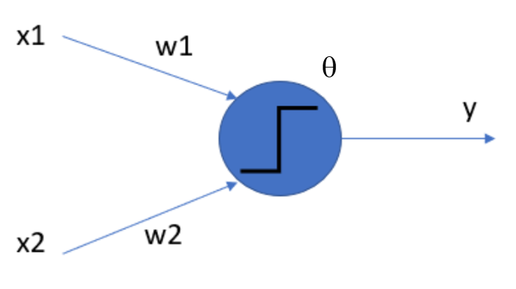
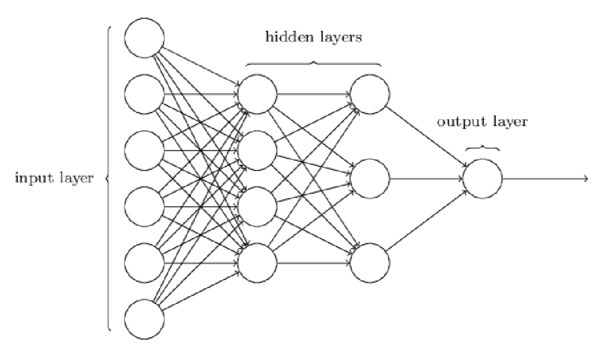

```{r setup, include=FALSE}
knitr::opts_chunk$set(echo = TRUE)
```

EXTRAKT: Abschnitt 8) MLP

# 8 Anwendung von DL Verfahren: Multilayer Perceptron (MLP)

## 8.1 Vorhaben

Wir wollen in diesem Abschnitt ein Verfahren aus dem Bereich Deep Learning (DL) testen. Genauer gesagt wollen wir ein künstliches neuronales Netz (kNN) in Form eines einfach Multilayer Perceptrons aufbauen. Ein Perpeptron bezeichnet dabei die Grundeinheit (unit) unseres Netzes und ist eine vereinfachte künstliche Nervenzelle.

Die Abbildung zeigt ein solches Perceptron mit zwei Eingabewerten $x_1$ und $x_2$, sowie Gewichten $w_1$, $w_2$ und einer Schwelle $\theta$. Der Ausgabewert $y$ ergibt sich durch Anwendung einer sogenannten Aktivierungsfunktion $f(.)$ auf die Summe der gewichteten Eingabewerte abzüglich Schwellwert. Dabei wird häufig $b=-\theta$ gesetzt: $y=f(h)=f(\vec{x}\cdot\vec{w}+b)$, wobei mit $h$ das postsynaptische Potential bezeichnet wird. Beispiele für Aktivierungsfunktionen sind die Heaviside-Stufenfunktion, einfache lineare Funktionen $f(h)=h$, gerichtete lineare Funktionen ("relu" = rectified linear units) $f(h)=max(h,0)$ oder sigmoide Funktionen $f(h)=\frac{1}{1+e^{-h}}$.



Mehrere Perceptrons bilden eine Schicht eines neuronalen Netzes. Und ein Netz besteht in der Regel aus einer Eingabeschicht (input layer), einer Ausgabeschicht (output layer) und optional Zwischenschichten (hidden layers), wie im Bild skizziert:



Wir haben in dieser Arbeit nur sogenannte Feedforward-Netze benutzt, bei denen die Signalrichtung immer nur von einer zur nächsten Schicht zeigt. Im Grundzustand ist jede Einheit einer Schicht mit jeder Einheit der nächsten Schicht verbunden und die Verbindung erhält ein Gewicht $w$. 

Für eine Kombination von Eingabewerten lässt sich der Ausgabewert in einem Feedforward-Netz sehr einfach berechnen. In unserem Fall haben wir eine Reihe von Trainingsdaten und kennen für gewisse Eingabeparameter die gewünschten Ausgabewerte, nämlich Umsätze je Warengruppe. In der Trainingsphase berechnen wir den Fehler (die sogenannte "Loss"-Funktion) $L$ aus der Differenz des berechneten Ausgabewertes zum erwarteten Umsatz.

Um den Fehler zu minimieren, müssen nachfolgend die Gewichte und Schwellwerte rückwirkend angepasst werden, man spricht hierbei von "backpropagation", weil man nur die Schichten bis zurück zur Eingabeschicht durchwandert. Die nötige Anpassung der Gewichte und Schwellwerte berehnet man bspw. mithilfe des Gradienten der Loss-Funktionen in Bezug auf die postsynaptischen Potentiale. Ein Standard-Verfahren ist das Gradient-Descent-Verfahren. Werden zusätzlich die Gewichte und Schwellwerte mit zufälligen Werten initialisiert, spricht man vom Stochastic-Gradient-Descent-Verfahren (SGD). Bei diesem iterativen Lernalgorithmus versucht man den Fehler zu minimieren und sich so schrittweise an ein lokales oder sogar an das globale Minimum anzunähern. Neben SGD gibt es zahlreiche weitere Optimierungsstrategien. 

Eine Erweiterung des klassischen SGD-Verfahrens ist "Adam": Dabei wird nicht nur der aktuelle Gradient für die Anpassung der Gewichte und Schwellwerte herangezogen, sondern eine Sequenz von Gradienten. Wenn mehrere aufeinanderfolgende Anpassungen in die gleiche Richtung vorgenommen werden, erhöht sich somit die Lerngeschwindigkeit, man spricht von Lernen mit Momentum. Für klassisches SGD hingegen ist die Lernrate konstant.

Ein Modell wird üblicherweise über viele Epochen trainiert. In jeder Epoche kommt jeder Trainings-Input zum Einsatz. Die Anpassung der Gewichte und Schwellwerte kann nach jedem Input vorgenommen werden ("online learning") oder erst am Ende einer Epoche, nachdem alle Ausgabewerte für alle Eingabekombinationen berechnet wurden ("batch learning"). In der Praxis verwendet man als Kompromiss häufig sogenannte mini-batches und verwendet dabei eine gewisse Anzahl an Trainings-Inputs, bevor die Gewichte und Schwellwerte angepasst werden.

Wir haben unsere neuronalen Netze in Python programmiert. Dabei verwenden wir das von Google entwickelte open-source Framework Tensonflow, das für die datenstromorientierte Programmierung konzipiert wurde und im Bereich Deep Learning weit verbreitet ist. Darüberhinaus verwenden wir Keras als open-source Deep-Learning-Bibliothek. Unser Quellcode befindet sich im Python-Skript MLP.py.
