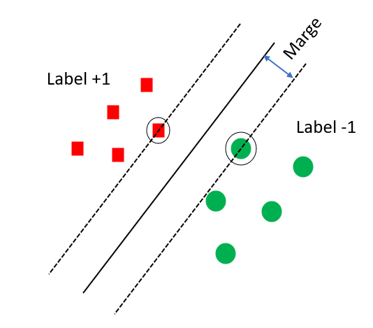
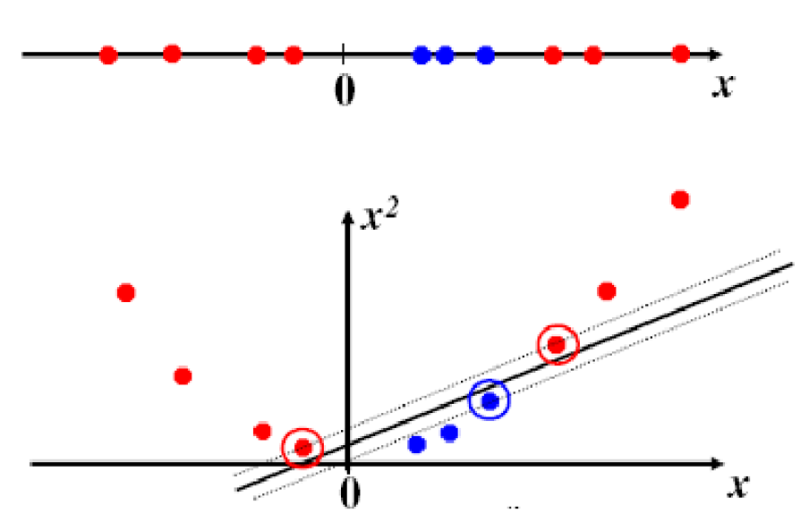

```{r setup, include=FALSE}
knitr::opts_chunk$set(echo = TRUE)
```

EXTRAKT: Abschnitt 7) SVM

# 7 Anwendung von ML Verfahren: Support Vector Machines (SVM)

## 7.1 Vorhaben und Theorie

Wir testen nun ein anerkanntes Verfahren aus dem Bereich Machine Learning (ML), nämlich Support Vector Machines (SVM). Dieses Verfahren wird häufig für die Klassifizierung verwendet, kann jedoch auch zur Lösung von Regressions-Problemen verwendet werden. Genau das wollen wir tun.

### Lineare SVM zur Klassifizierung

In der einfachsten Form hat man ein Trainingsset $D=\{(\vec{x}^{(1)},y^{(1)}),...,(\vec{x}^{(p)},y^{(p)})\}$ bestehend aus $p$ Eingabevektoren $\vec{x}$ mit zugehörigem Label $y$, beispielsweise $+1$ und $-1$.



Im Bild sehen wir ein Beispiel in zwei Dimensionen: Die roten Quadrate haben Label $+1$, die grünen Kreise $-1$. Man sucht dann die Trennlinie (durchgezogene Linie), die den Sicherheitsabstand ("Marge" oder engl. "margin") maximiert. Dir Grenzen der Sicherheitszone sind durch die gestrichelten Linien gezeigt. Die Datenpunkte, die direkt auf den getrennten Linien liegen haben als Abstand gerade die doppelte Marge und werden als Support-Vektoren bezeichnet. Für die Lösung des Problems sind nämlich gerade die Support-Vektoren entscheidend.

Die Trennlinie (in höheren Dimensionen Hyperebene) lässt sich beschreiben als $H=\{\vec{x}|\vec{w}^T\cdot\vec{x}+b=0\}$. Dabei bezeichnet $\vec{w}$ den Normal-Vektor der Hyperebene. Und als Lösung erhalten wir eine Klassifizierungsfunktion $f(\vec{x})=sgn(\vec{w}^T\cdot\vec{x}+b)$. Dieser Klassifizierer ist unsere Support Vector Machine.

Das Problem ist, dass die Hyperebene durch $\vec{w}$ nicht eindeutig bestimmt ist. Wir legen daher durch Normierung die sogenannte kanonische Hyperebene fest. Konkret erreichen wir das durch die Nebenbedingungen $(*)$: $\vec{w}^T\cdot\vec{x}+b \ge +1$ für Support-Vektoren mit Label $+1$ und $\vec{w}^T\cdot\vec{x}+b \le -1$ für Support-Vektoren mit Label $-1$. Damit ergibt sich der Sicherheitsabstand zwischen den beiden gestrichelten Linien zu $\frac{2}{||\vec{w}||}$.

Jetzt haben wir ein Optimierungsproblem und müssen $||\vec{w}||$ minimieren, um den Sicherheitsabstand zu maximieren, unter den Nebenbedingungen $(*)$. Bei der Lösung kommen Lagrange-Multiplikatoren $\alpha_\mu\ge0$ ins Spiel und liefern als Lösung die optimalen Werte $\vec{w}^*$ und $b^*$ mit $\vec{w}^*=\sum_{\mu=1}^{p}\alpha_\mu y^{(\mu)}\vec{x}^{(\mu)}$. Die Details sparen wir an dieser Stelle aus.

Damit erhalten wir die Klassifizierungsfunktion $f(\vec{x})=sgn(\vec{w}^{*T}\cdot\vec{x}+b^*)=sgn(\sum_{\mu=1}^{p}\alpha_\mu y^{(\mu)}\vec{x}^{(\mu)T}\cdot\vec{x}+b^*)$.

### Klassifizierung von linear nicht trennbaren Datensätzen

SVM kann auch angewendet werden, wenn keine scharfe Trennung zwischen den Klassen möglich ist. In solchen Fällen verwendet man die sogenannte Soft-Margin-Klassifizierung. Ziel dabei ist eine Trennlinie zu finden, die die Anzahl der Punkte innerhalb des Sicherheitsabstandes minimiert bzw. die Anzahl der falsch klassifizierten Datenpunkte minimiert. Durch diese Nebenbedingung kommt ein weiterer Parameter $C$ ("cost") ins Spiel.

### Nicht-lineare SVM zur Klassifizierung

Bislang haben skizziert, wie man SVM auf linear trennbare Datensätze anwendet - abgesehen von einigen Überlappungen der Daten unterschiedlicher Klassen. Aber SVM kann noch mehr:



Im oberen Teil der Abbildung sehen wir Daten zweier Klassen (rote und blaue Kreise), die in einer Dimension linear nicht trennbar sind. Transformiert man die Daten jedoch in eine höhere Dimension (hier 2D) durch eine Funktion $\vec{x}\rightarrow\Phi(\vec{x})$, sieht man, dass die Klassen nun linear trennbar sind. Man spricht von einer Transformation in den höher-dimensionalen "Feature-Raum" und führt dann SVM eben in diesem Feature-Raum durch.

Dabei nutzt man aus, dass die transformierten Eingabevektoren $\Phi(\vec{x})$ nur in Form von Skalarprodukten auftauchen und definiert eine sogenannte Kernel-Funktion $k(.,.)$, um den Zusammenhang zwischen Eingabevektoren und transformierten Eingabevektoren im Feature-Raum zu vereinfachen: $k(\vec{x},\vec{y})=\Phi(\vec{x})^T\cdot\Phi(\vec{y})$. 

Wir verwenden später als Kernel $k(\vec{x},\vec{y})=exp(-\gamma(\vec{x}-\vec{y})^2)$, also eine Gauss-Funktion, die man auch als "Radial-Basis-Funktion" (rbf) bezeichnet. Unsere Klassifizierungsfunktion wird dann zu:

$f(\vec{x})=sgn(\sum_{\mu=1}^{p}\alpha_\mu y^{(\mu)}\Phi(\vec{x}^{(\mu)})^T\cdot\Phi(\vec{x})+b^*)=sgn(\sum_{\mu=1}^{p}\alpha_\mu y^{(\mu)}k(\vec{x}^{(\mu)},\vec{x})+b^*)$.

### SVM zur Regression

Verzichten wir in der Klassifizierungsfunktion $f(.)$ auf $sgn(.)$ und verwenden stattdessen nur das Argument, dann können wir SVM auch auf Regressions-Probleme anwenden. Wir wollen dabei eine Funktion $f(\vec{x})$ finden mit möglichst geringem Fehler $|f(\vec{x})-y|$ bei Anwendung auf den Testdaten. Dabei besteht die Gefahr von Overfitting, nämlich dass wir den Schätzer zu gut an die Besonderheiten in den verwendeten Trainingsdaten anpassen und gleichzeitig die Prognosequalität bei Anwendung auf neue unbekannte Eingabewerte sinkt (schlechte Veralgemeinerung). Um diesen Interessenskonflikt zu lösen, führt man in der später durchgeführten $\epsilon$-Regression einen Toleranzbereich $\epsilon$ ein, innerhalb dessen wir Abweichungen nicht bestrafen. Mathematisch ausgedrückt gilt für die Loss-Funktion $L_\epsilon=0$ für $|f(\vec{x})-y|\le\epsilon$.

Als freie Parameter haben wir also $C$ ("cost") und $\epsilon$, die es zu optimieren gilt. Dafür verwenden wir später eine Funktion zum Tuning der Hyperparameter. Daneben haben wir in unserem rbf-Kernel noch den Parameter $\gamma$, der üblicherweise als Kehrwert der Anzahl der Eingabeparameter festgelegt wird.

Die SVM-Funktionalitäten sind im R-Paket "e1071" implementiert.

